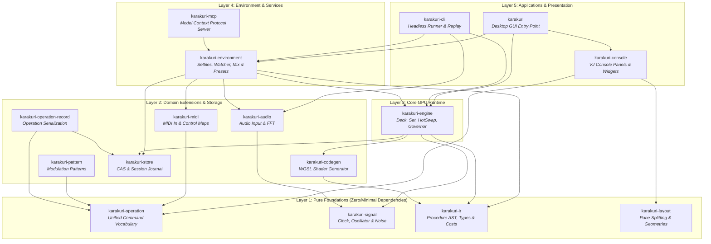

# Karakuri Crates Architecture

This directory contains the modular crates that make up the **Karakuri** GPU-native, AI-native real-time visual performance system.

---

## 1. System Architecture & Layers

The codebase is structured into five distinct architectural layers with strict dependency flow from pure foundations up to user-facing applications.

---

## 2. Crate Catalog

| Layer | Crate | Description | Dependencies | Status |
|:---:|:---|:---|:---|:---:|
| **1** | [`karakuri-signal`](karakuri-signal/README.md) | Clock oscillators, tempo tracking, noise generators, and signal bus | Pure leaf (no workspace deps) | Refactored & Documented |
| **1** | [`karakuri-operation`](karakuri-operation/README.md) | Unified vocabulary and grammar of operator actions and AI commands | Pure leaf (no workspace deps) | Pending |
| **1** | [`karakuri-ir`](karakuri-ir/README.md) | Intermediate representation (`.kir`), parser, type-checker, and cost estimator | Pure leaf (no workspace deps) | Pending |
| **1** | [`karakuri-layout`](karakuri-layout/README.md) | Geometry, split ratios, dock arrangements, and pane fold logic | Pure leaf (no workspace deps) | Pending |
| **2** | [`karakuri-audio`](karakuri-audio/README.md) | Audio device input capture, ring buffers, FFT analysis, and metering | `karakuri-signal` | Pending |
| **2** | [`karakuri-midi`](karakuri-midi/README.md) | MIDI controller input decoding, note/CC mapping to operations | `karakuri-operation` | Pending |
| **2** | [`karakuri-pattern`](karakuri-pattern/README.md) | Algorithmic parameter sequences and modulation generators | `karakuri-operation` | Refactored & Documented |
| **2** | [`karakuri-codegen`](karakuri-codegen/README.md) | Compiles checked `.kir` IR into optimized WGSL shader modules | `karakuri-ir` | Pending |
| **2** | [`karakuri-store`](karakuri-store/README.md) | Content-addressed storage (CAS) and append-only session journals | `sha2`, `memmap2` | Pending |
| **2** | [`karakuri-operation-record`](karakuri-operation-record/README.md) | Serialization and deserialization of operations for session recording | `karakuri-operation`, `karakuri-store` | Pending |
| **3** | [`karakuri-engine`](karakuri-engine/README.md) | Real-time GPU execution runtime (`wgpu 30`): Decks, Sets, HotSwap, Governor | `karakuri-codegen`, `ir`, `signal`, `store` | Refactored |
| **4** | [`karakuri-environment`](karakuri-environment/README.md) | System coordination: Setfile packaging (`.kset`), live mix transitions, presets | `engine`, `audio`, `midi`, `store`, `ir` | Pending |
| **4** | [`karakuri-mcp`](karakuri-mcp/README.md) | Model Context Protocol JSON-RPC server exposing AI pair-programming tools | `karakuri-environment` | Pending |
| **5** | [`karakuri-console`](karakuri-console/README.md) | VJ performance console UI (egui): Program, Staging, Master, Sequencer, Library | `karakuri-layout`, `operation` | Pending |
| **5** | [`karakuri-cli`](karakuri-cli/README.md) | Headless session player, offscreen batch PNG renderer, and benchmarks | `engine`, `environment`, `audio` | Pending |
| **5** | [`karakuri`](karakuri/README.md) | Primary desktop GUI application: winit windowing and bridge coordination | `console`, `engine`, `environment` | Pending |

---

## 3. Core Design Principles

1. **GPU-Native Execution**: No hand-written shaders in authoring paths; shaders are compiled from declarative IR into WGSL compute and render pipelines.
2. **Real-Time Safety & Non-Blocking Render Loop**:
   - Shaders, pipelines, and GPU buffers are never allocated on the render thread.
   - Compilations run asynchronously on background worker threads.
   - Swaps occur exclusively at frame boundaries.
3. **Unified Vocabulary**: All UI controls, MIDI bindings, CLI scripts, and AI MCP tools route into the exact same strongly typed operations defined in `karakuri-operation`.
4. **Content-Addressed Persistence**: Sets, procedures, and sessions are hashed via SHA-256 and stored immutably in `karakuri-store`.
