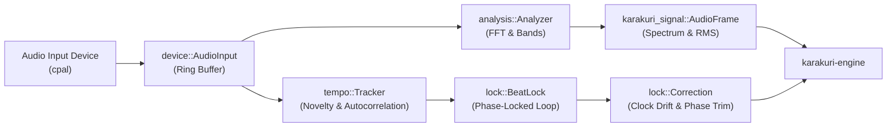

# karakuri-audio

Real-time audio input capture, spectral analysis, and phase-locked tempo tracking for the Karakuri visual performance system.

---

## 1. Architectural Role

`karakuri-audio` resides in **Layer 2 (Domain Extensions & Hardware)**. It bridges raw hardware audio input devices into strongly-typed signal measurements and oscillator corrections consumed by the core engine.

To maintain deterministic replayability, `karakuri-audio` produces only **pure values**:
1. [`AudioFrame`](karakuri_signal::AudioFrame): Multi-band energy, RMS levels, and onset detections.
2. [`Correction`](lock::Correction): Phase adjustments and frequency trimming for the clock oscillator.

Because these are values emitted into the session journal, session replays receive the exact same audio measurements without requiring hardware audio devices.

---

## 2. Module Decomposition

| Module | Responsibility | Allocation Policy |
|---|---|---|
| [`analysis`](src/analysis.rs) | Short-time Fourier transform (FFT), logarithmic band grouping, envelope follower, and onset detection. | Pre-allocated working buffers; zero allocation during hop processing. |
| [`tempo`](src/tempo.rs) | Spectral novelty processing, lag autocorrelation, tempo candidate selection, and beat phase estimation within a tracking window. | Fixed-size ring buffers; no runtime heap allocation. |
| [`lock`](src/lock.rs) | Phase-locked loop (`BeatLock`) calculating phase and tempo correction steps while accounting for analysis and presentation latencies. | Zero allocation. |
| [`device`](src/device.rs) | Audio device enumeration and streaming input via `cpal`. Non-blocking ring buffer passing frames to worker/engine threads with staleness tracking. | Initial device stream allocation only. |

---

## 3. Latency Compensation Model

Audio-visual synchronization must account for two distinct latency components:
- **Analysis Latency ($A$)**: Half the FFT analysis window plus device input buffer latency. Computed deterministically per frame (`device::Reading::age`).
- **Delivery / Presentation Latency ($D$)**: GPU frame pacing, display pipeline delay, and room acoustics (distance between speakers and audience).

Because acoustic distance and display latency cannot be probed locally, the system exposes a signed offset (`latency-offset-ms`) that shifts the phase-locked grid forward or backward.

---

## 4. Invariants

- **Audio Thread Safety**: Audio stream callbacks execute in real-time priority and never lock mutexes, allocate memory, or block on I/O.
- **Zero Allocations in Analysis Hop**: All FFT plans, windowing buffers, and scratch spaces are allocated once at construction.
- **Octave Consistency**: The tempo tracker searches within a focused octave window to prevent rapid 2x or 0.5x tempo octave jumping during quiet musical passages.
- **Graceful Degradation**: If an input device stops delivering samples, confidence smoothly decays to zero without stalling downstream rendering loops.
