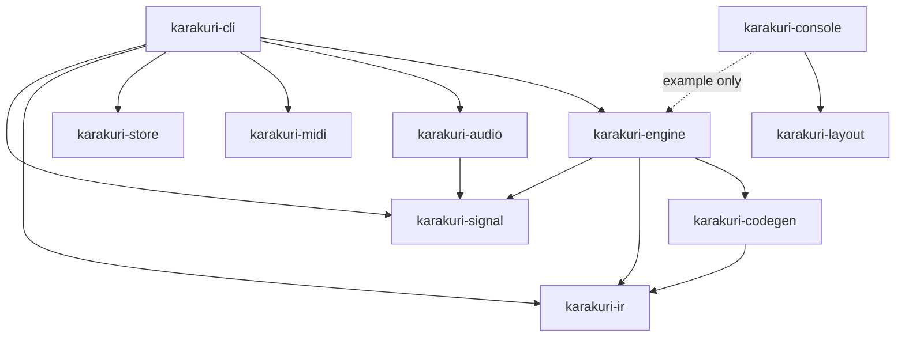
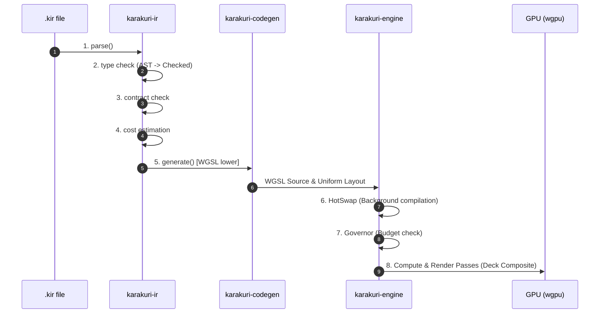
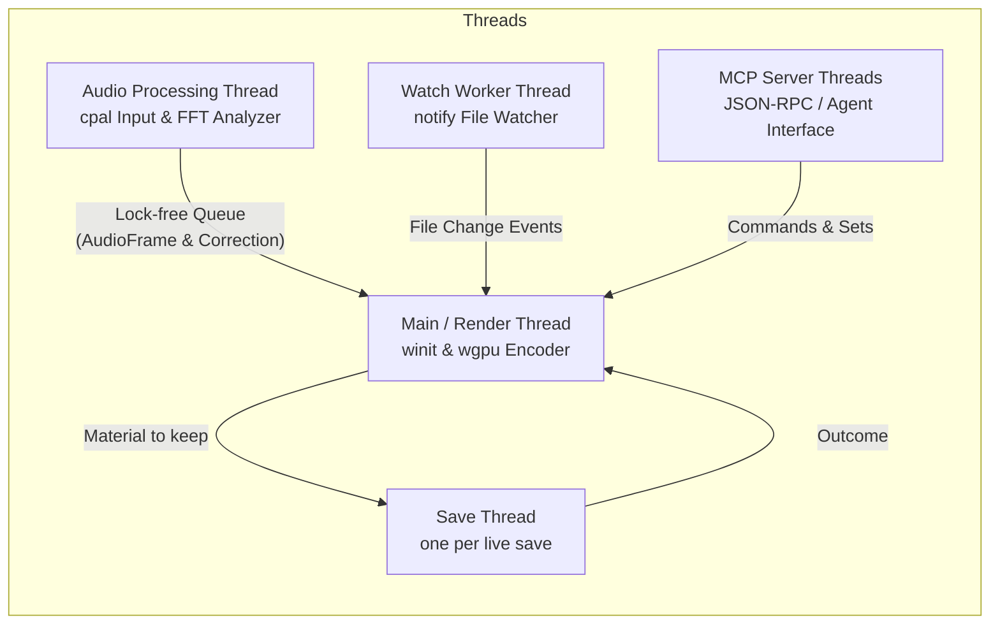

# Karakuri Architecture Guide

This document describes the source code structure, multi-crate architecture, compilation and execution pipeline, threading model, and contributor guide for **Karakuri**, a GPU-native, AI-native real-time visual generation system.

---

## 1. Core Principles & Design Goals

The rules this architecture is built on are **one file each** in
[docs/principles/](principles/), so that they are stated in a single place and cannot drift between
documents. They were previously copied here and into [contributing.md](contributing.md), and the two
copies had already stopped agreeing on which four were the foundational ones.

The ones a reader of this document needs first:

- [Nothing allocates or compiles a shader on the render thread](principles/0001-nothing-allocates-or-compiles-a-shader-on-the-render-thread.md)
- [Simulation time comes from a record, never from a clock](principles/0002-simulation-time-comes-from-a-record-never-from-a-clock.md)
- [Compaction preserves order](principles/0003-compaction-preserves-order.md)
- [A live Set is never mutated in place](principles/0004-a-live-set-is-never-mutated-in-place.md)
- [A swap happens on a frame boundary, and an over-budget Set rolls back on its own](principles/0005-a-swap-happens-on-a-frame-boundary-and-an-over-budget-set-rolls-back-on-its-own.md)
- [The workspace stays closed to Rust](principles/0006-the-workspace-stays-closed-to-rust.md)

Why each is the way it is — and what was rejected to get there — is in
[docs/adr/](adr/).

---

## 2. Workspace & Crate Architecture

Karakuri is structured as a Cargo workspace with 10 dedicated crates under [crates/](../crates):



### Crate Breakdown

| Crate | Path | Responsibility |
|---|---|---|
| [karakuri-ir](../crates/karakuri-ir) | `crates/karakuri-ir` | DSL (`.kir`) parsing, lexing, type checking, contract verification, and static cost estimation |
| [karakuri-codegen](../crates/karakuri-codegen) | `crates/karakuri-codegen` | WGSL shader code generation from typed AST (`Checked`), uniform struct layout computation |
| [karakuri-engine](../crates/karakuri-engine) | `crates/karakuri-engine` | `wgpu` pipeline management, `Deck`/`Set` composition, `HotSwap`, `Governor`, OIT, `Present`, and the one frame loop (`compose` over a slice of `Sink`s) |
| [karakuri-signal](../crates/karakuri-signal) | `crates/karakuri-signal` | Complete signal bus (`SignalBus`), signal `confidence` tracking, local `Oscillator` |
| [karakuri-audio](../crates/karakuri-audio) | `crates/karakuri-audio` | Real-time audio capture (`cpal`), FFT band analysis, beat tracking, latency offset management |
| [karakuri-midi](../crates/karakuri-midi) | `crates/karakuri-midi` | MIDI input event parsing and signal/parameter binding |
| [karakuri-store](../crates/karakuri-store) | `crates/karakuri-store` | Content-addressed artifact storage (keyed by `.kir` hash), `.set` files, `.ndjson` session logs |
| [karakuri-layout](../crates/karakuri-layout) | `crates/karakuri-layout` | The console's arrangement as arithmetic: views and splits with a size, a minimum and a maximum each, solved to rectangles. No toolkit, no device, no window (ADR-0156) |
| [karakuri-console](../crates/karakuri-console) | `crates/karakuri-console` | The console: its arrangement, the panel model a pointer and a keyboard act on, and the `egui` view. **The destination the CLI is scaffolding for** — `src/` still takes no device, and the window is `examples/panel.rs`'s |
| [karakuri-cli](../crates/karakuri-cli) | `crates/karakuri-cli` | V1 entry point, and **scaffolding rather than the destination** (`README.md`): flag parsing, the `winit` event loop, the clock, session recording and replay, the PNG writer, the hot-reloading watcher, MCP server integration |

### Repository Layout

Where everything lives, including the parts that are not crates:

```
crates/
  karakuri-ir/        IR parser, type checker, cost estimation
  karakuri-codegen/   IR → WGSL
  karakuri-engine/    render graph, Set lifecycle, pipeline management
  karakuri-signal/    local oscillator, synthesized signals, signal bus
  karakuri-audio/     input device, analysis, tempo tracking, the beat lock
  karakuri-midi/      wire messages, and the operator's map of them
  karakuri-store/     content-addressed artifact store, ndjson I/O
  karakuri-layout/    the console's arrangement, solved to rectangles
  karakuri-console/   the console: arrangement, panel model, and the egui view
  karakuri-cli/       V1 entry point, and scaffolding rather than the destination
.githooks/            pre-commit: `cargo fmt --check` on what is staged
                      pre-push:   fmt, clippy and every test
                      enable with `git config core.hooksPath .githooks`
docs/
  adr/                every decision, with the alternatives that lost — append-only
  architecture.md     the codebase architecture, multi-crate map, and pipeline
  contributing.md     engineering principles, build/test commands, and verification rules
  ir-spec.md          the IR. Settled; open questions are empty
  manual.md           how to play it: flags, keys, and what each does
  manual/             the console's manual, published — the seven rules, the
                      words, the console region by region, every operation
  plugins.md          out-of-process helpers, and why they are out of process
  principles/         the rules in force, one per file — current only
  roadmap.md          where this goes after V1
examples/             app presets: seven L1, four L2, one L3, one Field,
                      nine L4, and a control-surface map to copy
.karakuri/            the store: artifacts, sets, sessions, scratch and the
                      edit history (gitignored, and `--store` moves it)
```

### Vocabulary

The words the rest of these documents use for the runtime objects above. They are defined
once here so that a term means the same thing in the roadmap, the manual and the code:

| Term | Meaning |
|---|---|
| Procedure | Code that runs every frame on the GPU, written in the IR |
| Artifact | A saved procedure. Content-addressed and immutable |
| Slot | Two things, and it is worth knowing which. A **layer slot** is a position within a Set (L1/L2/L3/L4). A **deck slot** is a position within the deck, holding a whole Set. [roadmap.md](roadmap.md) says *member* for the second; the code says `Deck::slot`, and that disagreement is recorded rather than resolved — renaming either is churn until something depends on telling them apart |
| Deck | Where prepared-but-not-showing material lives, at Set granularity. Up to four slots; one to four of them Live and composited, the rest resident |
| Residency | How ready a deck slot is, over three levels: **Live** (composited), **Priming** (stepped, and drawn only if it is being auditioned), **Allocated** (compiled, buffers held, not stepping, keeping its state; drawn only if it is being auditioned). It is **two facts, not one** — what the operator *requested*, which only they change, and what the engine is *effectively* doing, which the governor recomputes each pass |
| Parked | Requested Priming, effective Allocated: waiting for budget, **not cancelled**. It resumes by itself when there is room, because the request is never overwritten — every pass recomputes the effective level from it |
| Set | Filled slots forming one video source. The unit of compilation and of lifecycle |
| VideoSource | The interface L5 consumes. Set is one implementation of it |
| Signal bus | Input distributed to every layer. Always complete; values carry a confidence |
| Local oscillator | The single source of truth for phase and tempo. External input is only correction |
| Record stream | The path engine state is mutated through, so that a session replays. ndjson. **Everything an operator moves goes through it, and so does the material** — see [P-0028](principles/0028-every-control-ends-in-the-same-record.md) |
| Set file | A Set's state projection. No time in it |
| Session stream | The timeline. A Set file followed by `tick` records and the edits between them |

---

## 3. Compilation & Execution Pipeline

The journey from a `.kir` file to rendered GPU pixels spans 8 explicit stages:



1. **Parse Stage** (`karakuri-ir::parse`): Lexical tokenization and recursive-descent parsing into an unchecked AST.
2. **Type Check Stage** (`karakuri-ir::typed`): Type inference and type annotation verification. Produces a typed `Checked` AST.
3. **Contract Check Stage** (`karakuri-ir::check`): Mandated attribute assignment check (`position`, etc.), lifespan constraints (`spawn`/`kill`), contract compliance.
4. **Cost Estimation Stage** (`karakuri-ir::cost`): Static analysis of execution cost (element counts, loop bounds, field call counts).
5. **WGSL Lowering Stage** (`karakuri-codegen`): Lowering `Checked` trees to WebGPU compute, vertex, and fragment WGSL text, ensuring 16-byte uniform alignment padding.
6. **HotSwap & Compilation Stage** (`karakuri-engine::swap`): Asynchronous background `wgpu` pipeline creation and atomic swap on frame boundaries.
7. **Governor Verification Stage** (`karakuri-engine::governor`): Frame budget monitoring against `Probe` timing measurements, initiating rollback upon budget overrun.
8. **Execution Stage** (`karakuri-engine::deck` / `present`): GPU compute pass dispatch (L1/L3) and render pass execution (L4, Weighted Blended OIT, Tone Mapping).

---

## 4. Crate Deep Dives

### 4.1 karakuri-ir

- **Purpose**: Parsing and static verification of `.kir` DSL files.
- **Key Modules**:
  - `ast.rs` / `typed.rs`: AST node definitions (`Kind::L1` [geometry/elements], `Kind::L2` [deformations/filters], `Kind::L3` [camera], `Kind::L4` [renderers], `Kind::Field` [spatial data fields]) and the `Checked` tree.
  - `check.rs`: Enforces language contracts (e.g., all emitted attributes assigned on every branch).
  - `cost.rs`: Static cost model and field evaluation call counter.

### 4.2 karakuri-codegen

- **Purpose**: Translating checked IR trees into WGSL shader code and uniform buffer layouts.
- **Key Modules**:
  - `l1.rs`: Lowers `spawn`/`element` blocks to compute shaders with double-buffered `prev`/`next` state arrays.
  - `l3.rs`: Lowers camera state procedures to single-invocation compute passes.
  - `l4.rs`: Lowers vertex and fragment procedures. Expands `topology points` to quad primitives for billboard rendering.
  - `field.rs`: Splices spatial field function bodies into caller modules.
  - `layout.rs`: Computes uniform struct member offsets and trailing 16-byte alignment padding.

### 4.3 karakuri-engine

- **Purpose**: `wgpu` pipeline management, render graph execution, compositing, and the one frame loop every output is driven from.
- **Key Modules**:
  - `deck.rs`: Manages up to 4 deck slots and composites them using `add`, `over`, or `max` blend modes.
  - `frame.rs`: The one frame loop — `compose` asks every `Sink` for a target, commits, renders the deck, and draws into and presents the sinks that answered. `WindowSink` is the default one.
  - `set.rs`: Manages a node graph (`Set`) representing a complete visual scene.
  - `swap.rs`: `HotSwap` state machine for safe pipeline transitions.
  - `governor.rs`: Tracks frame execution budget (`budget_ms`) and enforces rollbacks.
  - `oit.rs`: Weighted Blended Order-Independent Transparency for alpha blending.
  - `present.rs`: Tone mapping operators (AgX, ACES, Filmic, etc.) and color space conversions.

### 4.4 karakuri-signal, karakuri-audio, karakuri-midi

- **Purpose**: Signal propagation, audio capture, and MIDI controller integration.
- **Key Design Principles**:
  - **Complete Bus**: The `SignalBus` never fails or returns an `Option`. Querying an unprovided signal name yields a `Sample::synthesized(0.0)` with a low `confidence` score (0.0..1.0).
  - **Local Oscillator**: Rendering reads from a local `Oscillator` rather than external system clocks. Audio beat tracking supplies a `Correction` delta to adjust oscillator drift.
  - **Latency Offset**: Audio-visual latency is adjusted via `--latency-offset-ms` (signed), compensating for external PA/projector pipeline delays.

### 4.5 karakuri-store

- **Purpose**: Content-addressed artifact storage keyed by SHA-256 of `.kir` source text, `.set` configuration files, and `.ndjson` session recordings.

### 4.6 karakuri-cli

- **Purpose**: Main entry point and runtime driver.
- **Key Modules**:
  - `main.rs`: `winit` application event loop, VJ keyboard controls, status line formatting.
  - `watch.rs`: Hot-reloading file system watcher for live editing.
  - `mcp.rs`: Model Context Protocol (MCP) server for dynamic LLM agent interaction.
  - `session.rs` / `render.rs`: Session recording/replay and offscreen headless PNG rendering.

---

## 5. Threading & Concurrency Model

Karakuri maintains high real-time performance through a decoupled multi-threaded architecture:



- **Main / Render Thread**: Drives the `winit` event loop and encodes `wgpu` render passes. Must never block or allocate during frame rendering.
- **Audio Thread**: Runs `cpal` callbacks, FFT band analysis, and beat tracking, sending measurements across a lock-free channel.
- **Watch Worker Thread**: Monitors `.kir` files via `notify`, triggering background parsing and lowering upon edits.
- **MCP Server Threads**: Handles incoming Model Context Protocol connections from external AI agents.
- **Save Thread**: One per live save (the `k` key), spawned and detached. It writes the Set file into the store — which may not happen on a frame. **Nothing here reads a `.kir`**: the run keeps the text it compiled, so what a slot is running is a content hash from launch onward and this thread puts those bytes in the store as it writes the file that names them. That is what makes a save follow the picture rather than the disk, and it is also why a windowed run that saves nothing creates no store at all — only `--record-session`, whose `procedure` records a replay has to resolve, needs the launch sources on disk before the first frame. The outcome comes back over a channel the frame loop drains, and the `save` record is written there rather than at the key press, so a stream never claims a file the disk refused. No frame waits for one; the *run* waits once, at exit, bounded, so a save pressed in the last second is still recorded and a hung disk still cannot prevent quitting. A pool would be machinery for a rate of a few an hour.

---

## 6. Contributor & Extension Guide

### 6.1 Adding a New IR Builtin Function

1. **`karakuri-ir`**:
   - Add the variant to `Builtin` enum in `src/builtin.rs`.
   - Add type checking and arity validation in `src/check.rs`.
   - Assign cost in `src/cost.rs`.
2. **`karakuri-codegen`**:
   - Implement lowering logic / WGSL string generation in `src/lower.rs` (or appropriate sub-module).
3. **Testing**:
   - Add an end-to-end test in `karakuri-codegen/tests/naga_test.rs` to verify Naga validation passes.

### 6.2 Adding a New Tone Mapper / Composite Mode

1. **`karakuri-engine`**:
   - Add variant to `TonemapOp` or `Blend` in `src/present.rs` / `src/deck.rs`.
   - Add shader logic in the corresponding WGSL presentation shader.
2. **`karakuri-cli`**:
   - Map key binding in `src/main.rs` and update `--help` output.

---

## 7. Related Documents

- [README.md](../README.md): The front door — what this is, a quickstart, and the document map
- [principles/](principles/): The rules in force, one per file — current only
- [adr/](adr/): Every decision, with the alternatives that lost — append-only
- [ir-spec.md](ir-spec.md): `.kir` DSL language specification
- [roadmap.md](roadmap.md): Architectural vision and implementation roadmap
- [manual.md](manual.md): VJ operator manual
