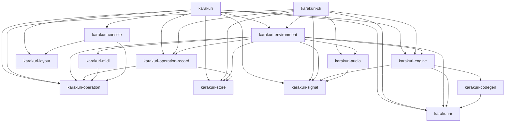
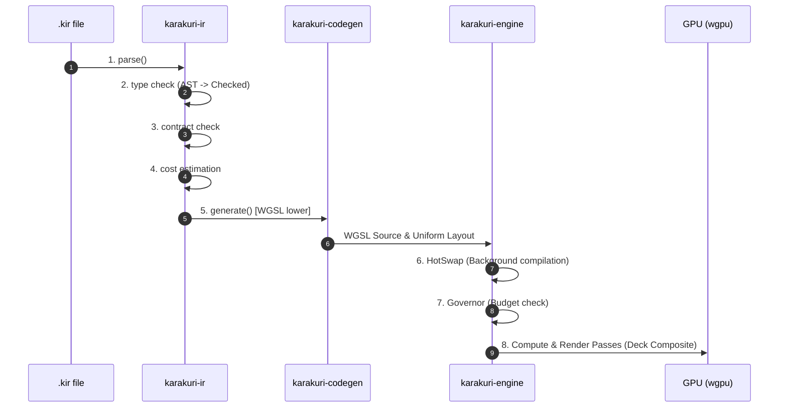
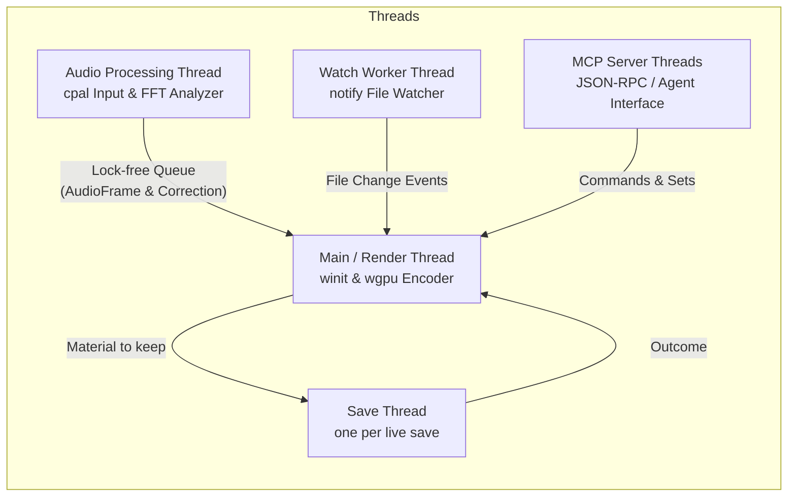

# Karakuri Architecture Guide

This document describes the source code structure, multi-crate architecture, compilation and execution pipeline, threading model, and contributor guide for **Karakuri**, a GPU-native, AI-native real-time visual generation system.

---

## 1. Core Principles & Design Goals

The rules this architecture is built on are **one file each** in
[docs/principles/](principles/), so that they are stated in a single place and cannot drift between
documents. They were previously copied here and into [contributing.md](contributing.md), and the two
copies had already stopped agreeing on which four were the foundational ones.

The ones a reader of this document needs first:

- [A swap happens on a frame boundary, and an over-budget Set rolls back on its own](principles/0005-a-swap-happens-on-a-frame-boundary-and-an-over-budget-set-rolls-back-on-its-own.md)
- [Take the mechanism that exists, and pay the bill now](principles/0085-take-the-mechanism-that-exists-and-pay-the-bill-now.md)
- [Cost is known before it is paid](principles/0091-cost-is-known-before-it-is-paid.md)
- [The same inputs produce the same frame](principles/0092-the-same-inputs-produce-the-same-frame.md)

Why each is the way it is — and what was rejected to get there — is in
[docs/adr/](adr/).

---

## 2. Workspace & Crate Architecture

Karakuri is structured as a Cargo workspace with 14 dedicated crates under [crates/](../crates):



### Crate Breakdown

| Crate | Path | Responsibility |
|---|---|---|
| [karakuri-ir](../crates/karakuri-ir) | `crates/karakuri-ir` | DSL (`.kir`) parsing, lexing, type checking, contract verification, and static cost estimation |
| [karakuri-codegen](../crates/karakuri-codegen) | `crates/karakuri-codegen` | WGSL shader code generation from typed AST (`Checked`), uniform struct layout computation |
| [karakuri-engine](../crates/karakuri-engine) | `crates/karakuri-engine` | `wgpu` pipeline management, `Deck`/`Set` composition, `HotSwap`, `Governor`, OIT, `Present`, and the one frame loop (`compose` over a slice of `Sink`s) |
| [karakuri-signal](../crates/karakuri-signal) | `crates/karakuri-signal` | Complete signal bus (`SignalBus`), signal `confidence` tracking, local `Oscillator` |
| [karakuri-audio](../crates/karakuri-audio) | `crates/karakuri-audio` | Real-time audio capture (`cpal`), FFT band analysis, beat tracking, latency offset management |
| [karakuri-midi](../crates/karakuri-midi) | `crates/karakuri-midi` | MIDI input event parsing and the operator's map. `Map::operation` is a pure function of one message and answers a `karakuri_operation::Operation` — a map line names a state (`residency 0 live`), never a step, and a line in the older grammar is refused with the line to write instead (ADR-0196). Depends on `midir` and on `karakuri-operation`, which has no dependencies of its own |
| [karakuri-store](../crates/karakuri-store) | `crates/karakuri-store` | Content-addressed artifact storage (keyed by `.kir` hash), `.kbset` Set files (`Store::SET_FILE_SUFFIX`; the store holds the resolved form and only that one, ADR-0231), `.ndjson` session logs |
| [karakuri-operation](../crates/karakuri-operation) | `crates/karakuri-operation` | **The operation vocabulary**: every named operation `docs/manual/operations.html` specifies, which every surface is to route into (ADR-0180). **The total is not transcribed here** — `grep -c '<h3' docs/manual/operations.html` is the count, and a number written into prose has gone stale four times in this repository already. A leaf crate with **no dependencies at all** — `std` only — because the surfaces that must reach it share nothing. `karakuri-console`, `karakuri-midi`, `karakuri-operation-record` and `karakuri-cli` depend on it; the mixer's faders were its first customer, the CLI's mix controls its second, and the MIDI map its third — which took `Action` away with it (ADR-0196). The console's `panel::Op` has not moved and what blocks it is the operations page rather than the code (ADR-0197); the CLI's key handler is surveyed and partly moved — twenty-one of its thirty-nine keys route through `Live::operate`, three (`b`, `,`, `.`) keep their own path because their record is `Owed::NotSettled`, twelve name a `Silent` operation and cannot route at all, and three name nothing in the vocabulary (ADR-0198, and ADR-0232 for the five that moved when the transition settings became a reading; `c` followed them when the wipe's front shape turned out to be a third such setting and its soft edge the arriving deck's). The fourth surface is the MCP server — `karakuri-environment`'s since ADR-0215 — whose seven tools name seven of these operations and **perform them here** rather than through `Live::operate`: all seven are `Silent` — four ask, two owe a record written where the work lands, and `WireInput` has nothing in the session vocabulary to carry it — and there is no `Live` on a connection thread anyway (ADR-0199, ADR-0235). It is the only surface that can say a node address, so `NodeAt` and `Layer` have no other caller. **`gate` is the second thing in this crate**: one exhaustive match, with no wildcard arm, saying for every operation whether it is open to a model or closed until an operator opens its class, which class, which bay's head holds the indicator, and the sentence a refusal is said in — 41 closed, 23 open (ADR-0235). It is the map's audit rather than a member of the vocabulary, which is why opening a class is no operation of its own (ADR-0236) |
| [karakuri-operation-record](../crates/karakuri-operation-record) | `crates/karakuri-operation-record` | **Where an operation becomes a record** — the step P-0090 needs and the one place it happens (ADR-0194). Depends on `karakuri-operation` and `karakuri-store` and on nothing else, because neither of those two may depend on the other. The conversion is not pure: it takes an operation **and a reading of what is running**, since `Record::Look` carries a tone map operator no exposure control can name. One exhaustive match over every operation, answering the records it writes, the settled reason it writes none, or the gap that stops it |
| [karakuri-layout](../crates/karakuri-layout) | `crates/karakuri-layout` | The console's arrangement as arithmetic: views and splits with a size, a minimum and a maximum each, solved to rectangles. No toolkit, no device, no window (ADR-0156) |
| [karakuri-console](../crates/karakuri-console) | `crates/karakuri-console` | The console: its arrangement, the panel model a pointer and a keyboard act on, and the `egui` view. **The destination the CLI is scaffolding for.** `src/` takes no device and now cannot: the eight dev-dependencies that could reach one left with the example (ADR-0214), so ADR-0156's seam is enforced by the manifest holding nothing rather than by a rule |
| [karakuri](../crates/karakuri) | `crates/karakuri` | **The panel as a program** — the window, the event loop, the engine behind the Program bay and the store behind the Library bay, over `karakuri-console` and `karakuri-environment`. `cargo run -p karakuri`. It is what the panel column of [the operations page](manual/operations.html) is measured against (ADR-0213), and it has no library target on purpose: nothing may depend on a surface |
| [karakuri-environment](../crates/karakuri-environment) | `crates/karakuri-environment` | **The program: everything this instrument deals with that is not itself.** A module belongs here if what it deals with lives outside this process — a disk, a device, a port, a socket, another program — or is the record of what happened (ADR-0215). It exists because `karakuri-cli` has no library target and the panel could therefore reach none of it, a boundary this repository had already paid for five times (ADR-0214). **Two thin binaries sit over it**, and no module in it may know which surface it is under. Holds **all thirteen** modules that were in scope — audio input, the `.kir` compile step, the edit history, the metadata card, the mixer's records and wire spellings, the MIDI map's surface, the MCP server, the PNG writer, the scratch store, session recording, the Set file format, the external tempo-source protocol and the hot-reloading watcher — **plus a fourteenth that was not in that scope**, `places`, which owns the presets root and the store root, every refusal about them, and which of the four candidates a search answered with (ADR-0230) |
| [karakuri-cli](../crates/karakuri-cli) | `crates/karakuri-cli` | V1 entry point, and **scaffolding rather than the destination** (`README.md`). Since ADR-0214's move it is **one file** — flag parsing, the `winit` event loop, the clock, the key handler, `Live`, and replay. Everything that deals with a disk, a device, a port or the record went to `karakuri-environment`; what is left is a surface, and splitting `main.rs` is the next thing rather than moving more out of it |

### Repository Layout

Where everything lives, including the parts that are not crates:

```
crates/
  karakuri-ir/        IR parser, type checker, cost estimation
  karakuri-codegen/   IR → WGSL
  karakuri-engine/    render graph, Set lifecycle, pipeline management
  karakuri-signal/    local oscillator, synthesized signals, signal bus
  karakuri-audio/     input device, analysis, tempo tracking, the beat lock
  karakuri-midi/      wire messages, and the operator's map of them
  karakuri-store/     content-addressed artifact store, ndjson I/O
  karakuri-operation/ the named operations every surface routes into
  karakuri-operation-record/
                      where an operation becomes a record, and the reading it takes
  karakuri-layout/    the console's arrangement, solved to rectangles
  karakuri-console/   the console: arrangement, panel model, and the egui view
  karakuri/           the panel as a program: `cargo run -p karakuri`
  karakuri-environment/  the program: the disk, the devices, the ports, the record
  karakuri-cli/       V1 entry point, and scaffolding rather than the destination
.githooks/            pre-commit: `cargo fmt --check` on what is staged
                      pre-push:   fmt, clippy and every test
                      enable with `git config core.hooksPath .githooks`
docs/
  adr/                every decision, with the alternatives that lost — append-only
  architecture.md     the codebase architecture, multi-crate map, and pipeline
  contributing.md     engineering principles, build/test commands, and verification rules
  ir-spec.md          the IR. Settled; open questions are empty
  manual.md           how to play it: flags, keys, and what each does
  manual/             the console's manual, published — the seven rules, the
                      words, the console region by region, every operation
  plugins.md          out-of-process helpers, and why they are out of process
  principles/         the rules in force, one per file — current only
  roadmap.md          the milestones, their status, and the handover
examples/             app presets: seven L1, four L2, one L3, one Field,
                      nine L4, and a control-surface map to copy
.karakuri/            the store: artifacts, sets, sessions, scratch and the
                      edit history (gitignored, and `--store` moves it)
```

### Vocabulary

The words the rest of these documents use for the runtime objects above. They are defined
once here so that a term means the same thing in the roadmap, the manual and the code:

| Term | Meaning |
|---|---|
| Procedure | Code that runs every frame on the GPU, written in the IR |
| Artifact | A saved procedure. Content-addressed and immutable |
| Slot | Three things, and it is worth knowing which. A **layer slot** is a position within a Set (L1/L2/L3/L4); a **deck slot** is a position within the deck, holding a whole Set; an **input slot** is a declared input on a node. The three are set out under [Words that carry more than one sense](#words-that-carry-more-than-one-sense), and the clash is recorded rather than resolved (ADR-0049) — renaming either of the first two is churn until something depends on telling them apart |
| Deck | Where prepared-but-not-showing material lives, at Set granularity. Up to four slots; one to four of them Live and composited, the rest resident |
| Residency | How ready a deck slot is, over three levels: **Live** (composited), **Priming** (stepped, and drawn only if it is being auditioned), **Allocated** (compiled, buffers held, not stepping, keeping its state; drawn only if it is being auditioned). It is **two facts, not one** — what the operator *requested*, which only they change, and what the engine is *effectively* doing, which the governor recomputes each pass |
| Parked | Requested Priming, effective Allocated: waiting for budget, **not cancelled**. It resumes by itself when there is room, because the request is never overwritten — every pass recomputes the effective level from it |
| Set | Filled slots forming one video source. The unit of compilation and of lifecycle |
| VideoSource | The interface L5 consumes. Set is one implementation of it |
| Signal bus | Input distributed to every layer. Always complete; values carry a confidence |
| Local oscillator | The single source of truth for phase and tempo. External input is only correction |
| Record stream | The path engine state is mutated through, so that a session replays. ndjson. **Everything an operator moves goes through it, and so does the material** — see [P-0090](principles/0090-a-surface-offers-it-never-decides.md) |
| Set file | A Set's state projection. No time in it |
| Session stream | The timeline. A Set file followed by `tick` records and the edits between them |

### The Layer Model

Six positions, `L0` through `L5`. **This is not the IR's list of five `kind`s**, and the two
lists overlap on four: `L1` through `L4` are in both, `Field` is a `kind` with no position
here, and `L0` and `L5` have a position here and no `kind` file at all — [ir-spec.md](ir-spec.md)
says outright there is no `kind L5`, because compositing has no code to lower.

| Position | Role |
|---|---|
| L0 | Signal bus. Audio, tempo, MIDI and synthesized values |
| L1 | Geometry generation. Vertices, particles, SDF builtins used inline |
| L2 | Deformation and motion. Time-axis modulation, physics |
| L3 | Camera and space. Viewpoint, motion grammars |
| L4 | Render and material. Raster, raymarch, splatting |
| L5 | Composite. Set mixing, transitions, post, output routing |

*Layer* in this column is the model position and nothing else. The other two senses of the
word are under [Words that carry more than one sense](#words-that-carry-more-than-one-sense).

The signatures the five `kind`s have as an algebra, what breaks L2's endomorphism, how
several sources or several renderers compose within one position, and how a consumer's
missing attribute is synthesised are all [ir-spec.md](ir-spec.md)'s. They are not restated
here.

**L5 has no writable form, and giving it one is not an extension of the algebra.**
`karakuri-engine/src/node/merge.rs` already writes the signature: `[Texture] -> Texture`. A
master effect is that with one input and the mixer is the same with several, so admitting
frame effects means adding `L5` to `Kind::ALL` — whose one stated reason for excluding it, no
code to lower, lapses the moment an L5 is authored. Fan-in is already solved by `uses` plus
`edge`; a per-deck effect and a master effect become one node at different points; and the
deck count stops being a system constant, since how many inputs an L5 folds becomes a property
of the procedure rather than of one built-in shader. **Feedback is the exception**: reading the
previous frame is a cycle, and which cut it reads is undecided — see [roadmap.md](roadmap.md).

Two things sit orthogonal to the positions: the **control plane** — agents, director, mix
agent, generation worker — and the **library** — search, genealogy, embeddings, thumbnails —
on top of the content addressing. Where each stands is [roadmap.md](roadmap.md)'s.

### Three Clocks

The single most load-bearing idea in the design. These must never collapse into each other.

| Clock | Period | What happens |
|---|---|---|
| Frame | 8–16 ms | GPU execution and parameter evaluation only. No allocation, no compilation |
| Beat / bar | 0.5–4 s | Variant switching, parameter morphs, transitions. Selection among precompiled options only |
| Generation | seconds to minutes | LLM writes IR, validation, shader compilation. Background worker |

The consequence is that **AI works ahead of time and the runtime only selects**. An agent
reacting to music chooses from a pool it prepared earlier and queues generation for material
it expects to need later. No LLM call is ever on a path a frame waits for.

### Words that carry more than one sense

Three words each carry more than one sense. They are listed here because a decision written
in a word that means two things cannot be recorded —
[P-0093](principles/0093-a-statement-is-held-true-by-the-thing-it-describes-or-it-is-deleted.md) asks that names be
disjoint by name and not merely disjoint in practice.

**`layer` carries three senses.**

- **A kind** — what a procedure lowers to: `L1`, `L2`, `L3`, `L4`, `Field`. This is the
  `layer` field on a `slot`, `capacity`, `param`, `bind` and `procedure` record, the
  `karakuri_store::record::Layer` type and `karakuri_operation::Layer`. There are five. A
  bare *layer* in [ir-spec.md](ir-spec.md) means this.
- **A position in the architecture model** — the six rows above. Overlaps the kinds on four.
- **What one deck slot contributes to the mix**, stacked in deck slot order. **Never written
  bare**: it is *a deck slot's layer* or *a deck's layer*, with its owner attached.
  [Concepts](manual/concepts.html) disowns the loose reading — *"A deck is not a layer in an
  image editor"* — because a deck is running material with its own time, which is why it has
  a residency rather than a visibility.

Three sentences in the manual still write the third sense bare: *"what a layer covers"* and
*"a layer that has to disappear"* on [the operations page](manual/operations.html), and
*"touches what a layer covers"* on [the console page](manual/console.html). Ordinary-English
uses of the word are not this vocabulary and are left alone.

**`authority` carries two senses, and both are in force.**

- **Where a rule lives** —
  [P-0090](principles/0090-a-surface-offers-it-never-decides.md). A constraint
  on what the instrument will accept lives where the record is applied, so every surface meets
  the same wall. This sense is about code.
- **Who may move a control** — `man / sug / auto`, rule 06 of
  [the seven rules](manual/index.html). This sense is about an operator and an agent, and it
  is set per node of a Set
  ([ADR-0211](adr/0211-authority-is-set-per-node-and-the-record-is-the-sessions.md)).

They are not the same word twice by accident. P-0090 is why the second cannot be built as a
lock one surface holds: a rule that binds one surface binds none.

**`slot` carries three senses.** The first two are
[ADR-0049](adr/0049-slot-means-two-things-and-the-clash-is-recorded.md), which recorded the
clash rather than resolving it.

- **A node of a Set.** `Record::Slot`, and the `slot` lines in a Set file — a procedure at a
  `(layer, index)` address. Say *a node of a Set*.
- **A member of the deck.** The `slot: u8` field on every session record, and the deck's own
  indexing. Say *a deck slot*.
- **A declared input on a node.** `Record::Edge`'s `slot: String` — what `uses far : Geometry`
  names. Say *an input slot*. This one is not in ADR-0049.

---

## 3. Compilation & Execution Pipeline

The journey from a `.kir` file to rendered GPU pixels spans 8 explicit stages:



1. **Parse Stage** (`karakuri-ir::parse`): Lexical tokenization and recursive-descent parsing into an unchecked AST.
2. **Type Check Stage** (`karakuri-ir::typed`): Type inference and type annotation verification. Produces a typed `Checked` AST.
3. **Contract Check Stage** (`karakuri-ir::check`): Mandated attribute assignment check (`position`, etc.), lifespan constraints (`spawn`/`kill`), contract compliance.
4. **Cost Estimation Stage** (`karakuri-ir::cost`): Static analysis of execution cost (element counts, loop bounds, field call counts).
5. **WGSL Lowering Stage** (`karakuri-codegen`): Lowering `Checked` trees to WebGPU compute, vertex, and fragment WGSL text, ensuring 16-byte uniform alignment padding.
6. **HotSwap & Compilation Stage** (`karakuri-engine::swap`): Asynchronous background `wgpu` pipeline creation and atomic swap on frame boundaries.
7. **Governor Verification Stage** (`karakuri-engine::governor`): Frame budget monitoring against `Probe` timing measurements, initiating rollback upon budget overrun.
8. **Execution Stage** (`karakuri-engine::deck` / `present`): GPU compute pass dispatch (L1/L3) and render pass execution (L4, Weighted Blended OIT, Tone Mapping).

---

## 4. Crate Deep Dives

### 4.1 karakuri-ir

- **Purpose**: Parsing and static verification of `.kir` DSL files.
- **Key Modules**:
  - `ast.rs` / `typed.rs`: AST node definitions (`Kind::L1` [geometry/elements], `Kind::L2` [deformations/filters], `Kind::L3` [camera], `Kind::L4` [renderers], `Kind::Field` [spatial data fields]) and the `Checked` tree.
  - `check.rs`: Enforces language contracts (e.g., all emitted attributes assigned on every branch).
  - `cost.rs`: Static cost model and field evaluation call counter.

### 4.2 karakuri-codegen

- **Purpose**: Translating checked IR trees into WGSL shader code and uniform buffer layouts.
- **Key Modules**:
  - `l1.rs`: Lowers `spawn`/`element` blocks to compute shaders with double-buffered `prev`/`next` state arrays.
  - `l3.rs`: Lowers camera state procedures to single-invocation compute passes.
  - `l4.rs`: Lowers vertex and fragment procedures. Expands `topology points` to quad primitives for billboard rendering.
  - `field.rs`: Splices spatial field function bodies into caller modules.
  - `layout.rs`: Computes uniform struct member offsets and trailing 16-byte alignment padding.

### 4.3 karakuri-engine

- **Purpose**: `wgpu` pipeline management, render graph execution, compositing, and the one frame loop every output is driven from.
- **Key Modules**:
  - `deck.rs`: Manages up to 4 deck slots and composites them using `add`, `over`, or `max` blend modes.
  - `frame.rs`: The one frame loop — `compose` asks every `Sink` for a target, commits, renders the deck, and draws into and presents the sinks that answered. `WindowSink` is the default one.
  - `set.rs`: Manages a node graph (`Set`) representing a complete visual scene.
  - `swap.rs`: `HotSwap` state machine for safe pipeline transitions.
  - `governor.rs`: Tracks frame execution budget (`budget_ms`) and enforces rollbacks.
  - `oit.rs`: Weighted Blended Order-Independent Transparency for alpha blending.
  - `present.rs`: Tone mapping operators (AgX, ACES, Filmic, etc.) and color space conversions.

### 4.4 karakuri-signal, karakuri-audio, karakuri-midi

- **Purpose**: Signal propagation, audio capture, and MIDI controller integration.
- **Key Design Principles**:
  - **Complete Bus**: The `SignalBus` never fails or returns an `Option`. Querying an unprovided signal name yields a `Sample::synthesized(0.0)` with a low `confidence` score (0.0..1.0).
  - **Local Oscillator**: Rendering reads from a local `Oscillator` rather than external system clocks. Audio beat tracking supplies a `Correction` delta to adjust oscillator drift.
  - **Latency Offset**: Audio-visual latency is adjusted via `--latency-offset-ms` (signed), compensating for external PA/projector pipeline delays.

### 4.5 karakuri-store

- **Purpose**: Content-addressed artifact storage keyed by SHA-256 of `.kir` source text, `.kbset` Set files, and `.ndjson` session recordings. **A Set has two forms and the store holds one of them**: `.kset` is the authoring form, naming its parts by relative path beside them, and `.kbset` is the resolved form the store holds and the form that travels, so nothing is left to work out at the frame boundary a load lands on (ADR-0229, ADR-0231).
- **What a Set file cannot carry is named rather than dropped, and printed on load.** A `param`
  may be a vector where the engine's map holds `f32`, and a `camera` record carries two of
  `Orbit`'s six fields, so the other four come back as defaults. Both are real disagreements
  between the format and the engine rather than omissions in the loader, and each is reported
  at the site in `karakuri-environment/src/setfile.rs`. A Set file that half-applied in silence
  is the failure this repository refuses.

### 4.6 karakuri-cli

- **Purpose**: The command-line surface, and **scaffolding rather than the destination**.
- **Key Modules**: `src/main.rs`, and nothing else. Flag parsing, the `winit` application event
  loop, the clock, the VJ keyboard controls, `Live`, the status line and replay driving.
- **What used to be here**: the watcher, the MCP server, session recording, the offscreen PNG
  renderer, the Set file format, the metadata card, audio, MIDI and the edit history all moved to
  `karakuri-environment` (ADR-0214, ADR-0215), so that the panel could reach them too. A comment
  or a document naming `karakuri-cli/src/<anything>.rs` is pointing at where the code was.

### 4.7 karakuri-environment

- **Purpose**: Everything this instrument deals with that lives outside this process — a disk, a
  device, a port, a socket, another program — or is the record of what happened (ADR-0215). Two
  thin binaries sit over it, and **no module in it may know which surface it is under**.
- **Key Modules**:
  - `watch.rs`: Hot-reloading file system watcher for live editing.
  - `mcp.rs`: Model Context Protocol (MCP) server for dynamic LLM agent interaction. Its seven tools name seven `karakuri_operation::Operation`s and perform them on its own threads; the manual's MCP column is checked against what it publishes, both ways round (ADR-0199). What a model may reach is gated per class rather than per tool, and the performance-stopping classes are shut until an operator opens one from the head of the bay it belongs to (ADR-0235).
  - `session.rs` / `render.rs`: Session recording/replay and offscreen headless PNG rendering.
  - `setfile.rs` / `meta.rs` / `history.rs`: the Set file format, the metadata card, and the edit history.
  - `audio.rs` / `midi.rs` / `tempo_source.rs`: the input device, the MIDI port, and the out-of-process tempo source.
  - `mix.rs`: where a mixer operation becomes the record that moves the deck.
  - `places.rs`: the presets root and the store root — **told rather than baked**. `--presets DIR` and `--store DIR` name them; with neither given, a four-candidate search off `current_exe()` runs and the first candidate that *is* a library wins, where the test is a directory holding at least one `.kset` rather than a directory that exists. Which candidate answered is carried in `Found` so a program can say it rather than describe what it probably did (ADR-0230).

### 4.8 karakuri

- **Purpose**: The panel as a program — `cargo run -p karakuri`. A window, an event loop, the
  `egui` plumbing between them, and the English. It has no library target on purpose: nothing may
  depend on a surface. It is what the panel column of
  [the operations page](manual/operations.html) is measured against (ADR-0213).

---

## 5. Threading & Concurrency Model

Karakuri maintains high real-time performance through a decoupled multi-threaded architecture:



- **Main / Render Thread**: Drives the `winit` event loop and encodes `wgpu` render passes. Must never block or allocate during frame rendering.
- **Audio Thread**: Runs `cpal` callbacks, FFT band analysis, and beat tracking, sending measurements across a lock-free channel.
- **Watch Worker Thread**: Monitors `.kir` files via `notify`, triggering background parsing and lowering upon edits.
- **MCP Server Threads**: Handles incoming Model Context Protocol connections from external AI agents.
- **Save Thread**: One per live save (the `k` key), spawned and detached. It writes the Set file into the store — which may not happen on a frame. **Nothing here reads a `.kir`**: the run keeps the text it compiled, so what a slot is running is a content hash from launch onward and this thread puts those bytes in the store as it writes the file that names them. That is what makes a save follow the picture rather than the disk, and it is also why a windowed run that saves nothing creates no store at all — only `--record-session`, whose `procedure` records a replay has to resolve, needs the launch sources on disk before the first frame. The outcome comes back over a channel the frame loop drains, and the `save` record is written there rather than at the key press, so a stream never claims a file the disk refused. No frame waits for one; the *run* waits once, at exit, bounded, so a save pressed in the last second is still recorded and a hung disk still cannot prevent quitting. A pool would be machinery for a rate of a few an hour.

---

## 6. Contributor & Extension Guide

### 6.1 Adding a New IR Builtin Function

1. **`karakuri-ir`**:
   - Add the variant to `Builtin` enum in `src/builtin.rs`.
   - Add type checking and arity validation in `src/check.rs`.
   - Assign cost in `src/cost.rs`.
2. **`karakuri-codegen`**:
   - Implement lowering logic / WGSL string generation in `src/lower.rs` (or appropriate sub-module).
3. **Testing**:
   - Add an end-to-end test in `karakuri-codegen/tests/naga_test.rs` to verify Naga validation passes.

### 6.2 Measuring a Crate Seam

Before moving code across a package boundary, measure what it reaches. Each of these three
commands finds what the one before it cannot, which is why all three are kept:

```sh
sed 's|//.*||' <file> | grep -o 'crate::[A-Za-z_][A-Za-z0-9_]*' | sort -u   # code
grep -o 'crate::[A-Za-z_][A-Za-z0-9_]*' <file> | sort -u                    # and doc links
grep -o 'crate::{[^}]*}' <file> | sort -u                                   # and brace groups
```

Intra-doc links are the ones that rot in silence: a binary crate gets no rustdoc run, so a
trait method named as an inherent one fails nothing until the code is in a library. Two such
links in `karakuri-cli` had been broken from the day they were written and were found only by
the move to `karakuri-environment`.

### 6.3 Adding a New Tone Mapper / Composite Mode

1. **`karakuri-engine`**:
   - Add variant to `TonemapOp` or `Blend` in `src/present.rs` / `src/deck.rs`.
   - Add shader logic in the corresponding WGSL presentation shader.
2. **`karakuri-cli`**:
   - Map key binding in `src/main.rs` and update `--help` output.

---

## 7. Related Documents

- [README.md](../README.md): The front door — what this is, a quickstart, and the document map
- [principles/](principles/): The rules in force, one per file — current only
- [adr/](adr/): Every decision, with the alternatives that lost — append-only
- [ir-spec.md](ir-spec.md): `.kir` DSL language specification
- [roadmap.md](roadmap.md): The milestones, what each is waiting on, and the handover
- [manual.md](manual.md): VJ operator manual
