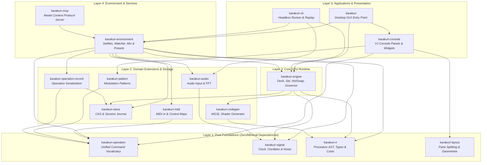
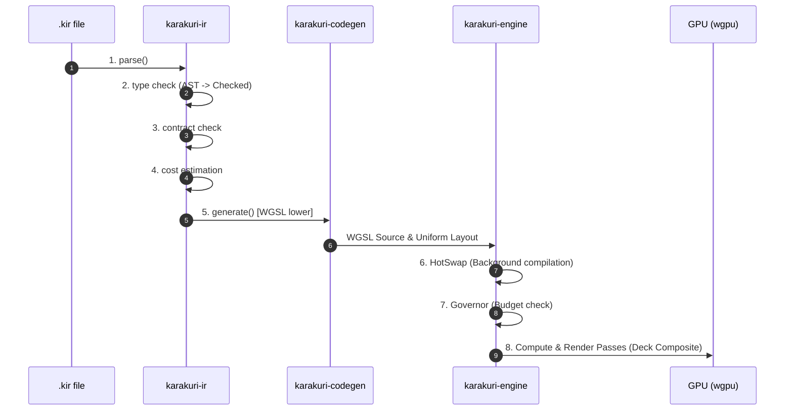
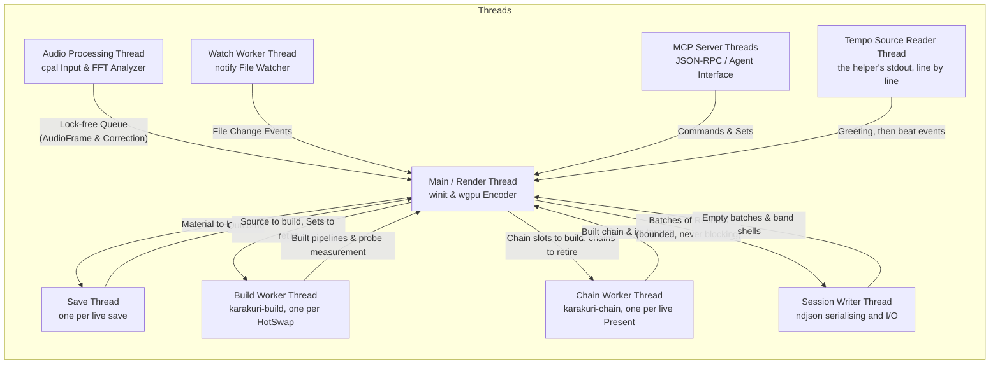

# Karakuri Architecture Guide

This document describes the source code structure, multi-crate architecture, compilation and execution pipeline, threading model, and contributor guide for **Karakuri**, a GPU-native, AI-native real-time visual generation system.

---

## 1. Core Principles & Design Goals

The rules this architecture is built on are **one file each** in
[docs/principles/](principles/), so that they are stated in a single place and cannot drift between
documents. They were previously copied here and into [contributing.md](contributing.md), and the two
copies had already stopped agreeing on which four were the foundational ones.

The ones a reader of this document needs first:

- [Take the mechanism that exists, and pay the bill now](principles/0085-take-the-mechanism-that-exists-and-pay-the-bill-now.md)
- [Cost is known before it is paid](principles/0091-cost-is-known-before-it-is-paid.md)
- [The same inputs produce the same frame](principles/0092-the-same-inputs-produce-the-same-frame.md)
- [The show does not stop, it does not go quiet, and it does not leave the operator's hands](principles/0094-the-show-does-not-stop-it-does-not-go-quiet-and-it-does-not-leave-the-operators-hands.md)

Why each is the way it is — and what was rejected to get there — is in
[docs/adr/](adr/).

---

## 2. Hierarchical Documentation Architecture (The 3-Tier Model)

To avoid documentation drift and provide clear conceptual layering across a 16-crate codebase, Karakuri organizes all architecture and technical specifications into a **3-tier documentation hierarchy**:

- **Tier 1: System Concept & High-Level Map**
  - [`docs/architecture.md`](architecture.md) (this document): The central system guide, multi-crate topology, 8-stage pipeline overview, threading model, and contributor guide.
  - [`docs/architecture/README.md`](architecture/README.md): Navigational directory, 5-layer dependency map, and crate catalog.
- **Tier 2: Subsystem Architectures**
  - [`docs/architecture/console.md`](architecture/console.md): Layout calculation arithmetic (`karakuri-layout`), componentized widget library (`card`, `chip`, `track`, `field`, `fader`, `head`, `pills`, `fold_grip`), modular bay architecture (`mixer/`, `transport/`, `library/`, `inspector/`), unified 38-probe `ControlDescriptor` registry, and hover/focus graphs.
  - [`docs/architecture/engine.md`](architecture/engine.md): The 8-stage `.kir` compilation pipeline, Deck and Set composition graphs, 4-tier residency model (`Live`, `Priming`, `Allocated`, `Parked`), 3-clock timing model, and infallible signal bus.
  - [`docs/architecture/runtime.md`](architecture/runtime.md): Desktop GUI coordinator (`karakuri` readout & bridge subsystems), modular headless CLI runner (`karakuri-cli`), environmental services (`karakuri-environment`), and content-addressed persistence (`karakuri-store`).
  - [`docs/architecture/operations.md`](architecture/operations.md): Unified operation command vocabulary (`karakuri-operation`), zero-allocation session recording, operator permission gates (`gate.rs`, `man`/`sug`/`auto`), sequencer patterns (`karakuri-pattern`), and Model Context Protocol AI tools (`karakuri-mcp`).
- **Tier 3: Invariants, Decisions & Specifications**
  - [`docs/principles/`](principles/): Active, non-negotiable architectural invariants (one file per principle).
  - [`docs/adr/`](adr/): Append-only Architectural Decision Records documenting historical context and rejected alternatives.
  - [`docs/ir-spec.md`](ir-spec.md): Formal grammar, type system, and static contracts of the `.kir` procedural shading language.

---

## 3. Workspace & Crate Architecture

Karakuri is structured as a Cargo workspace with **16 dedicated crates** under [crates/](../crates), organized into five distinct architectural layers:



### Crate Breakdown

| Layer | Crate | Path & Documentation | Responsibility |
|:---:|---|---|---|
| **1** | [karakuri-ir](../crates/karakuri-ir) | [`crates/karakuri-ir/README.md`](../crates/karakuri-ir/README.md) | DSL (`.kir`) parsing, lexing, type checking, contract verification, and static cost estimation |
| **1** | [karakuri-layout](../crates/karakuri-layout) | [`crates/karakuri-layout/README.md`](../crates/karakuri-layout/README.md) | Console arrangement as arithmetic: views and splits with size, min, max, solved to screen rectangles. Zero GPU/window dependency (ADR-0156) |
| **1** | [karakuri-signal](../crates/karakuri-signal) | [`crates/karakuri-signal/README.md`](../crates/karakuri-signal/README.md) | Infallible signal bus (`SignalBus`), signal `confidence` tracking, local monotonic `Oscillator` |
| **1** | [karakuri-operation](../crates/karakuri-operation) | [`crates/karakuri-operation/README.md`](../crates/karakuri-operation/README.md) | **The unified operation vocabulary**: every named command every control surface routes into (ADR-0180), plus operator permission gating (`gate.rs`, ADR-0235). Zero dependencies beyond `std` |
| **2** | [karakuri-codegen](../crates/karakuri-codegen) | [`crates/karakuri-codegen/README.md`](../crates/karakuri-codegen/README.md) | WGSL shader code generation from typed AST (`Checked`), pass fusion, uniform struct layout computation |
| **2** | [karakuri-audio](../crates/karakuri-audio) | [`crates/karakuri-audio/README.md`](../crates/karakuri-audio/README.md) | Real-time audio capture (`cpal`), FFT band analysis, beat tracking, latency offset management |
| **2** | [karakuri-midi](../crates/karakuri-midi) | [`crates/karakuri-midi/README.md`](../crates/karakuri-midi/README.md) | MIDI input event parsing (`midir`) and operator control map converting hardware messages to `Operation`s (ADR-0196) |
| **2** | [karakuri-pattern](../crates/karakuri-pattern) | [`crates/karakuri-pattern/README.md`](../crates/karakuri-pattern/README.md) | Sequencer modulation patterns: 16-step lanes emitting parameter `Operation`s synchronized to `Oscillator::beats` (ADR-0320) |
| **2** | [karakuri-store](../crates/karakuri-store) | [`crates/karakuri-store/README.md`](../crates/karakuri-store/README.md) | Content-addressed artifact storage (keyed by `.kir` SHA-256 hash), `.kbset` pre-resolved Set files (ADR-0231), `.ndjson` session logs |
| **2** | [karakuri-operation-record](../crates/karakuri-operation-record) | [`crates/karakuri-operation-record/README.md`](../crates/karakuri-operation-record/README.md) | **Operation serialization**: translates `Operation` and runtime readings into immutable session records (ADR-0194) |
| **3** | [karakuri-engine](../crates/karakuri-engine) | [`crates/karakuri-engine/README.md`](../crates/karakuri-engine/README.md) | `wgpu` pipeline management, `Deck`/`Set` composition, `HotSwap`, `Governor`, OIT, `Present`, and the one frame loop (`compose` over `Sink`s) |
| **4** | [karakuri-environment](../crates/karakuri-environment) | [`crates/karakuri-environment/README.md`](../crates/karakuri-environment/README.md) | External OS services: modular Setfile packaging (`setfile/`), hot-reloading watcher (`watch/`), directory resolution (`places`), edit history (`history/`), mix transitions, and step clock derivation |
| **4** | [karakuri-mcp](../crates/karakuri-mcp) | [`crates/karakuri-mcp/README.md`](../crates/karakuri-mcp/README.md) | Model Context Protocol JSON-RPC server exposing 10 AI pair-programming tools under operator permission gates (`gate.rs`, ADR-0235) |
| **5** | [karakuri-console](../crates/karakuri-console) | [`crates/karakuri-console/README.md`](../crates/karakuri-console/README.md) | VJ console UI (`egui`): modular bays (`mixer/`, `transport/`, `library/`, `inspector/`, `program`, `staging`, `master`, `sequencer`), componentized widgets (`card`, `chip`, `track`, `field`, `fader`, `head`, `pills`, `fold_grip`), and unified 38-probe `ControlDescriptor` registry |
| **5** | [karakuri-cli](../crates/karakuri-cli) | [`crates/karakuri-cli/README.md`](../crates/karakuri-cli/README.md) | Modular headless runtime: argument parsing (`args.rs`), bit-exact session replay (`replay.rs`), headless snapshot export (`save.rs`), slot aiming (`aiming.rs`), and interactive terminal performance (`live.rs`) |
| **5** | [karakuri](../crates/karakuri) | [`crates/karakuri/README.md`](../crates/karakuri/README.md) | Desktop GUI application: `winit` event loop (`app.rs`), bridge abstraction (`bridge/`: `sinks`, `engine`, `filesystem`, `handlers`), and decoupled telemetry readout (`readout/`: `costs`, `hud`, `dispatch`) |

### Repository Layout

Where everything lives, including the parts that are not crates:

```
crates/
  karakuri-ir/        IR parser, type checker, cost estimation
  karakuri-codegen/   IR → WGSL, uniform layout, pass fusion
  karakuri-engine/    render graph, Set lifecycle, pipeline management, Governor
  karakuri-signal/    local oscillator, synthesized signals, signal bus
  karakuri-audio/     input device, FFT analysis, tempo tracking, beat lock
  karakuri-midi/      wire messages, and operator control map
  karakuri-store/     content-addressed artifact store, ndjson I/O
  karakuri-operation/ unified operation vocabulary and operator permission gate
  karakuri-operation-record/
                      operation to record serialization with runtime readings
  karakuri-layout/    console arrangement arithmetic, solved rectangles
  karakuri-pattern/   16-step sequencer modulation patterns
  karakuri-console/   VJ console UI: modular bays, widgets, control registry
  karakuri-environment/ external OS services: setfile, watcher, places, history
  karakuri-mcp/       Model Context Protocol server for AI assistant pair programming
  karakuri-cli/       modular headless runner, replay, batch renderer, live terminal
  karakuri/           desktop GUI application: app loop, bridge, readout
docs/
  adr/                every decision, with the alternatives that lost — append-only
  architecture.md     central system architecture portal and high-level map
  architecture/       Tier 2 subsystem deep-dives (console, engine, runtime, operations)
  contributing.md     engineering principles, build/test commands, and verification rules
  ir-spec.md          the IR specification. Settled; open questions are empty
  manual.md           how to play it: flags, keys, and what each does
  manual/             the console's manual, published — seven rules, bays, operations
  plugins.md          out-of-process helpers, and why they are out of process
  principles/         the rules in force, one per file — current only
  refactoring.md      architectural refactoring and modernization roadmap
  roadmap.md          the milestones, their status, and the handover
examples/             app presets: .kir procedures of every kind (L1-L5, Field),
                      .kset Set files, and control surface maps
.karakuri/            the store: artifacts, sets, sessions, scratch (gitignored)
```
.githooks/            pre-commit: `cargo fmt --check` on what is staged
                      pre-push:   fmt, clippy and every test
                      enable with `git config core.hooksPath .githooks`
docs/
  adr/                every decision, with the alternatives that lost — append-only
  architecture.md     the codebase architecture, multi-crate map, and pipeline
  contributing.md     engineering principles, build/test commands, and verification rules
  ir-spec.md          the IR. Settled; open questions are empty
  manual.md           how to play it: flags, keys, and what each does
  manual/             the console's manual, published — the seven rules, the
                      words, the console region by region, every operation
  plugins.md          out-of-process helpers, and why they are out of process
  principles/         the rules in force, one per file — current only
  roadmap.md          the milestones, their status, and the handover
examples/             app presets: `.kir` procedures of every kind — L1, L2,
                      L3, Field and L4 — the `.kset` Set files that pair them
                      into something playable, and a control-surface map to
                      copy. `ls examples` is the index; a procedure's `kind`
                      line is which layer it is
.karakuri/            the store: artifacts, sets, sessions, scratch and the
                      edit history (gitignored, and `--store` moves it)
```

### Vocabulary

The words the rest of these documents use for the runtime objects above. They are defined
once here so that a term means the same thing in the roadmap, the manual and the code:

| Term | Meaning |
|---|---|
| Procedure | Code that runs every frame on the GPU, written in the IR |
| Artifact | A saved procedure. Content-addressed and immutable |
| Slot | Three things, and it is worth knowing which. A **layer slot** is a position within a Set (L1/L2/L3/L4); a **deck slot** is a position within the deck, holding a whole Set; an **input slot** is a declared input on a node. The three are set out under [Words that carry more than one sense](#words-that-carry-more-than-one-sense), and the clash is recorded rather than resolved (ADR-0049) — renaming either of the first two is churn until something depends on telling them apart |
| Deck | Where prepared-but-not-showing material lives, at Set granularity. Up to four slots; one to four of them Live and composited, the rest resident |
| Residency | How ready a deck slot is, over three levels: **Live** (stepped, drawn, composited), **Priming** (stepped, drawn into its own cell, out of the mix, and asked for), **Allocated** (the same, and asked of nothing). Every slot steps every frame and every slot is drawn, so residency decides what reaches the mix rather than whether the material runs. It is **two facts, not one** — what the operator *requested*, which only they change, and what the engine is *effectively* doing, which the governor recomputes each pass |
| Parked | Requested Priming, effective Allocated: waiting for budget, **not cancelled**. It resumes by itself when there is room, because the request is never overwritten — every pass recomputes the effective level from it |
| Set | Filled slots forming one video source. The unit of compilation and of lifecycle |
| VideoSource | The interface L5 consumes. Set is one implementation of it |
| Signal bus | Input distributed to every layer. Always complete; values carry a confidence |
| Local oscillator | The single source of truth for phase and tempo. External input is only correction |
| Record stream | The path engine state is mutated through, so that a session replays. ndjson. **Everything an operator moves goes through it, and so does the material** — see [P-0090](principles/0090-a-surface-offers-it-never-decides.md) |
| Set file | A Set's state projection. No time in it |
| Session stream | The timeline. A Set file followed by `tick` records and the edits between them |

### The Layer Model

Six positions, `L0` through `L5`. **This is not the IR's list of six `kind`s**, and the two
lists overlap on five: `L1` through `L5` are in both, `Field` is a `kind` with no position
here, and `L0` is a position here with no `kind` file at all. **`L5` used to be the second
such position and is not any more**: [ir-spec.md](ir-spec.md) stated its absence as a
*condition* — compositing was fixed, so there was no code to lower — and
[ADR-0340](adr/0340-kind-l5-is-written-and-the-master-chain-is-an-ordered-list-of-them.md)
ended it by writing the compositing down.

| Position | Role |
|---|---|
| L0 | Signal bus. Audio, tempo, MIDI and synthesized values |
| L1 | Geometry generation. Vertices, particles, SDF builtins used inline |
| L2 | Deformation and motion. Time-axis modulation, physics |
| L3 | Camera and space. Viewpoint, motion grammars |
| L4 | Render and material. Raster, raymarch, splatting |
| L5 | Composite. Set mixing, transitions, post, output routing |

*Layer* in this column is the model position and nothing else. The other two senses of the
word are under [Words that carry more than one sense](#words-that-carry-more-than-one-sense).

The signatures the six `kind`s have as an algebra, what breaks L2's endomorphism, how
several sources or several renderers compose within one position, and how a consumer's
missing attribute is synthesised are all [ir-spec.md](ir-spec.md)'s. They are not restated
here.

**L5 has a writable form, and giving it one was not an extension of the algebra.**
`karakuri-engine/src/node/merge.rs` already wrote the signature: `[Texture] -> Texture`. A
master effect is that with one input and the mixer is the same with several, so admitting frame
effects was adding `L5` to `Kind::ALL` — whose one stated reason for excluding it, no code to
lower, lapsed the moment an L5 could be authored. Fan-in is solved by `uses` plus `edge`, and
`uses <name> : Texture` is that declaration; a per-deck effect and a master effect become one
node at different points, which nothing builds; and the deck count stops being a system
constant, since how many inputs an L5 folds is a property of the procedure rather than of one
built-in shader. **What is built is the kind and not the chain**: the master chain is still
three hand-written passes, so a `.kir` declaring `kind L5` compiles, costs and lowers and has
nowhere to run. **Feedback was the exception and is not one
any more**: reading the previous frame is a cycle, and which cut it reads was decided on
2026-09-09 — either of them, chosen where the pass is instantiated, with only the chosen one
retained
([ADR-0317](adr/0317-the-master-chain-is-three-fixed-passes-and-feedback-reads-either-cut.md)).
**The writable form was decided on 2026-09-10 and the kind is built**
([ADR-0340](adr/0340-kind-l5-is-written-and-the-master-chain-is-an-ordered-list-of-them.md)):
`Kind::ALL` is six, a `.kir` may declare `kind L5`, and the row in the table above is a model
position **and** a kind. The specification is in the present tense at
[ir-spec.md](ir-spec.md)'s *The `frame` block (L5)*. **What is still nobody's is the chain** —
the master chain becoming an ordered list of L5 slots, which is *L5's chain — specified, not
built* and [roadmap.md](roadmap.md)'s M5.16.

Two things sit orthogonal to the positions: the **control plane** — agents, director, mix
agent, generation worker — and the **library** — search, genealogy, embeddings, thumbnails —
on top of the content addressing. Where each stands is [roadmap.md](roadmap.md)'s.

### Three Clocks

The single most load-bearing idea in the design. These must never collapse into each other.

| Clock | Period | What happens |
|---|---|---|
| Frame | 8–16 ms | GPU execution and parameter evaluation only. No allocation, no compilation |
| Beat / bar | 0.5–4 s | Variant switching, parameter morphs, transitions. Selection among precompiled options only |
| Generation | seconds to minutes | LLM writes IR, validation, shader compilation. Background worker |

The consequence is that **AI works ahead of time and the runtime only selects**. An agent
reacting to music chooses from a pool it prepared earlier and queues generation for material
it expects to need later. No LLM call is ever on a path a frame waits for.

### Words that carry more than one sense

Three words each carry more than one sense. They are listed here because a decision written
in a word that means two things cannot be recorded —
`docs/contributing.md` §4 asks that names be
disjoint by name and not merely disjoint in practice.

**`layer` carries three senses.**

- **A kind** — what a procedure lowers to: `L1`, `L2`, `L3`, `L4`, `Field`, `L5`. This is the
  `layer` field on a `slot`, `capacity`, `param`, `bind` and `procedure` record, the
  `karakuri_store::record::Layer` type and `karakuri_operation::Layer`. There are six. A
  bare *layer* in [ir-spec.md](ir-spec.md) means this.
- **A position in the architecture model** — the six rows above. Overlaps the kinds on five.
- **What one deck slot contributes to the mix**, stacked in deck slot order. **Never written
  bare**: it is *a deck slot's layer* or *a deck's layer*, with its owner attached.
  [Concepts](manual/concepts.html) disowns the loose reading — *"A deck is not a layer in an
  image editor"* — because a deck is running material with its own time, which is why it has
  a residency rather than a visibility.

Three sentences in the manual still write the third sense bare: *"what a layer covers"* and
*"a layer that has to disappear"* on [the operations page](manual/operations.html), and
*"touches what a layer covers"* on [the console page](manual/console.html). Ordinary-English
uses of the word are not this vocabulary and are left alone.

**`authority` carries two senses, and both are in force.**

- **Where a rule lives** —
  [P-0090](principles/0090-a-surface-offers-it-never-decides.md). A constraint
  on what the instrument will accept lives where the record is applied, so every surface meets
  the same wall. This sense is about code.
- **Who may move a control** — `man / sug / auto`, rule 06 of
  [the seven rules](manual/index.html). This sense is about an operator and an agent, and it
  is set per node of a Set
  ([ADR-0211](adr/0211-authority-is-set-per-node-and-the-record-is-the-sessions.md)).

They are not the same word twice by accident. P-0090 is why the second cannot be built as a
lock one surface holds: a rule that binds one surface binds none.

**`slot` carries three senses.** The first two are
[ADR-0049](adr/0049-slot-means-two-things-and-the-clash-is-recorded.md), which recorded the
clash rather than resolving it.

- **A node of a Set.** `Record::Slot`, and the `slot` lines in a Set file — a procedure at a
  `(layer, index)` address. Say *a node of a Set*.
- **A member of the deck.** The `slot: u8` field on every session record, and the deck's own
  indexing. Say *a deck slot*.
- **A declared input on a node.** `Record::Edge`'s `slot: String` — what `uses far : Geometry`
  names. Say *an input slot*. This one is not in ADR-0049.

---

## 3. Compilation & Execution Pipeline

The journey from a `.kir` file to rendered GPU pixels spans 8 explicit stages:



1. **Parse Stage** (`karakuri-ir::parse`): Lexical tokenization and recursive-descent parsing into an unchecked AST.
2. **Type Check Stage** (`karakuri-ir::typed`): Type inference and type annotation verification. Produces a typed `Checked` AST.
3. **Contract Check Stage** (`karakuri-ir::check`): Mandated attribute assignment check (`position`, etc.), lifespan constraints (`spawn`/`kill`), contract compliance.
4. **Cost Estimation Stage** (`karakuri-ir::cost`): Static analysis of execution cost (element counts, loop bounds, field call counts).
5. **WGSL Lowering Stage** (`karakuri-codegen`): Lowering `Checked` trees to WebGPU compute, vertex, and fragment WGSL text, ensuring 16-byte uniform alignment padding.
6. **HotSwap & Compilation Stage** (`karakuri-engine::swap`): Asynchronous background `wgpu` pipeline creation and atomic swap on frame boundaries.
7. **Governor Verification Stage** (`karakuri-engine::governor`): Frame budget monitoring against `Probe` timing measurements, initiating rollback upon budget overrun.
8. **Execution Stage** (`karakuri-engine::deck` / `present`): GPU compute pass dispatch (L1/L3) and render pass execution (L4, Weighted Blended OIT, Tone Mapping).

---

## 4. Crate Deep Dives & Subsystem Architecture Links

For complete subsystem architectural specifications, component breakdowns, and data structures, see the **Tier 2 Subsystem Guides**:
- [Console & Layout Subsystem (`docs/architecture/console.md`)](architecture/console.md)
- [Engine, Codegen & IR Subsystem (`docs/architecture/engine.md`)](architecture/engine.md)
- [Runtime, IO & Environmental Integration (`docs/architecture/runtime.md`)](architecture/runtime.md)
- [Operations, Control Plane & AI Interface (`docs/architecture/operations.md`)](architecture/operations.md)

### 4.1 karakuri-ir
- **Crate Documentation**: [`crates/karakuri-ir/README.md`](../crates/karakuri-ir/README.md)
- **Subsystem Guide**: [Engine Subsystem](architecture/engine.md)
- **Purpose**: Parsing, semantic checking, and static complexity analysis of `.kir` DSL files.
- **Key Modules**:
  - `ast.rs` / `typed.rs`: AST node definitions (`Kind::L1` [geometry], `Kind::L2` [motion], `Kind::L3` [camera], `Kind::L4` [renderers], `Kind::L5` [composite], `Kind::Field` [spatial fields]) and the `Checked` typed tree.
  - `check.rs`: Enforces language contracts (e.g., all emitted attributes assigned on every branch).
  - `cost.rs`: Static cost model and field evaluation call counter.

### 4.2 karakuri-codegen
- **Crate Documentation**: [`crates/karakuri-codegen/README.md`](../crates/karakuri-codegen/README.md)
- **Subsystem Guide**: [Engine Subsystem](architecture/engine.md)
- **Purpose**: Translating checked IR trees into WGSL shader code and uniform buffer layouts with pass fusion.
- **Key Modules**:
  - `l1.rs`: Lowers `spawn`/`element` blocks to compute shaders with double-buffered `prev`/`next` state arrays.
  - `l3.rs`: Lowers camera state procedures to single-invocation compute passes.
  - `l4.rs`: Lowers vertex and fragment procedures, expanding point topologies to billboards.
  - `field.rs`: Inlines spatial field function bodies into caller modules.
  - `layout.rs`: Computes uniform struct member offsets and trailing 16-byte alignment padding.

### 4.3 karakuri-engine
- **Crate Documentation**: [`crates/karakuri-engine/README.md`](../crates/karakuri-engine/README.md)
- **Subsystem Guide**: [Engine Subsystem](architecture/engine.md)
- **Purpose**: `wgpu` pipeline management, multi-pass render graph execution, compositing, and the real-time frame loop.
- **Key Modules**:
  - `deck.rs`: Manages up to 4 deck slots and composites them using `add`, `over`, or `max` blend modes.
  - `frame.rs`: The one frame loop — `compose` asks every `Sink` for a target, commits, renders the deck, and presents.
  - `set.rs`: Manages a node graph (`Set`) representing a complete visual scene.
  - `swap.rs`: `HotSwap` state machine for safe asynchronous pipeline transitions on background threads.
  - `governor.rs`: Tracks frame execution budget (`budget_ms`) and enforces automatic slot parking.
  - `oit.rs`: Weighted Blended Order-Independent Transparency for alpha blending.
  - `present.rs`: `TonemapOp` (`Clamp`, `Reinhard`, `Aces`, `AgX`) and color space conversions.

### 4.4 karakuri-signal, karakuri-audio, karakuri-midi
- **Crate Documentation**: [`crates/karakuri-signal/README.md`](../crates/karakuri-signal/README.md), [`crates/karakuri-audio/README.md`](../crates/karakuri-audio/README.md), [`crates/karakuri-midi/README.md`](../crates/karakuri-midi/README.md)
- **Subsystem Guides**: [Engine Subsystem](architecture/engine.md), [Runtime Subsystem](architecture/runtime.md)
- **Purpose**: Signal propagation, real-time audio capture, and MIDI controller integration.
- **Key Design Principles**:
  - **Complete Bus**: The `SignalBus` never fails or returns an `Option`. Unconnected signals return fallback values with a low `confidence` score (0.0..1.0).
  - **Local Oscillator**: Rendering reads from a local monotonic `Oscillator` rather than system clocks; audio beat tracking supplies small `Correction` deltas.
  - **Latency Offset**: Audio-visual latency is adjusted via `--latency-offset-ms` (signed) to compensate for external PA/projector delays.

### 4.5 karakuri-store
- **Crate Documentation**: [`crates/karakuri-store/README.md`](../crates/karakuri-store/README.md)
- **Subsystem Guide**: [Runtime Subsystem](architecture/runtime.md)
- **Purpose**: Content-addressed artifact storage keyed by SHA-256 of `.kir` source text, `.kbset` pre-resolved Set files (ADR-0231), and `.ndjson` session logs.

### 4.6 karakuri-cli
- **Crate Documentation**: [`crates/karakuri-cli/README.md`](../crates/karakuri-cli/README.md)
- **Subsystem Guide**: [Runtime Subsystem](architecture/runtime.md)
- **Purpose**: Modular headless runner, offline batch renderer, and session replayer (decomposed in P22).
- **Key Modules**:
  - `args.rs`: CLI command-line arguments, subcommands, and flags.
  - `replay.rs`: Bit-exact, zero-allocation session replayer executing `.ndjson` journal files against engine state.
  - `save.rs`: Headless snapshot export and Set saving.
  - `aiming.rs`: Targeted Set loading, deck slot binding, and procedural parameter initialization.
  - `live.rs`: Real-time terminal interactive session controller and keymap dispatch.
  - `app.rs`: Terminal runner initialization and loop coordinator.

### 4.7 karakuri-environment
- **Crate Documentation**: [`crates/karakuri-environment/README.md`](../crates/karakuri-environment/README.md)
- **Subsystem Guide**: [Runtime Subsystem](architecture/runtime.md)
- **Purpose**: External OS services, file systems, device IO, and shared system coordination (modularized in P23).
- **Key Modules**:
  - `setfile/`: Modular Set file system (`bundle.rs`, `codec.rs`, `types.rs`, `summary.rs`, `binding.rs`).
  - `watch/` / `watch.rs`: Hot-reloading file system watcher for live `.kir` shader editing.
  - `places.rs`: Preset and storage directory resolution with 4-candidate search heuristics (ADR-0230).
  - `history.rs` / `history/`: Undo/redo version history for nodes and Sets.
  - `audio.rs` / `midi.rs` / `tempo_source.rs`: External peripheral and device integrations.
  - `clock.rs`: Single deterministic integer step count derivation (ADR-0297).

### 4.8 karakuri (Desktop GUI Application)
- **Crate Documentation**: [`crates/karakuri/README.md`](../crates/karakuri/README.md)
- **Subsystem Guide**: [Runtime Subsystem](architecture/runtime.md)
- **Purpose**: Desktop GUI application coordinating `winit` windowing, `egui` console rendering, and `wgpu` engine presentation (modularized in P24, P33).
- **Key Modules**:
  - `readout/`: Decoupled performance monitoring (`costs.rs`, `hud.rs`, `dispatch.rs`, `mod.rs`).
  - `bridge/`: Hardware and OS abstraction (`sinks.rs`, `engine.rs`, `filesystem.rs`, `handlers.rs`).
  - `app.rs`: Main window event loop and frame presentation.

### 4.9 karakuri-mcp
- **Crate Documentation**: [`crates/karakuri-mcp/README.md`](../crates/karakuri-mcp/README.md)
- **Subsystem Guide**: [Operations Subsystem](architecture/operations.md)
- **Purpose**: Model Context Protocol (JSON-RPC) server exposing 10 AI pair-programming tools on background worker threads, strictly gated by operator permission classes in `karakuri-operation::gate` (ADR-0235).

### 4.10 karakuri-console & karakuri-layout
- **Crate Documentation**: [`crates/karakuri-console/README.md`](../crates/karakuri-console/README.md), [`crates/karakuri-layout/README.md`](../crates/karakuri-layout/README.md)
- **Subsystem Guide**: [Console Subsystem](architecture/console.md)
- **Purpose**: The live VJ performance console: pure arithmetic layout solving (`karakuri-layout`), componentized widget library (`view::widgets`), modular bays (`mixer/`, `transport/`, `library/`, `inspector/`, `program`, `staging`, `master`, `sequencer`), and unified 38-probe `ControlDescriptor` registry.

### 4.11 karakuri-operation, karakuri-operation-record & karakuri-pattern
- **Crate Documentation**: [`crates/karakuri-operation/README.md`](../crates/karakuri-operation/README.md), [`crates/karakuri-operation-record/README.md`](../crates/karakuri-operation-record/README.md), [`crates/karakuri-pattern/README.md`](../crates/karakuri-pattern/README.md)
- **Subsystem Guide**: [Operations Subsystem](architecture/operations.md)
- **Purpose**: Control plane foundation: universal `Operation` enum, zero-allocation session recording, operator permission gates (`gate.rs`, `man`/`sug`/`auto`), and 16-step sequencer modulation patterns.

---

## 5. Threading & Concurrency Model

Karakuri maintains high real-time performance through a decoupled multi-threaded architecture:



- **Main / Render Thread**: Drives the `winit` event loop and encodes `wgpu` render passes. Must never block or allocate during frame rendering.
- **Audio Thread**: Runs `cpal` callbacks, FFT band analysis, and beat tracking, sending measurements across a lock-free channel.
- **Watch Worker Thread**: Monitors `.kir` files via `notify`, triggering background parsing and lowering upon edits.
- **MCP Server Threads**: Handles incoming Model Context Protocol connections from external AI agents.
- **Build Worker Thread**: One per `HotSwap`, named `karakuri-build`. **This is the thread §3's *asynchronous background `wgpu` pipeline creation* names**: it builds a Set against the same `Device` and `Queue` the render thread renders with — a refcount bump rather than a second device, which is the whole reason the finished pipelines are usable when they arrive — and it probes what one costs before the swap. A poll loop rather than a blocking one, because it has two jobs: asking the source for work, and freeing whatever the render thread retired. A `recv` that blocked until the next request would leave a rolled-back Set's buffers resident until the operator happened to edit a file again.
- **Chain Worker Thread**: One per `ChainSwap`, named `karakuri-chain`, and one `ChainSwap` per `Present` whose master chain a live operator can change — the desktop GUI's and `karakuri-cli`'s live loop's, and neither the offscreen renderer's nor a replay's. It compiles each L5 chain slot, creates its pipeline, and allocates the chain's entry target, ping-pong targets, retention history and bind groups, against the same `Device` and `Queue` the render thread renders with. It also drains the graveyard the render thread hands retired chains to, so the pipelines and textures a chain displaced are freed here rather than where the frame is encoded ([ADR-0033](adr/0033-freeing-on-the-render-thread-is-the-same-invariant-as-allocating.md)). Separate from the build worker rather than a second `Source` on it, because a press on a Master row may not wait behind a Set build and its probe measurement ([ADR-0255](adr/0255-three-clocks-run-at-once-and-a-slower-ones-work-never-lands-on-a-faster-one.md), [ADR-0354](adr/0354-a-chain-is-compiled-on-a-thread-of-its-own-and-lands-at-a-frame-boundary.md)). The render thread collects what it finished at the next frame boundary with `try_recv` and never blocks; where two builds are waiting the newest is installed and the rest are retired.
- **Session Writer Thread**: One per open recording. `Line::new` serialises eagerly and a `String` is an allocation, so a frame that produced a line would be allocating on the render thread; the frame path only ever moves a `Record` into a `Vec` that already has room, and this thread does the serialising and the I/O. The channel is bounded and a frame that finds it full does not block, does not grow, and does not silently skip — it counts the batch as dropped and says so at the end, because a session with a hole in it is not a session. Batches and audio band buffers circulate back on a return channel, so nothing allocates one after start-up.
- **Tempo Source Reader Thread**: One per `--tempo-source` helper, named `tempo-source`. It reads the child's stdout line by line and sends the greeting and then each beat event over a channel. Reading through a channel rather than straight off the pipe is what makes a timeout expressible at all — a source that spawns and never writes used to hang the whole run before the window opened, with nothing on the terminal saying why.
- **Save Thread**: One per live save (the `k` key), spawned and detached. It writes the Set file into the store — which may not happen on a frame. **Nothing here reads a `.kir`**: the run keeps the text it compiled, so what a slot is running is a content hash from launch onward and this thread puts those bytes in the store as it writes the file that names them. That is what makes a save follow the picture rather than the disk, and it is also why a windowed run that saves nothing creates no store at all — only `--record-session`, whose `procedure` records a replay has to resolve, needs the launch sources on disk before the first frame. The outcome comes back over a channel the frame loop drains, and the `save` record is written there rather than at the key press, so a stream never claims a file the disk refused. No frame waits for one; the *run* waits once, at exit, bounded, so a save pressed in the last second is still recorded and a hung disk still cannot prevent quitting. A pool would be machinery for a rate of a few an hour.

---

## 6. Contributor & Extension Guide

### 6.1 Adding a New IR Builtin Function

1. **`karakuri-ir`**:
   - Add the variant to `Builtin` enum in `src/builtin.rs`.
   - Add type checking and arity validation in `src/check.rs`.
   - Assign cost in `src/cost.rs`.
2. **`karakuri-codegen`**:
   - Implement lowering logic / WGSL string generation in `src/lower.rs` (or appropriate sub-module).
3. **Testing**:
   - Add an end-to-end test in `karakuri-codegen/tests/naga_test.rs` to verify Naga validation passes.

### 6.2 Measuring a Crate Seam

Before moving code across a package boundary, measure what it reaches. Each of these three
commands finds what the one before it cannot, which is why all three are kept:

```sh
sed 's|//.*||' <file> | grep -o 'crate::[A-Za-z_][A-Za-z0-9_]*' | sort -u   # code
grep -o 'crate::[A-Za-z_][A-Za-z0-9_]*' <file> | sort -u                    # and doc links
grep -o 'crate::{[^}]*}' <file> | sort -u                                   # and brace groups
```

Intra-doc links are the ones that rot in silence: a binary crate gets no rustdoc run, so a
trait method named as an inherent one fails nothing until the code is in a library. Two such
links in `karakuri-cli` had been broken from the day they were written and were found only by
the move to `karakuri-environment`.

### 6.3 Adding a New Tone Mapper / Composite Mode

1. **`karakuri-engine`**:
   - Add variant to `TonemapOp` or `Blend` in `src/present.rs` / `src/deck.rs`.
   - Add shader logic in the corresponding WGSL presentation shader.
2. **`karakuri-cli`**:
   - Map key binding in `src/main.rs` and update `--help` output.

---

## 7. Related Documents

- [README.md](../README.md): The front door — what this is, a quickstart, and the document map
- [architecture/](architecture/README.md): The Tier 2 Subsystem Architecture Documentation index:
  - [Console & Layout Subsystem](architecture/console.md)
  - [Engine, Codegen & IR Subsystem](architecture/engine.md)
  - [Runtime, IO & Environmental Integration](architecture/runtime.md)
  - [Operations, Control Plane & AI Interface](architecture/operations.md)
- [principles/](principles/): The rules in force, one per file — current only
- [adr/](adr/): Every decision, with the alternatives that lost — append-only
- [ir-spec.md](ir-spec.md): `.kir` DSL language specification
- [refactoring.md](refactoring.md): Architectural refactoring and modernization roadmap (Phases 1–5)
- [roadmap.md](roadmap.md): The milestones, what each is waiting on, and the handover
- [manual.md](manual.md): VJ operator manual
