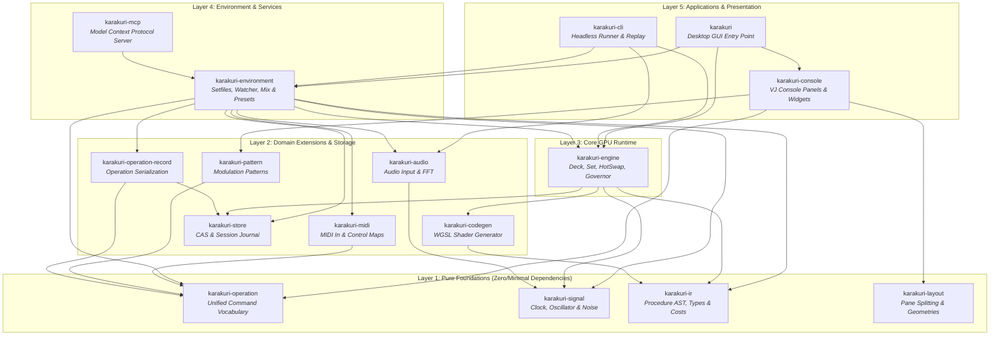

# Karakuri Architecture Guide & Subsystem Index

Welcome to the architectural documentation for **Karakuri**, a GPU-native, AI-native real-time visual performance system.

This directory establishes a structured, **3-tier documentation model** covering the entire system from high-level architectural invariants down to crate-level implementations and historical architectural decisions.

---

## 1. The 3-Tier Documentation Model

To prevent documentation drift and maintain clarity across a complex multi-crate workspace, Karakuri organizes architectural knowledge into three distinct tiers:

```
┌──────────────────────────────────────────────────────────────────┐
│ Tier 1: System Concept & High-Level Map                          │
│ docs/architecture.md, docs/architecture/README.md                │
│ System overview, design goals, multi-crate topology, dataflow    │
└─────────────────────────────────┬────────────────────────────────┘
                                  │
                                  ▼
┌──────────────────────────────────────────────────────────────────┐
│ Tier 2: Subsystem Architectures                                  │
│ docs/architecture/{console,engine,runtime,operations}.md         │
│ Deep dives into modular subsystems, components, and interactions │
└─────────────────────────────────┬────────────────────────────────┘
                                  │
                                  ▼
┌──────────────────────────────────────────────────────────────────┐
│ Tier 3: Decisions & Invariants                                   │
│ docs/principles/, docs/adr/, docs/ir-spec.md                     │
│ Immutable invariants, architectural decision records, IR grammar │
└──────────────────────────────────────────────────────────────────┘
```

### Tier 1: System Concept & High-Level Map
- **[`docs/architecture.md`](../architecture.md)**: The central architectural portal, multi-crate breakdown, pipeline overview, threading model, and contributor guide.
- **[`docs/architecture/README.md`](README.md)** (this document): The navigational hub linking subsystems, crate topologies, and documentation layers.

### Tier 2: Subsystem Architectures
Detailed architectural specifications for each major domain of the system, complete with module breakdowns, data structures, and cross-crate links:
- **[Console & Layout Subsystem](console.md)**: UI layout arithmetic (`karakuri-layout`), componentized widgets, modular bays, `ControlDescriptor` registry, and hover/focus graphs.
- **[Engine & Rendering Subsystem](engine.md)**: The 8-stage `.kir` compilation pipeline, Deck/Set execution graphs, residency lifecycle, 3-clock model, and signal bus.
- **[Runtime & Environment Subsystem](runtime.md)**: Desktop GUI coordinator (`karakuri`), headless runner (`karakuri-cli`), environmental services (`karakuri-environment`), and artifact store (`karakuri-store`).
- **[Operations & Control Plane Subsystem](operations.md)**: Single operation vocabulary (`karakuri-operation`), immutable session journals, operator permission gates (`gate.rs`), sequencer patterns, and AI/MCP interface (`karakuri-mcp`).

### Tier 3: Decisions & Invariants
- **[Principles (`docs/principles/`)](../principles/)**: The active, non-negotiable architectural invariants enforced across the codebase.
- **[Architectural Decision Records (`docs/adr/`)](../adr/)**: Append-only log recording every architectural choice, context, and rejected alternatives.
- **[IR Specification (`docs/ir-spec.md`)](../ir-spec.md)**: Formal grammar, type system, and static contracts of the `.kir` procedural shading language.

---

## 2. Workspace Crate Architecture

Karakuri is organized as a Cargo workspace with **16 modular crates** arranged into five distinct architectural layers. Dependencies flow strictly downward from high-level applications to zero-dependency foundation leaves.



---

## 3. Crate Catalog & Documentation Cross-References

Each crate in the workspace maintains its own detailed `README.md` documenting its public API, internal module layout, and test verification suite. The table below provides two-way links between the architecture documentation and crate-level documentation:

| Layer | Crate | Subsystem Guide | Crate Documentation | Primary Responsibility |
|:---:|:---|:---|:---|:---|
| **5** | `karakuri` | [Runtime](runtime.md) | [`crates/karakuri/README.md`](../../crates/karakuri/README.md) | Desktop GUI windowing (`winit`), bridge coordination, readout event dispatch |
| **5** | `karakuri-console` | [Console](console.md) | [`crates/karakuri-console/README.md`](../../crates/karakuri-console/README.md) | VJ console UI (`egui`), modular bays, widget library, control registry |
| **5** | `karakuri-cli` | [Runtime](runtime.md) | [`crates/karakuri-cli/README.md`](../../crates/karakuri-cli/README.md) | Headless session runner, offline batch renderer, bit-exact journal replayer |
| **4** | `karakuri-environment` | [Runtime](runtime.md) | [`crates/karakuri-environment/README.md`](../../crates/karakuri-environment/README.md) | External OS services: Setfiles (`.kset`/`.kbset`), file watcher, presets, history |
| **4** | `karakuri-mcp` | [Operations](operations.md) | [`crates/karakuri-mcp/README.md`](../../crates/karakuri-mcp/README.md) | Model Context Protocol JSON-RPC server exposing tools to external AI agents |
| **3** | `karakuri-engine` | [Engine](engine.md) | [`crates/karakuri-engine/README.md`](../../crates/karakuri-engine/README.md) | GPU execution runtime (`wgpu`): Deck, Set, HotSwap, Governor, OIT, Tone mapping |
| **2** | `karakuri-codegen` | [Engine](engine.md) | [`crates/karakuri-codegen/README.md`](../../crates/karakuri-codegen/README.md) | AST lowering into optimized WGSL shader modules with 16-byte uniform alignment |
| **2** | `karakuri-audio` | [Runtime](runtime.md) | [`crates/karakuri-audio/README.md`](../../crates/karakuri-audio/README.md) | Real-time audio capture (`cpal`), lock-free ring buffer, FFT spectrum, beat tracking |
| **2** | `karakuri-midi` | [Runtime](runtime.md) | [`crates/karakuri-midi/README.md`](../../crates/karakuri-midi/README.md) | MIDI controller event decoding, note/CC to `Operation` mapping |
| **2** | `karakuri-pattern` | [Operations](operations.md) | [`crates/karakuri-pattern/README.md`](../../crates/karakuri-pattern/README.md) | Sequencer modulation patterns: 16-step lanes emitting parameter operations |
| **2** | `karakuri-store` | [Runtime](runtime.md) | [`crates/karakuri-store/README.md`](../../crates/karakuri-store/README.md) | Content-addressed artifact store (`.kir`), resolved Sets (`.kbset`), `.ndjson` journals |
| **2** | `karakuri-operation-record` | [Operations](operations.md) | [`crates/karakuri-operation-record/README.md`](../../crates/karakuri-operation-record/README.md) | Pure translation of operations and runtime readings into immutable session records |
| **1** | `karakuri-operation` | [Operations](operations.md) | [`crates/karakuri-operation/README.md`](../../crates/karakuri-operation/README.md) | Universal operation command vocabulary and operator permission gating (`gate.rs`) |
| **1** | `karakuri-signal` | [Engine](engine.md) | [`crates/karakuri-signal/README.md`](../../crates/karakuri-signal/README.md) | Infallible signal bus, confidence scores, local phase-locked oscillator |
| **1** | `karakuri-ir` | [Engine](engine.md) | [`crates/karakuri-ir/README.md`](../../crates/karakuri-ir/README.md) | Procedural shading DSL (`.kir`), parser, type-checker, contract verification, cost estimation |
| **1** | `karakuri-layout` | [Console](console.md) | [`crates/karakuri-layout/README.md`](../../crates/karakuri-layout/README.md) | Arithmetic split tree, solved rectangle bounding boxes, zero GPU dependency |

---

## 4. Subsystem Architecture Guides

To explore a specific subsystem in detail, consult the corresponding Tier 2 architectural guide:

1. **[Console Subsystem (`console.md`)](console.md)**:
   Covers `karakuri-console` and `karakuri-layout`. Explains layout solving without GPU dependencies, the componentized widget library (`card`, `chip`, `track`, `field`, `fader`, `head`, `pills`, `fold_grip`), the modular bays (`mixer/`, `transport/`, `library/`, `inspector/`, `program`, `staging`, `master`, `sequencer`), the unified 38-probe `ControlDescriptor` registry, and the hover/focus navigation subsystems.

2. **[Engine Subsystem (`engine.md`)](engine.md)**:
   Covers `karakuri-engine`, `karakuri-codegen`, `karakuri-ir`, and `karakuri-signal`. Explains the 8-stage pipeline from `.kir` source to GPU pixels, the Deck and Set composition lifecycle, the 4-tier residency model (`Live`, `Priming`, `Allocated`, `Parked`), the strict 3-clock timing discipline, and the infallible signal bus.

3. **[Runtime Subsystem (`runtime.md`)](runtime.md)**:
   Covers `karakuri`, `karakuri-cli`, `karakuri-environment`, `karakuri-audio`, `karakuri-midi`, and `karakuri-store`. Explains GUI windowing and bridge coordination, headless CLI execution and replay, environmental services (Setfile bundles, file watching, presets, history), and content-addressed storage.

4. **[Operations Subsystem (`operations.md`)](operations.md)**:
   Covers `karakuri-operation`, `karakuri-operation-record`, `karakuri-pattern`, and `karakuri-mcp`. Explains the unified command grammar, zero-allocation session recording, operator permission gates (`gate.rs`, `man`/`sug`/`auto`), sequencer pattern generation, and Model Context Protocol AI tool integration.
