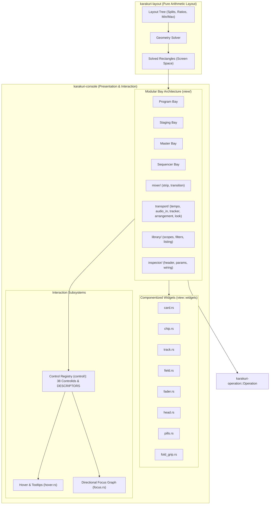
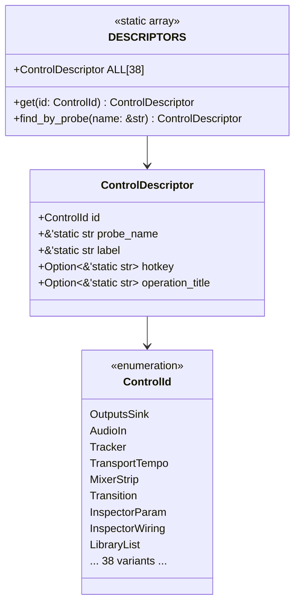

# Console & Layout Subsystem Architecture

This document specifies the architecture of the **Console & Layout Subsystem** in Karakuri, encompassing [`karakuri-console`](../../crates/karakuri-console/README.md), [`karakuri-layout`](../../crates/karakuri-layout/README.md), and their interactions with [`karakuri-pattern`](../../crates/karakuri-pattern/README.md) and [`karakuri-operation`](../../crates/karakuri-operation/README.md).

---

## 1. System Role & Architecture Overview

The Console Subsystem provides the real-time visual operator interface for live VJ performance, inspection, and parameter modulation. It translates pointer interactions, keyboard events, and focus transitions into strongly-typed operations without any direct GPU hardware access or device coupling.



### Upstream and Downstream Links
- **Crate Documentation**:
  - [`karakuri-console`](../../crates/karakuri-console/README.md): egui-based UI views, panels, and input mapping.
  - [`karakuri-layout`](../../crates/karakuri-layout/README.md): Pure geometric layout arithmetic.
  - [`karakuri-pattern`](../../crates/karakuri-pattern/README.md): Step sequencer modulation pattern data structures.
  - [`karakuri-operation`](../../crates/karakuri-operation/README.md): Unified operation vocabulary.
- **Architectural Context**:
  - [System Overview](README.md): 3-tier architectural hierarchy and crate topology.
  - [Operations Subsystem](operations.md): How console controls route into the unified command vocabulary.
  - [Principles](../principles/): [ADR-0156](../adr/0156-the-consoles-arrangement-is-a-tree-this-repository-owns.md) (Arithmetic layout Seam).

---

## 2. Layout Calculation: Pure Arithmetic Tree (`karakuri-layout`)

Following [ADR-0156](../adr/0156-the-consoles-arrangement-is-a-tree-this-repository-owns.md), layout calculation is strictly decoupled from UI rendering toolkits, OS windows, and GPU devices.

### 2.1 Design Invariants
1. **Zero Device Dependency**: `karakuri-layout` does not depend on `winit`, `wgpu`, `egui`, or OS graphics contexts. It is a pure leaf crate with zero external dependencies beyond `std`.
2. **Deterministic Arithmetic**: Given screen dimensions `(width, height)`, the layout solves a hierarchical tree of split containers and leaves into concrete pixel-space bounding rectangles (`Rect`).
3. **Solved Rectangles**: All panel dimensions, dock ratios, collapsed states, and fold grips are calculated before any drawing pass begins.

### 2.2 Core Types
- `SplitDirection`: `Horizontal` or `Vertical`.
- `Split`: Defines binary partition ratios with minimum and maximum pixel clamps.
- `View`: Identifies named panel regions (`Program`, `Staging`, `Master`, `Mixer`, `Transport`, `Library`, `Inspector`, `Sequencer`, `Outputs`).
- `SolvedLayout`: Maps each active `View` to its solved `Rect { x, y, w, h }` for the current frame.

---

## 3. Componentized Widget Architecture (`view::widgets`)

During Phase 4 refactoring (P30), UI primitives were extracted from monolithic view scripts into reusable, single-responsibility widgets under `karakuri-console::view::widgets`:

| Widget File | Component | Primary Responsibility |
|---|---|---|
| [`card.rs`](../../crates/karakuri-console/src/view/widgets/card.rs) | `Card` | Structured metadata container with subtle borders, title bars, and status accents. Used across Library items and Inspector parameter cards. |
| [`chip.rs`](../../crates/karakuri-console/src/view/widgets/chip.rs) | `Chip` | Compact interactive tags and status badges (e.g., layer kinds `L1`..`L5`, active filter tags, confidence indicators). |
| [`track.rs`](../../crates/karakuri-console/src/view/widgets/track.rs) | `Track` | Numeric value tracks and timeline runners with animated playheads and fill bars. |
| [`field.rs`](../../crates/karakuri-console/src/view/widgets/field.rs) | `Field` | Editable numeric and text input boxes with drag-to-scrub sensitivity and validation limits. |
| [`fader.rs`](../../crates/karakuri-console/src/view/widgets/fader.rs) | `Fader` | High-precision vertical/horizontal channel faders with dB/linear scales, thumb grips, and touch physics. |
| [`head.rs`](../../crates/karakuri-console/src/view/widgets/head.rs) | `BayHead` | Standardized bay header bar containing title, status glyphs, operator authority indicators, and collapse/expand actions. |
| [`pills.rs`](../../crates/karakuri-console/src/view/widgets/pills.rs) | `Pills` | Mutually-exclusive toggle groups and mode switch selectors (e.g., blend modes, residency selectors). |
| [`fold_grip.rs`](../../crates/karakuri-console/src/view/widgets/fold_grip.rs) | `FoldGrip` | Hit-testable splitter grips allowing interactive mouse dragging to resize bays or toggle fold states. |

All widgets follow standardized padding, typography, contrast tokens, and probe hit-testing conventions.

---

## 4. Modular Bay Architecture (`view/`)

The console layout divides operator functionality into modular **bays**. In Phase 4 (P31), large monolithic bay files were decomposed into cohesive directory structures:

### 4.1 Mixer Bay (`view/mixer/`)
Manages real-time compositing, transition curves, and deck balancing.
- **[`strip.rs`](../../crates/karakuri-console/src/view/mixer/strip.rs)**: Individual deck channel strips containing gain faders, peak meters, mute/solo buttons, and cue monitors.
- **[`transition.rs`](../../crates/karakuri-console/src/view/mixer/transition.rs)**: Crossfader controls, transition curves (linear, smoothstep, exponential), wipe front shapes, and soft edge parameters.
- **[`mod.rs`](../../crates/karakuri-console/src/view/mixer/mod.rs)**: Main mixer bay coordinator assembling strips, crossfader, and master bus controls.

### 4.2 Transport Bay (`view/transport/`)
Controls rhythm, clock synchronization, and global visual aesthetics.
- **[`tempo.rs`](../../crates/karakuri-console/src/view/transport/tempo.rs)**: Master tempo controls, BPM dial, tap-tempo button, manual nudge, and external MIDI clock sync.
- **[`audio_in.rs`](../../crates/karakuri-console/src/view/transport/audio_in.rs)**: Audio capture device selection, input gain calibration, noise floor gating, and FFT spectrum visualizer.
- **[`tracker.rs`](../../crates/karakuri-console/src/view/transport/tracker.rs)**: Audio beat tracking confidence metrics, phase lock display, and transient detector sensitivity.
- **[`arrangement.rs`](../../crates/karakuri-console/src/view/transport/arrangement.rs)**: Bar and beat progress indicators, phrase counters, and arrangement cue points.
- **[`look.rs`](../../crates/karakuri-console/src/view/transport/look.rs)**: Global tone mapping operator selection (`Clamp`, `Reinhard`, `Aces`, `AgX`), exposure adjustment, and color grading LUTs.

### 4.3 Library Bay (`view/library/`)
Browses, searches, and previews procedures and Set bundles in the artifact store.
- **[`scopes.rs`](../../crates/karakuri-console/src/view/library/scopes.rs)**: Scope filters for partitioning the library by origin (built-in examples, project presets, user session artifacts).
- **[`filters.rs`](../../crates/karakuri-console/src/view/library/filters.rs)**: Multi-attribute search query parsing, layer kind toggles (`L1`..`L5`), tag filters, and authoring metadata search.
- **[`listing.rs`](../../crates/karakuri-console/src/view/library/listing.rs)**: Virtualized item grid displaying thumbnails, procedure complexity ratings, star favorites, and drag-and-drop load triggers.
- **[`mod.rs`](../../crates/karakuri-console/src/view/library/mod.rs)**: Library view coordinator binding search input, filter state, and item actions.

### 4.4 Inspector Bay (`view/inspector/`)
Provides deep parameter inspection and live shader uniform manipulation.
- **[`header.rs`](../../crates/karakuri-console/src/view/inspector/header.rs)**: Node identity card, compilation status, execution cost metrics, and operator authority status (`man`/`sug`/`auto`).
- **[`params.rs`](../../crates/karakuri-console/src/view/inspector/params.rs)**: Dynamic uniform parameter sliders, color pickers, toggle switches, and vector component editors.
- **[`wiring.rs`](../../crates/karakuri-console/src/view/inspector/wiring.rs)**: Modulation matrix for routing signal bus channels (audio FFT, MIDI CC, LFO) to procedure inputs.
- **[`mod.rs`](../../crates/karakuri-console/src/view/inspector/mod.rs)**: Inspector coordinator handling node selection and live value mutation.

### 4.5 Dedicated Bays
- **`program.rs`**: Displays the active on-air composited visual output with full-resolution preview, aspect ratio guards, and frame timing overlays.
- **`staging.rs`**: Candidate deck preparation preview allowing offline previewing of Sets before cueing or transitioning.
- **`master.rs`**: Final output stage controls, master blackout switch, feedback loop routing, and global post-processing chain.
- **`sequencer.rs`**: 16-step algorithmic parameter modulation sequencer driven by `karakuri-pattern`.

---

## 5. Unified Control Descriptor Registry (`karakuri-console::control`)

The Console Subsystem maintains a centralized static registry linking every interactive UI element to its probe identifier, keyboard shortcut, and operation title.



### 5.1 The 38 `ControlId` Probes
`ControlId` defines exactly **38 strongly-typed variants** mapped 1-to-1 in probe order to `crate::input::PROBES`:
- `OutputsSink`, `AudioIn`, `Tracker`, `TransportLearn`, `TransportMap`, `Arrangement`, `Look`, `TransportRec`, `TransportTempo`
- `MixerStrip`, `Transition`, `Master`
- `InspectorPaneName`, `InspectorPaneKeep`, `InspectorPaneTarget`, `InspectorDeckHead`, `InspectorRenderers`, `InspectorParam`, `InspectorPublish`, `InspectorUses`, `InspectorAuthority`, `InspectorNodeKeep`, `InspectorSensitivity`
- `ProgramSolo`, `BayGrip`, `DeckPreview`
- `LibraryScope`, `LibraryFilter`, `LibraryKinds`, `LibraryBadges`, `LibraryParams`, `LibraryLoad`, `LibraryStars`, `LibraryList`
- `ClassPills`, `Sequencer`, `StagingBack`, `StagingCandidate`

### 5.2 `ControlDescriptor` Structure
Each interactive probe is described by metadata in `control::descriptor`:
```rust
pub struct ControlDescriptor {
    pub id: ControlId,
    pub probe_name: &'static str,
    pub label: &'static str,
    pub hotkey: Option<&'static str>,
    pub operation_title: Option<&'static str>,
}
```
This metadata establishes a single source of truth across the user interface:
1. **Tooltips**: Dynamic hotkey badges (e.g. `[Space]`, `[K]`) are rendered directly from `ControlDescriptor::hotkey`.
2. **Command Routing**: `operation_title` connects UI actions directly to `karakuri_operation::Operation`.
3. **Automated Verification**: Static unit tests verify that every probe in `PROBES` matches its corresponding `ControlDescriptor` entry.

---

## 6. Hover & Focus Subsystems

Interactive navigation is managed by two decoupled modules:

### 6.1 Hover Subsystem (`hover.rs`)
- Evaluates pointer coordinates against solved layout rectangles and hit-testable probe regions.
- Computes tooltip positions with automatic edge clamping to keep callouts on screen.
- Formats rich tooltip popups incorporating descriptions from `docs/manual/console.html` and hotkey badges from `control::DESCRIPTORS`.

### 6.2 Focus Subsystem (`focus.rs`)
- Maintains a bidirectional navigation graph across all 38 interactive controls.
- Implements keyboard-only operation via `Tab`, `Shift+Tab`, and directional arrow navigation.
- Preserves focus memory across bay collapse/expand cycles and modal transitions.

---

## 7. Testing & Verification

The console subsystem enforces strict behavioral and geometric invariants:
- **Geometry Tests** (`karakuri-layout`): Ensures split constraints never produce negative dimensions or NaN coordinates.
- **Probe Alignment Tests** (`karakuri-console::control`): Verifies that all 38 `ControlId` variants match `PROBES` slice ordering.
- **Zero-Allocation Layout Tests**: Confirms that layout calculation requires zero heap reallocation during steady-state frame loops.
