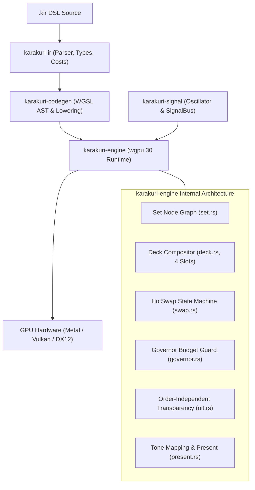
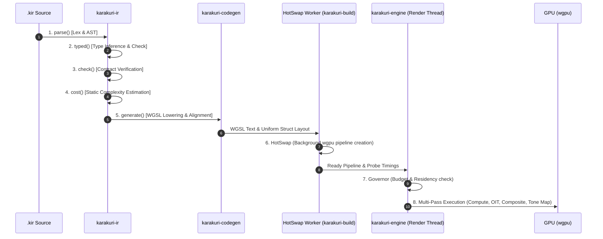

# Engine, Codegen & IR Subsystem Architecture

This document specifies the architecture of the **Engine, Codegen & IR Subsystem** in Karakuri, covering [`karakuri-engine`](../../crates/karakuri-engine/README.md), [`karakuri-codegen`](../../crates/karakuri-codegen/README.md), [`karakuri-ir`](../../crates/karakuri-ir/README.md), and [`karakuri-signal`](../../crates/karakuri-signal/README.md).

---

## 1. Subsystem Role & Core Philosophy

The Engine Subsystem is the GPU execution core of Karakuri. It takes declarative procedural shading definitions (`.kir`), compiles them through an 8-stage pipeline into WebGPU (WGSL) shaders, and executes multi-pass compute and render graphs with zero allocation during the steady-state render loop.



### Upstream and Downstream Links
- **Crate Documentation**:
  - [`karakuri-engine`](../../crates/karakuri-engine/README.md): Pipeline execution, multi-pass rendering, and composition.
  - [`karakuri-codegen`](../../crates/karakuri-codegen/README.md): WGSL shader code generation, struct layout, and AST pass fusion.
  - [`karakuri-ir`](../../crates/karakuri-ir/README.md): Parser, AST, semantic contracts, and static cost estimation.
  - [`karakuri-signal`](../../crates/karakuri-signal/README.md): Clock oscillators, tempo tracking, noise, and signal routing.
- **Architectural Context**:
  - [System Overview](README.md): 3-tier architectural hierarchy and crate catalog.
  - [Runtime Subsystem](runtime.md): How application runners drive the engine frame loop.
  - [Principles](../principles/): [P-0091](../principles/0091-cost-is-known-before-it-is-paid.md) (Cost known before paid), [P-0092](../principles/0092-the-same-inputs-produce-the-same-frame.md) (Determinism), [P-0094](../principles/0094-the-show-does-not-stop-it-does-not-go-quiet-and-it-does-not-leave-the-operators-hands.md) (The show does not stop).

---

## 2. The 8-Stage Execution Pipeline

Transforming high-level procedural code into rendered GPU texels spans **8 explicit stages**, ensuring compile-time safety and runtime predictability:



### Stage Breakdown
1. **Parsing Stage** ([`karakuri-ir::parse`](../../crates/karakuri-ir/src/parse.rs)): Lexical analysis and recursive-descent parsing into an unchecked Abstract Syntax Tree (AST).
2. **Type Checking Stage** ([`karakuri-ir::typed`](../../crates/karakuri-ir/src/typed.rs)): Type inference, scalar/vector promotion, and type contract validation, producing a `Checked` AST.
3. **Contract Checking Stage** ([`karakuri-ir::check`](../../crates/karakuri-ir/src/check.rs)): Enforces semantic invariants, attribute assignment completeness (every branch assigns mandatory attributes like `position`), and lifespan bounds (`spawn`/`kill`).
4. **Cost Estimation Stage** ([`karakuri-ir::cost`](../../crates/karakuri-ir/src/cost.rs)): Computes static execution cost vectors across ALU instruction counts, loop bound multipliers, memory accesses, and spatial field invocations ([ADR-0013](../adr/0013-cost-has-three-axes-that-must-not-be-added.md)).
5. **WGSL Lowering Stage** ([`karakuri-codegen`](../../crates/karakuri-codegen/src/lib.rs)): Lowers `Checked` ASTs into valid WebGPU Shading Language (WGSL). Performs WGSL AST pass fusion and computes uniform buffer structs with strict 16-byte alignment padding.
6. **HotSwap Compilation Stage** ([`karakuri-engine::swap`](../../crates/karakuri-engine/src/swap.rs)): Background thread (`karakuri-build`) creates `wgpu::RenderPipeline` and `wgpu::ComputePipeline` instances asynchronously without stalling the real-time render thread.
7. **Governor Verification Stage** ([`karakuri-engine::governor`](../../crates/karakuri-engine/src/governor.rs)): Monitors execution cost against frame deadline budgets (`budget_ms`) using GPU timestamp query probes; automatically initiates safe rollback upon budget violations.
8. **Multi-Pass Execution Stage** ([`karakuri-engine::deck`](../../crates/karakuri-engine/src/deck.rs), [`present.rs`](../../crates/karakuri-engine/src/present.rs)): Dispatches compute shaders (L1 geometry/particles, L3 camera), executes render passes (L4 materials with Weighted Blended OIT), composites deck slots (L5), and applies tone mapping.

---

## 3. Composition Model: Decks, Sets & Slot Addressing

### 3.1 The Set: Unit of Compilation and Lifecycle
A **Set** represents a self-contained, playable visual graph consisting of up to four layer procedures:
- `L1` (Geometry / Emitter): Procedural vertex generation, particle systems, or inline SDF evaluations.
- `L2` (Deformation / Field): Particle velocity modification, noise fields, and physics modulation.
- `L3` (Camera / Transform): View matrix derivation, projection models, and spatial orientation.
- `L4` (Raster / Renderer): Primitive rasterization, raymarching, or point-cloud billboard splatting.

Sets own their compiled GPU pipelines, uniform buffers, and double-buffered state textures.

### 3.2 The Deck: Live Performance Surface
The **Deck** manages up to **4 deck slots** (0..3). A deck slot hosts a Set and determines its contribution to the final composited frame:
- **Composite Modes**: Slots are blended in order using configurable blend operations:
  - `Add`: Additive light accumulation.
  - `Over`: Standard alpha blending with premultiplied alpha.
  - `Max`: High-contrast peak luminance selection.
- **Master Chain**: An ordered post-processing sequence applying master transitions, feedback loop buffering, and global tone mapping.

### 3.3 Slot Addressing Disambiguation
As recorded in [ADR-0049](../adr/0049-slot-means-two-things-and-the-clash-is-recorded.md), the word *slot* carries distinct meanings:
- **Deck Slot**: A slot in the Deck holding an entire running Set (indexed 0..3).
- **Layer Slot**: A position within a Set graph (`L1`, `L2`, `L3`, `L4`).
- **Input Slot**: A declared uniform or texture input port on an individual procedure node.

---

## 4. The 4-Tier Residency Model

To balance immediate responsiveness with strict GPU frame budgets, Karakuri employs a four-tier residency lifecycle:

```
                  ┌──────────────┐
                  │   Allocated  │
                  └──────┬───────┘
                         │
                         ▼
                  ┌──────────────┐
                  │   Priming    │
                  └──────┬───────┘
                         │
            ▲            ▼            ▲
            │     ┌──────────────┐    │
     Headroom     │     Live     │    Over Budget
     Available    └──────────────┘    (Auto-Park)
            │            │            │
            └────────────┴────────────┘
                         │
                         ▼
                  ┌──────────────┐
                  │    Parked    │
                  └──────────────┘
```

### 4.1 Residency States
1. **`Live`**: The Set is fully stepped, rendered into its target texture, and actively composited into the main video mix.
2. **`Priming`**: The Set is compiled, stepped, and rendered into its private buffer off-screen. It consumes GPU time to keep simulation states warm, but is not mixed into the final output.
3. **`Allocated`**: The Set's GPU pipelines and buffers exist in VRAM, but execution is idle until requested.
4. **`Parked`**: The operator requested `Live` or `Priming`, but the engine's `Governor` detected insufficient GPU frame time budget. The Set is suspended off-screen.

### 4.2 Requested vs. Effective Residency
Residency is always represented as two separate facts:
- **Requested Residency**: Set exclusively by human operator intent or explicit automation commands.
- **Effective Residency**: Computed every frame by the `Governor` based on available millisecond headroom.

> [!IMPORTANT]
> **The Parking Invariant**: Material is never cancelled or dropped due to budget overruns. When the governor detects budget pressure, a slot is *parked*. The operator's requested state remains untouched; as soon as another heavy layer frees GPU time, the parked slot automatically resumes without operator intervention.

---

## 5. Timing: The Three Clocks Model

Karakuri's architecture strictly isolates execution into **three asynchronous time domains** that must never collapse into one another:

| Clock | Typical Period | Responsibilities & Invariants |
|---|---|---|
| **Frame Clock** | 8–16 ms (60–120 Hz) | GPU draw call dispatch, uniform buffer updates, parameter evaluation. **Zero memory allocation; zero shader compilation.** Guaranteed deterministic real-time deadline. |
| **Beat / Bar Clock** | 0.5–4.0 s | Musical rhythm synchronization. Variant switching, transition curves, parameter morphing, and phrase triggers. Operates exclusively on pre-compiled assets. |
| **Generation Clock** | Seconds to minutes | LLM procedure generation, DSL parsing, static verification, and background GPU pipeline compilation. Runs in background worker threads; never blocks a frame. |

### Architectural Implication: AI Ahead-of-Time
Because the generation clock is asynchronous, **AI never runs on the critical rendering path**. AI models generate candidate procedures ahead of time into the Staging bay or Library; the real-time VJ performance runtime only selects, cues, and morphs already-compiled assets.

---

## 6. Signal Bus & Local Oscillator (`karakuri-signal`)

Real-time modulation values (audio spectrum, MIDI faders, BPM phase, LFOs) are delivered to shaders through [`karakuri-signal`](../../crates/karakuri-signal/README.md).

### 6.1 Infallible Signal Bus (`SignalBus`)
The `SignalBus` guarantees complete distribution across all procedures without error branches:
- Querying any signal name returns a `Sample`:
  ```rust
  pub struct Sample {
      pub value: f32,
      pub confidence: f32, // 0.0 (synthesized fallback) to 1.0 (calibrated live input)
  }
  ```
- If an external signal (e.g. audio FFT band or MIDI CC) is unplugged or missing, the bus transparently returns a fallback value with `confidence = 0.0`. Shaders never branch on missing inputs ([ADR-0047](../adr/0047-a-binding-blends-on-confidence.md)).

### 6.2 Local Oscillator (`Oscillator`)
Following [P-0092](../principles/0092-the-same-inputs-produce-the-same-frame.md), the engine derives all phase and animation time from an internal, monotonic `Oscillator`:
- External audio beat detection and MIDI clock do not drive the engine clock directly; they supply small **`Correction`** deltas to smooth out drift.
- If audio input glitches or stops, the local oscillator maintains phase continuity without visual stuttering.

---

## 7. Testing & Verification

The engine subsystem is verified with comprehensive automated test suites:
- **Naga Validation** (`karakuri-codegen/tests/naga_test.rs`): Confirms that all generated WGSL passes Naga frontend and backend validation.
- **Deterministic Replay Tests** (`karakuri-engine`): Asserts that identical session record streams generate bit-exact identical frame outputs ([P-0092](../principles/0092-the-same-inputs-produce-the-same-frame.md)).
- **Governor Stress Tests**: Simulates overloaded frame budgets to verify that the Governor parks and unparks slots without GPU panics or memory leaks.
