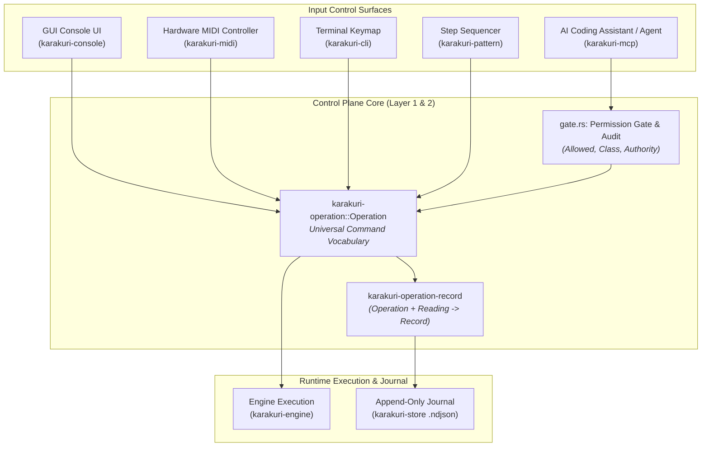
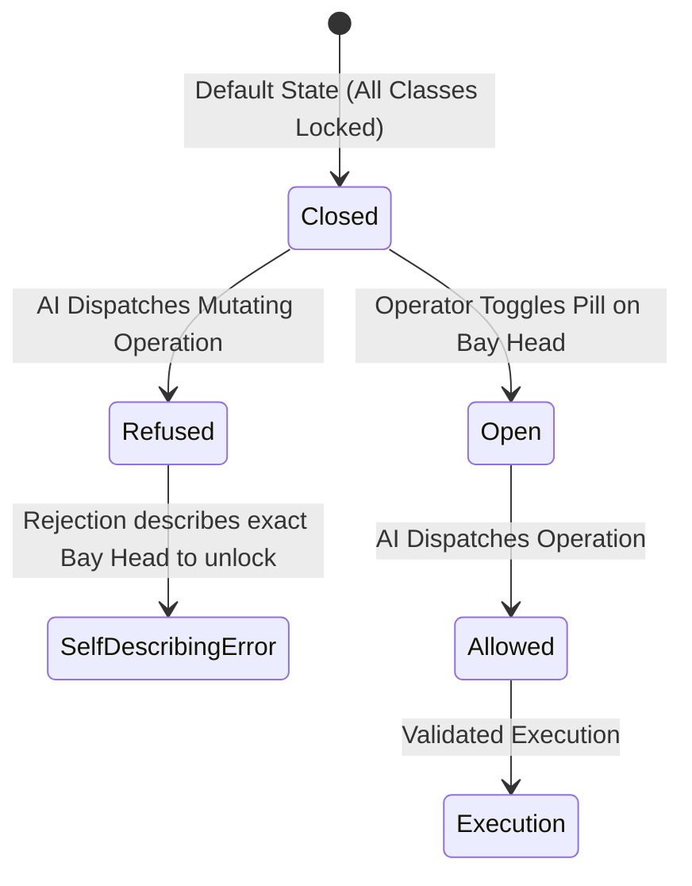

# Operations, Control Plane & AI Interface Architecture

This document specifies the architecture of the **Operations, Control Plane & AI Interface Subsystem** in Karakuri, covering [`karakuri-operation`](../../crates/karakuri-operation/README.md), [`karakuri-operation-record`](../../crates/karakuri-operation-record/README.md), [`karakuri-pattern`](../../crates/karakuri-pattern/README.md), and [`karakuri-mcp`](../../crates/karakuri-mcp/README.md).

---

## 1. Subsystem Role & Core Philosophy

The Operations Subsystem establishes the universal control plane for Karakuri. It defines the complete grammar of operator commands, records immutable session streams, enforces safety and authority boundaries between human operators and AI agents, and exposes a structured JSON-RPC interface for AI pair programming.



### Upstream and Downstream Links
- **Crate Documentation**:
  - [`karakuri-operation`](../../crates/karakuri-operation/README.md): The unified operation vocabulary and operator permission audit.
  - [`karakuri-operation-record`](../../crates/karakuri-operation-record/README.md): Operation-to-record conversion and replay translation.
  - [`karakuri-pattern`](../../crates/karakuri-pattern/README.md): Sequencer pattern generation and algorithmic modulation.
  - [`karakuri-mcp`](../../crates/karakuri-mcp/README.md): Model Context Protocol server exposing AI pair-programming tools.
- **Architectural Context**:
  - [System Overview](README.md): 3-tier architectural hierarchy and crate topology.
  - [Console Subsystem](console.md): How console UI controls bind to operations.
  - [Principles](../principles/): [P-0083](../principles/0083-a-refusal-carries-what-the-next-attempt-needs.md) (Refusal self-description), [P-0090](../principles/0090-a-surface-offers-it-never-decides.md) (Surfaces offer, never decide), [P-0094](../principles/0094-the-show-does-not-stop-it-does-not-go-quiet-and-it-does-not-leave-the-operators-hands.md) (Operator retains control).

---

## 2. Single Operation Vocabulary (`karakuri-operation`)

Following [ADR-0180](../adr/0180-the-operation-vocabulary-is-a-crate-with-no-dependencies.md) and [P-0090](../principles/0090-a-surface-offers-it-never-decides.md), every control surface must route into a single unified enumeration: `karakuri_operation::Operation`.

### 2.1 Design Invariants
1. **Zero-Dependency Leaf Crate**: `karakuri-operation` depends only on `std`. It contains no dependencies on graphics, audio, networking, or UI libraries, enabling any surface to depend on it without unwanted transitive dependencies.
2. **Exhaustive Grammar**: Every action an operator, sequencer, or AI model can perform is an explicit variant of `Operation`. There are no hidden backdoors or surface-specific mutation paths.
3. **No Direct Mutation**: Control surfaces do not mutate engine state directly. They emit an `Operation` value into the runtime event queue, ensuring all state transitions are logged, audited, and replayable.

### 2.2 Operation Categories
- **Deck & Mix Controls**: `SetDeckGain`, `SetTransitionDuration`, `TriggerTransition`, `SetResidency`, `SelectDeck`.
- **Procedural Uniforms**: `SetParamScalar`, `SetParamVector`, `BindInput`, `ResetParam`.
- **Transport & Rhythm**: `SetTempoBpm`, `NudgeTempo`, `TapTempo`, `SetLook`.
- **Library & Preset Management**: `LoadSet`, `SaveSet`, `StarItem`, `FilterLibrary`.
- **System & Master**: `MasterBlackout`, `SetChainParam`, `AddChainEffect`, `RemoveChainEffect`, `Quit`.

---

## 3. Operation Recording (`karakuri-operation-record`)

Recording user interactions is essential for bit-exact session replay ([ADR-0194](../adr/0194-where-an-operation-becomes-a-record-is-a-crate-that-depends-on-both.md)).

### 3.1 Translating Operations to Records
`karakuri-operation-record` provides a pure conversion function:
```rust
pub fn written(op: &Operation, reading: &Reading) -> Outcome
```
- **Context-Aware Conversion**: Some operations require runtime state to produce a complete record. For example, setting exposure requires reading the active tone mapper operator to serialize a valid `Record::Look`.
- **Zero Heap Allocation**: Records are written into pre-allocated memory buffers, ensuring that session recording never causes garbage collection or heap allocation spikes during frame rendering.
- **Determinism**: Replaying the recorded `.ndjson` journal through `karakuri-cli` reproduces identical visual outputs frame-by-frame.

---

## 4. Authority & Operator Permission Gates (`gate.rs`)

To ensure that AI coding assistants or automated scripts never disrupt a live visual performance, Karakuri implements a strict, compile-time enforced permission model in `karakuri-operation::gate` ([ADR-0235](../adr/0235-mcp-reaches-every-operation-and-what-could-stop-the-show-is-refused-until-the-operator-opens-it.md)).



### 4.1 The Three Authority Levels
Every procedure node tracks its governing authority level:
- **`Manual` (`man`)**: Locked exclusively to the human operator. Automated agents and sequencers are refused.
- **`Suggesting` (`sug`)**: AI models may propose parameter adjustments or shader edits into the Staging bay, but changes do not apply to on-air outputs without operator confirmation.
- **`Automatic` (`auto`)**: Fully delegated to algorithmic sequencers or connected AI agents.

### 4.2 Operator Permission Classes
`gate::Class` categorizes potentially disruptive operations into four openable classes:
1. **`Class::LiveDeck`**: Modifications to active on-air shaders. Unlocked at the head of the **Program bay**.
2. **`Class::MixFaders`**: Adjustments to deck volume and crossfaders. Unlocked at the head of the **Mixer bay**.
3. **`Class::MasterEffects`**: Global feedback, master blackout, and post-processing. Unlocked at the head of the **Master bay**.
4. **`Class::InputsAndOutputs`**: Routing hardware video sinks and input captures. Unlocked at the **Outputs row**.

### 4.3 Unclassed Critical Invariants
Operations that could immediately terminate or derail a live show cannot be opened by any class:
- `Clock`: Manual tempo tapping and phase manipulation.
- `Quitting`: `Operation::Quit`.
- `Authority`: Self-granting permissions (an agent cannot elevate its own authority).

### 4.4 The Typed `Allowed` Token Pattern
Security is enforced by the Rust type system:
```rust
pub struct Allowed<'a>(&'a Operation);

pub fn audit(op: &Operation, open: &Open) -> Result<Allowed, Refusal>;
```
The internal field of `Allowed` is private. The only way to obtain an `Allowed` token is to pass through `gate::audit`. Engine execution handlers accept `Allowed` rather than bare `Operation`s, making accidental permission bypasses a compile-time error.

### 4.5 Self-Describing Refusals
Following [P-0083](../principles/0083-a-refusal-carries-what-the-next-attempt-needs.md), whenever an operation is refused, the error response describes exactly which bay head the human operator must unlock:
> *"Mix faders are locked. The human operator can open them at the head of the Mixer bay."*

---

## 5. Sequencer Patterns (`karakuri-pattern`)

[`karakuri-pattern`](../../crates/karakuri-pattern/README.md) models algorithmic 16-step parameter modulation sequences ([ADR-0320](../adr/0320-a-pattern-is-one-bar-of-sixteen-slots-a-lane-is-a-target-and-two-levels-and-a-cell-is-a-bit.md)):
- **Data Structure**: A pattern consists of 1 bar, 16 steps, a step resolution mode, and a collection of parameter lanes.
- **Pure Operation Generator**: A sequencer lane does not bind to internal pointers; it emits an `Operation` targeting a specific parameter.
- **No Internal Clock**: Step advancement is a pure function of `karakuri_signal::Oscillator::beats` passed in from the frame loop, ensuring zero timing jitter.

---

## 6. AI / MCP Interface (`karakuri-mcp`)

[`karakuri-mcp`](../../crates/karakuri-mcp/README.md) implements the open Model Context Protocol (JSON-RPC) standard, allowing LLM coding assistants (such as Claude or Gemini) to interact with a running Karakuri instance as an intelligent pair programmer.

### 6.1 Structured Tool Catalog
The MCP server exposes 10 tools organized into four functional groups:

1. **Shader Procedure Tools**:
   - `check_procedure`: Statically validates `.kir` syntax, types, and execution costs without touching GPU memory.
   - `read_procedure`: Inspects active `.kir` source code from a specified slot.
   - `write_procedure`: Dispatches revised shader procedures to background compilation workers.
2. **Set Configuration Tools**:
   - `read_set`: Reads Set definitions, node bindings, and uniform states.
   - `list_sets`: Catalogs available Sets in the store with optional category filters.
   - `save_set`: Commits active deck parameters to a new or existing Set file.
3. **Graph & History Tools**:
   - `wire_input`: Connects modulation sources (audio FFT, LFO) to procedure uniform inputs.
   - `walk_history`: Traverses version history trees for nodes and Sets.
   - `swap_outcome`: Polls the status of asynchronous background compilation swaps.
4. **Command Dispatch**:
   - `operate`: Dispatches any operation from `karakuri-operation`, strictly validated against `gate::audit`.

### 6.2 Safe Asynchronous Execution
- The MCP server operates on dedicated background worker threads.
- Lengthy tasks (such as WGSL compilation or static analysis) never execute on the render thread, maintaining 60–120 FPS performance throughout active AI pair-programming sessions.

---

## 7. Testing & Verification

The operations subsystem enforces strict verification policies:
- **Audit Completeness Test** (`karakuri-operation::gate`): Asserts that `gate::standing` exhaustively matches every variant of `Operation` without a wildcard fallback arm.
- **Roundtrip Replay Tests** (`karakuri-operation-record`): Verifies that recorded session streams serialize and deserialize with bit-exact fidelity.
- **MCP Server Protocol Tests** (`karakuri-mcp/tests/`): Exercises JSON-RPC protocol compliance and permission refusal handling against live test environments.
