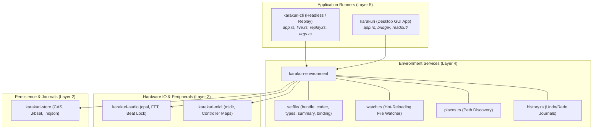

# Runtime, IO & Environmental Integration Architecture

This document specifies the architecture of the **Runtime, IO & Environmental Integration Subsystem** in Karakuri, covering application binaries ([`karakuri`](../../crates/karakuri/README.md), [`karakuri-cli`](../../crates/karakuri-cli/README.md)), external OS services ([`karakuri-environment`](../../crates/karakuri-environment/README.md)), hardware IO ([`karakuri-audio`](../../crates/karakuri-audio/README.md), [`karakuri-midi`](../../crates/karakuri-midi/README.md)), and persistent storage ([`karakuri-store`](../../crates/karakuri-store/README.md)).

---

## 1. System Role & Architecture Overview

The Runtime Subsystem connects Karakuri's pure mathematical models and GPU pipelines to external hardware, operating systems, file systems, and user peripherals. It manages application lifecycles, event dispatching, hardware IO streams, and content-addressed persistence.

### Upstream and Downstream Links
- **Crate Documentation**:
  - [`karakuri`](../../crates/karakuri/README.md): Desktop GUI application and window management.
  - [`karakuri-cli`](../../crates/karakuri-cli/README.md): Headless runner, batch renderer, and session replayer.
  - [`karakuri-environment`](../../crates/karakuri-environment/README.md): System coordinator, Setfile packaging, and file watching.
  - [`karakuri-store`](../../crates/karakuri-store/README.md): Content-addressed storage (CAS) and append-only session streams.
  - [`karakuri-audio`](../../crates/karakuri-audio/README.md): Audio capture and FFT analysis.
  - [`karakuri-midi`](../../crates/karakuri-midi/README.md): MIDI hardware mapping and input handling.
- **Architectural Context**:
  - [System Overview](README.md): 3-tier architectural hierarchy and crate topology.
  - [Console Subsystem](console.md): The UI presentation layer hosted within the GUI application.
  - [Engine Subsystem](engine.md): The core rendering engine driven by runtime frame loops.
  - [Operations Subsystem](operations.md): Command vocabulary and session journal persistence.

---

## 2. Desktop GUI Application Architecture (`karakuri`)

The primary desktop executable (`crates/karakuri`) coordinates the `winit` window event loop, `egui` console rendering, and `wgpu` engine frame presentation. During Phases 3 & 4 (P24, P33), its internal architecture was modularized into specialized subsystems:

### 2.1 Readout Subsystem (`readout/`)
Decouples performance monitoring and event dispatching from window rendering:
- **[`costs.rs`](../../crates/karakuri/src/readout/costs.rs)**: Aggregates real-time GPU timestamp metrics, frame render times, and static procedure complexity ratings for display.
- **[`hud.rs`](../../crates/karakuri/src/readout/hud.rs)**: Renders the non-intrusive Heads-Up Display (HUD) overlay showing FPS, budget headroom, dropped frames, and clock phases.
- **[`dispatch.rs`](../../crates/karakuri/src/readout/dispatch.rs)**: Manages lock-free asynchronous event dispatch between the background worker threads and the UI presentation layer.
- **[`mod.rs`](../../crates/karakuri/src/readout/mod.rs)**: Coordinator and public API for telemetry readout.

### 2.2 Bridge Subsystem (`bridge/`)
Abstracts engine commands, file system access, and rendering sinks:
- **[`sinks.rs`](../../crates/karakuri/src/bridge/sinks.rs)**: Defines output destinations (`WindowSink`, offscreen render textures, NDI/Syphon output streams).
- **[`engine.rs`](../../crates/karakuri/src/bridge/engine.rs)**: Manages engine lifecycle, device lost recovery, and GPU buffer resource pooling.
- **[`filesystem.rs`](../../crates/karakuri/src/bridge/filesystem.rs)**: Performs non-blocking asynchronous file loading, snapshot writes, and preset discovery.
- **[`handlers.rs`](../../crates/karakuri/src/bridge/handlers.rs)**: Maps incoming console and MCP commands to concrete engine execution methods.

### 2.3 Application Coordinator (`app.rs`)
Drives the top-level application loop:
- Implements `winit::application::ApplicationHandler` to process OS window events, keyboard shortcuts, and pointer events.
- Coordinates frame pacing and submits encoded GPU command buffers to the graphics queue.

---

## 3. Headless / CLI Runner Architecture (`karakuri-cli`)

Extracted during Phase 3 (P22) from a legacy monolith into a clean, modular architecture, [`karakuri-cli`](../../crates/karakuri-cli/README.md) provides scriptable, headless performance without a graphical window:

| Module | Responsibility |
|---|---|
| [`args.rs`](../../crates/karakuri-cli/src/args.rs) | Command-line argument parsing, subcommands (`play`, `record`, `render-png`, `bench`), and flag validation. |
| [`replay.rs`](../../crates/karakuri-cli/src/replay.rs) | Bit-exact, zero-allocation session replayer executing `.ndjson` journal files against engine state. |
| [`save.rs`](../../crates/karakuri-cli/src/save.rs) | Asynchronous snapshot saving and Set bundle export on background worker threads. |
| [`aiming.rs`](../../crates/karakuri-cli/src/aiming.rs) | Targeted Set loading, deck slot binding, and procedural parameter initialization. |
| [`live.rs`](../../crates/karakuri-cli/src/live.rs) | Terminal-driven real-time performance controller supporting keyboard operation, status telemetry, and ANSI meters. |
| [`app.rs`](../../crates/karakuri-cli/src/app.rs) | CLI entry point, signal termination handling, and execution loop orchestration. |

---

## 4. Environmental Services (`karakuri-environment`)

[`karakuri-environment`](../../crates/karakuri-environment/README.md) is the central integration crate for all state that touches external boundaries. No module in it knows whether it is running under the GUI or the CLI:

### 4.1 Setfile System (`setfile/`)
Decomposed in Phase 3 (P23), this module handles authoring (`.kset`) and compiled (`.kbset`) visual scene files:
- **`bundle.rs`**: Self-contained archive packaging bundling `.kir` shader sources, texture assets, and uniform bindings.
- **`codec.rs`**: High-performance JSON/binary serialization and deserialization.
- **`types.rs`**: Core Set data structures, slot assignments, and parameter defaults.
- **`summary.rs`**: Human-readable inspection metadata and procedure dependency manifests.
- **`binding.rs`**: Modulation wiring declarations between signal channels and procedure inputs.

### 4.2 Hot-Reloading Watcher (`watch.rs` & `watch/`)
- Utilizes OS file system event hooks (`notify`) to monitor active `.kir` shader files on disk.
- Debounces file modifications and triggers background re-parsing and lowering without dropping on-air frames.

### 4.3 Path Resolution & Presets (`places.rs`)
Following [ADR-0230](../adr/0230-where-the-programs-data-lives-is-told-rather-than-baked.md), `places.rs` deterministically resolves project paths:
- Discovers the preset root and artifact store using a 4-candidate heuristic off `std::env::current_exe()`.
- Probes whether a candidate directory actually contains a valid library rather than merely existing.

### 4.4 Hardware Integration
- **Audio Service (`audio.rs`)**: Integrates with [`karakuri-audio`](../../crates/karakuri-audio/README.md) using `cpal` for low-latency audio capture, real-time FFT spectrum analysis, and transient beat tracking.
- **MIDI Service (`midi.rs`)**: Integrates with [`karakuri-midi`](../../crates/karakuri-midi/README.md) using `midir` to decode hardware controller events and map them into pure `Operation` commands.
- **Clock Service (`clock.rs`)**: Computes integer simulation step increments per frame, guaranteeing deterministic time advance across both GUI and CLI runners ([ADR-0297](../adr/0297-the-panels-tick-is-measured-and-the-fixed-step-a-frame-ran-the-room-at-the-displays-rate.md)).

---

## 5. Artifact Store & Persistence (`karakuri-store`)

[`karakuri-store`](../../crates/karakuri-store/README.md) provides content-addressed storage and immutable journal logging:

### 5.1 Content-Addressed Storage (CAS)
- All `.kir` procedural shaders are stored as immutable blobs keyed by the SHA-256 hash of their UTF-8 source text.
- Prevents file name collisions and guarantees that a saved Set always references the exact shader source bytes used at save time, regardless of subsequent disk edits.

### 5.2 Resolved Set Files (`.kbset`)
- While `.kset` files use relative paths for local authoring convenience, `.kbset` files are pre-resolved, content-addressed packages ([ADR-0231](../adr/0231-a-sets-two-forms-take-two-extensions-and-the-store-holds-only-the-resolved-one.md)).
- Ensures that loading a Set during a live show requires zero path lookups or disk searches at the frame boundary.

### 5.3 Append-Only Session Streams (`.ndjson`)
- Every operator manipulation, parameter adjustment, and transition is serialized into newline-delimited JSON (`.ndjson`).
- Written via a dedicated background session writer thread connected to the render loop via bounded lock-free queues, ensuring zero heap allocations on the critical render thread.

---

## 6. Testing & Verification

The runtime subsystem is thoroughly covered by automated test suites:
- **Journal Replay Verification**: Confirms that recorded sessions replayed through `karakuri-cli` reproduce bit-exact frame outputs.
- **Setfile Roundtrip Tests**: Validates serialization and deserialization integrity across all supported `.kset` and `.kbset` schema versions.
- **Path Resolution Tests**: Verifies `places.rs` candidate detection across development, staging, and installed binary layouts.
