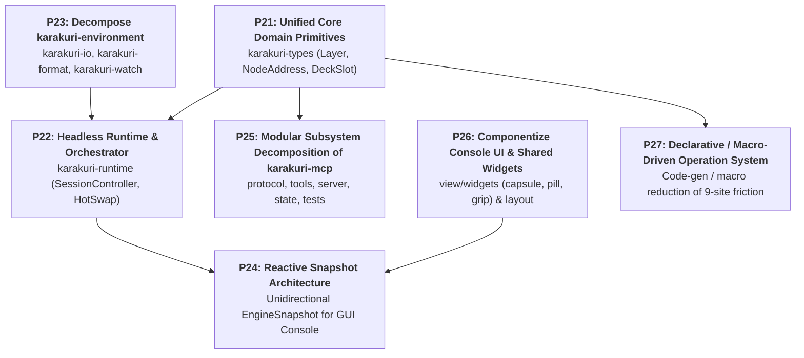

# Architectural Refactoring & Design Smells Report (Phase 3)

This document records the architectural smells, structural friction, and design distortions identified in the **Karakuri** codebase, along with the phased modernization roadmap for **Phase 3: Architectural Decomposition & Structural Decoupling (P21–P27)**.

While Karakuri maintains extreme real-time discipline on its hot paths through the standing rules in [`docs/principles/`](principles/) and architecture decision records in [`docs/adr/`](adr/), the rapid evolution across milestones M1–M5 and the interim scaffolding layers created significant structural rigidity and maintenance bottlenecks.

---

## 1. Executive Context & Paradigm Shift

### The Transition from Phase 2 to Phase 3
- **Phase 1 & Phase 2 (P1–P20) [COMPLETED]**:
  - Successfully addressed critical performance bottlenecks, transient render graph DAG allocation (P15), structured WGSL AST & pass fusion (P16), machine-readable AI diagnostics (P17), zero-allocation stream replay (P19), and unified keymap convergence (P20).
  - Undertook the first-pass triage decomposition: dismantled the original 33.1k-line `karakuri/src/main.rs` into submodules (`engine_bridge.rs`, `app.rs`, `readout.rs`, etc.), split `karakuri-console/src/view.rs` (24.2k lines) into bay modules, and extracted `karakuri-mcp` into its own crate.
- **The Limit of First-Pass File Splitting**:
  - The first-pass triage proved that splitting files alone without fundamental architectural decoupling leaves high maintenance friction: `crates/karakuri-cli/src/main.rs` remains at **12,300 lines**, `crates/karakuri-mcp/src/lib.rs` sits at **10,888 lines**, and the GUI bridge (`engine_bridge.rs` at **8,309 lines** and `readout.rs` at **4,805 lines**) has become an immense procedural adapter.
  - [ADR-0345](adr/0345-a-file-that-crosses-1000-lines-gets-a-nudge-not-a-gate.md) established that crossing 1,000 lines is a *nudge, not a gate*. The file size is merely a measurable symptom; **the root cause is structural coupling, lack of shared domain primitives, dual orchestration duplication, and kitchen-sink crates.**
- **Phase 3 Objective**:
  - Dissolve the fundamental architectural distortions, establish single sources of truth for core domain models, extract headless runtime orchestration, and make all subsystems modular, testable, and maintainable.

---

## 2. Analysis of 7 Core Structural Smells

```mermaid
flowchart TD
    subgraph UI_Surface["Surfaces & Glue (Duplicated Orchestration)"]
        CLI["karakuri-cli<br>(12.3k lines)"]
        GUI["karakuri (GUI)<br>(app.rs: 5.1k lines)"]
        BRIDGE["engine_bridge.rs (8.3k lines)<br>readout.rs (4.8k lines)"]
        CONSOLE["karakuri-console<br>(view/*: 26k lines)"]
    end

    subgraph Runtime_Void["Missing Abstraction"]
        RUNTIME["[Missing] Headless Runtime / Session Controller<br>(HotSwap, Deck, Clock, Session, Replay)"]
    end

    subgraph Operation_Rigidity["Operation Rigidity"]
        OP["karakuri-operation<br>(9-site manual maintenance)"]
        OPREC["karakuri-operation-record"]
    end

    subgraph Kitchen_Sink["Kitchen-Sink Coupling"]
        ENV["karakuri-environment<br>(Audio/MIDI/Watch/SetFile/Mix/Scratch...)"]
        MCP["karakuri-mcp<br>(10.8k line single-file monolith)"]
    end

    subgraph Type_Drift["Primitive Fragmentation (Conversion Hell)"]
        T1["karakuri-ir::Kind"]
        T2["karakuri-operation::Layer"]
        T3["karakuri-store::record::Layer"]
    end

    CLI -. duplicates .-> RUNTIME
    GUI -. duplicates .-> RUNTIME
    BRIDGE --> CONSOLE
    BRIDGE --> ENV
    CLI --> ENV
    GUI --> OP
    CLI --> OP
    T1 -. boilerplate conversion .-> T2
    T2 -. boilerplate conversion .-> T3
```

### Smell 1: Core Domain Primitive Fragmentation ("Conversion Hell")
- **Phenomenon**: The foundational concept of a pipeline layer/kind (`L1`, `L2`, `L3`, `L4`, `Field`, `L5`) is independently defined as an enum across three separate crates:
  1. `karakuri_ir::Kind`
  2. `karakuri_operation::Layer`
  3. `karakuri_store::record::Layer`
- **Impact**: To avoid circular dependencies, each crate and file implements bespoke, private conversion functions: `kind_of`, `layer_of`, `ir_layer`, `asked_layer`, `layer_named`, `kind_name`. Adding or modifying a layer requires updating dozens of manual match arms across the entire codebase.

### Smell 2: Dual Orchestration Duplication (CLI vs. GUI)
- **Phenomenon**: `karakuri-cli` was intended as scaffolding, yet remains a 12,300-line monolith. Both `karakuri-cli` (via its `Live` struct) and `karakuri` (via `engine_bridge.rs` and `app.rs`) independently orchestrate:
  - Multi-slot deck lifecycle and residency transitions.
  - Background `HotSwap` compilation, channel polling, and atomic swap.
  - File watching, preset loading, and scratch directory synchronisation.
  - Session recording (`ndjson`) and replay driving.
- **Impact**: Double the maintenance cost; features implemented in CLI (like headless session replay) are missing or lagged in the GUI console, and vice versa.

### Smell 3: `karakuri-environment` as a Kitchen-Sink Crate
- **Phenomenon**: ADR-0215 grouped "everything outside this process" into `karakuri-environment`. It holds audio capture, MIDI mappings, tempo source IPC, file watching, clock step derivation, `.kir` compilation, Set file formats (`setfile.rs` at 5,156 lines), session recording, PNG offscreen rendering, and mixer records (`mix.rs` at 2,810 lines).
- **Impact**: Extremely low cohesion. Any modification to file formats, audio hardware drivers, or mixer logic forces a full rebuild across almost every consuming crate and binary.

### Smell 4: Overgrown Procedural GUI Bridge (`engine_bridge.rs` & `readout.rs`)
- **Phenomenon**: To preserve `karakuri-console`'s purity (no `wgpu`/device dependencies, per ADR-0156), the GUI application maintains `engine_bridge.rs` (8,309 lines) and `readout.rs` (4,805 lines).
- **Impact**: These files imperatively gather, map, and reconcile engine state into `Reading`, `View`, and `Panel` structures every frame. Instead of a clean, reactive, unidirectional data flow, thousands of lines of procedural glue synchronize GUI states with engine internals.

### Smell 5: `karakuri-mcp` Single-File Monolith (10,888 lines)
- **Phenomenon**: While extracted into its own package, `crates/karakuri-mcp/src/lib.rs` is an enormous 10,888-line file containing JSON-RPC protocol parsing, connection loops, client state, 7 individual tool implementations, and ~1,700 lines of inline unit tests.
- **Impact**: Poor code readability, high risk of regression when editing tools, and severe cognitive overload.

### Smell 6: Entangled Console Bay Views & Shared Widgets (`view/mod.rs`)
- **Phenomenon**: `crates/karakuri-console/src/view/mod.rs` (7,493 lines) acts as both a bay dispatcher and a repository of shared UI widgets (Capsules, Pills, Grips, Chips, HeadWords, Outputs).
- **Impact**: The boundaries between shared reusable UI components, geometry layout solving (`plan_into`), and bay-specific drawing logic are blurred.

### Smell 7: Hardcoded 9-Site Operation Maintenance
- **Phenomenon**: Adding, removing, or changing an `Operation` variant requires manual edits across 9 explicit sites (as documented in `docs/contributing.md §5`): `Operation` enum, `OperationRecord` match arms, Gate classification, two manual HTML files, CLI key handlers, Console UI mapping, MCP tool bindings, and integration tests.
- **Impact**: High development friction, discouraging UI refactoring and parameter extensions.

---

## 3. Phase 3 Initiatives: Comprehensive Execution Roadmap

---

### P21. Unified Core Domain Primitives (`karakuri-types`)

#### Phenomenon
`karakuri_ir::Kind`, `karakuri_operation::Layer`, and `karakuri_store::record::Layer` duplicate the fundamental 6-variant pipeline layer definition, breeding dozens of boilerplate conversion functions across crates.

#### Refactoring Plan
1. **Create `crates/karakuri-types`**:
   - Zero-dependency leaf crate defining canonical domain primitives:
     - `Layer` (L1, L2, L3, L4, Field, L5) with `Display`, `FromStr`, `Serialize`, `Deserialize`.
     - `NodeAddress { layer: Layer, index: u32 }`.
     - Canonical `DeckSlot` and residency representations.
2. **Eliminate Redundant Enums**:
   - Deprecate `karakuri_operation::Layer` and `karakuri_store::record::Layer` in favor of `karakuri_types::Layer`.
   - Update `karakuri-ir` to use `karakuri_types::Layer` (or alias `Kind = Layer`).
3. **Purge Conversion Boilerplate**:
   - Remove `kind_of`, `layer_of`, `ir_layer`, `asked_layer`, and `layer_named` across `engine_bridge.rs`, `mcp`, `setfile.rs`, and `midi.rs`.

---

### P22. Headless Runtime & Orchestrator (`karakuri-runtime`)

#### Phenomenon
Both `karakuri-cli` (12.3k lines) and `karakuri` GUI (13.4k lines across `app.rs` and `engine_bridge.rs`) duplicate real-time orchestration logic: deck composition, HotSwap compilation worker channels, session recording, and transport clock driving.

#### Refactoring Plan
1. **Extract `karakuri-runtime`**:
   - Headless engine controller independent of windowing surfaces (`winit` / `egui`).
   - `SessionController`: Owns the 4-slot `Deck`, manages residency transitions, applies `Operation` / `Record` batches, and drives step execution.
   - `HotSwapCoordinator`: Manages background compilation threads, staging queues, budget probe verification, and atomic commit on frame boundaries.
   - `TransportClock`: Centralizes oscillator synchronization, audio tempo corrections, and latency offset adjustments.
2. **Slim Down `karakuri-cli` to Pure Surface Scaffolding**:
   - Reduce `karakuri-cli/src/main.rs` to a thin CLI wrapper (~500 lines) that parses CLI flags, instantiates `SessionController`, and runs a minimal event loop.
3. **Harmonize GUI Application**:
   - `karakuri` GUI directly embeds `SessionController`, eliminating duplicated state machines.

---

### P23. Decompose `karakuri-environment` into Focused Crates

#### Phenomenon
`karakuri-environment` is a catch-all kitchen-sink crate containing I/O hardware, file formats, compilation, watchers, and mix record logic.

#### Refactoring Plan
1. **Split into Cohesive Packages**:
   - `karakuri-io`: External hardware integration (Audio capture via `cpal`, MIDI input parsing, out-of-process tempo source IPC).
   - `karakuri-format`: File format serialization and loading (`.kset`, `.kbset` Set files, `.ndjson` session logs).
   - `karakuri-watch`: File system change monitoring (`notify`) and debouncing.
2. **Enforce Clean Dependency Boundaries**:
   - Ensure formats do not depend on hardware I/O or runtime state machines.

---

### P24. Reactive Snapshot Architecture for GUI Bridge

#### Phenomenon
`engine_bridge.rs` (8,309 lines) and `readout.rs` (4,805 lines) procedurally pull and assemble mutable engine state into view models on every frame, creating massive glue code.

#### Refactoring Plan
1. **Introduce `EngineSnapshot`**:
   - At the frame boundary, `SessionController` publishes an immutable, cheaply cloneable (via `Arc`) `EngineSnapshot` summarizing deck status, residency, slot metrics, transport state, and probe estimates.
2. **Unidirectional UI Rendering**:
   - `karakuri-console`'s `View::draw` consumes `&EngineSnapshot` directly.
   - View interactions emit pure `Operation`s sent to the runtime's input channel.
3. **Decompose `engine_bridge.rs`**:
   - Split remaining surface-specific concerns into focused submodules:
     - `bridge/sinks.rs`: `wgpu` presentation textures & `egui` texture registrations.
     - `bridge/filesystem.rs`: Presets listing and folder scan utilities.

---

### P25. Modular Subsystem Decomposition of `karakuri-mcp`

#### Phenomenon
`crates/karakuri-mcp/src/lib.rs` contains 10,888 lines in a single file, including ~1,700 lines of inline unit tests.

#### Refactoring Plan
1. **Submodule Breakdown**:
   - `src/protocol.rs`: JSON-RPC 2.0 message parsing, serialization, and error codes (~500 lines).
   - `src/server.rs`: TCP/STDIO listener loops, connection worker threads (~400 lines).
   - `src/state.rs`: Client session state, permission gates, and slots registry (~300 lines).
   - `src/tools/`: Dedicated module per MCP tool:
     - `tools/mod.rs`: Tool registration, schema generation, and routing (~300 lines).
     - `tools/procedure.rs`: `check_procedure` and `write_procedure` (~800 lines).
     - `tools/wire.rs`: `wire_input` (~600 lines).
     - `tools/set.rs`: `check_set_configuration` and slot inspection (~600 lines).
2. **Test Suite Relocation**:
   - Move inline `mod tests` (lines 9,195–10,888) to `tests/mcp_suite.rs`.

---

### P26. Componentize Console UI & Shared Widgets

#### Phenomenon
`crates/karakuri-console/src/view/mod.rs` (7,493 lines) combines overall bay composition with shared interactive widget drawing and layout math.

#### Refactoring Plan
1. **Extract `crates/karakuri-console/src/view/widgets/`**:
   - `head.rs`: Bay header bars, capsules, and bank buttons.
   - `pills.rs`: Status indicators, MCP toggle pills, and sink chips.
   - `fold_grip.rs`: Region collapse/expand handles and dividers.
   - `outputs.rs`: Master output monitors and routing selectors.
2. **Extract `src/view/layout.rs`**:
   - Geometric placement helpers: `plan_into`, `track`, `held_inside`.
3. **Retain `src/view/mod.rs` as a Clean Orchestrator**:
   - Limit `mod.rs` to high-level bay dispatching and top-level view orchestration (~800 lines).

---

### P27. Declarative / Macro-Driven Operation System

#### Phenomenon
Adding or modifying an operation variant requires tedious, error-prone manual updates across 9 separate code and documentation sites.

#### Refactoring Plan
1. **Declarative Operation Specification**:
   - Define operations using a central declarative macro or schema table (specifying identifier, doc summary, manual route category, record emission characteristics, and MCP gate permission).
2. **Auto-Generate Repetitive Machinery**:
   - Automatically derive:
     - `Operation` enum definition.
     - Default exhaustive match arms for Gate classification (`gate.rs`).
     - Automated consistency test assertions against `operations.html`.
3. **Preserve Mechanical Verification**:
   - Maintain automated tests verifying that the manual, the code, and the surface routes never drift.

---

## 4. Comprehensive Execution Matrix

| Initiative | Target Area | Primary Deliverable | Risk / Verification |
|---|---|---|---|
| **P21** | `karakuri-types` | Unified canonical `Layer` & `NodeAddress`; eliminate 5+ conversion functions | **Low** (Compile-time verified; zero behavior change) |
| **P22** | `karakuri-runtime` | Extract `SessionController` & `HotSwapCoordinator`; slim CLI to thin binary | **Medium** (Verified via existing integration suite) |
| **P23** | `karakuri-environment` | Decompose into `karakuri-io`, `karakuri-format`, `karakuri-watch` | **Low** (Package boundary restructuring) |
| **P24** | `engine_bridge` / `readout` | Unidirectional `EngineSnapshot` architecture; dissolve 8.3k-line bridge | **Medium** (Verified via GUI startup and rendering tests) |
| **P25** | `karakuri-mcp` | Decompose 10.8k-line monolith into `protocol`, `tools/*`, `server`, and `tests/` | **Low** (Zero API change; verified via MCP suite) |
| **P26** | `karakuri-console` | Extract `view/widgets/` and `view/layout.rs`; slim `mod.rs` to ~800 lines | **Low** (Zero rendering change; verified via console tests) |
| **P27** | `karakuri-operation` | Declarative macro for operation definition; mitigate 9-site friction | **Medium** (Verified via operation vocabulary test suite) |
