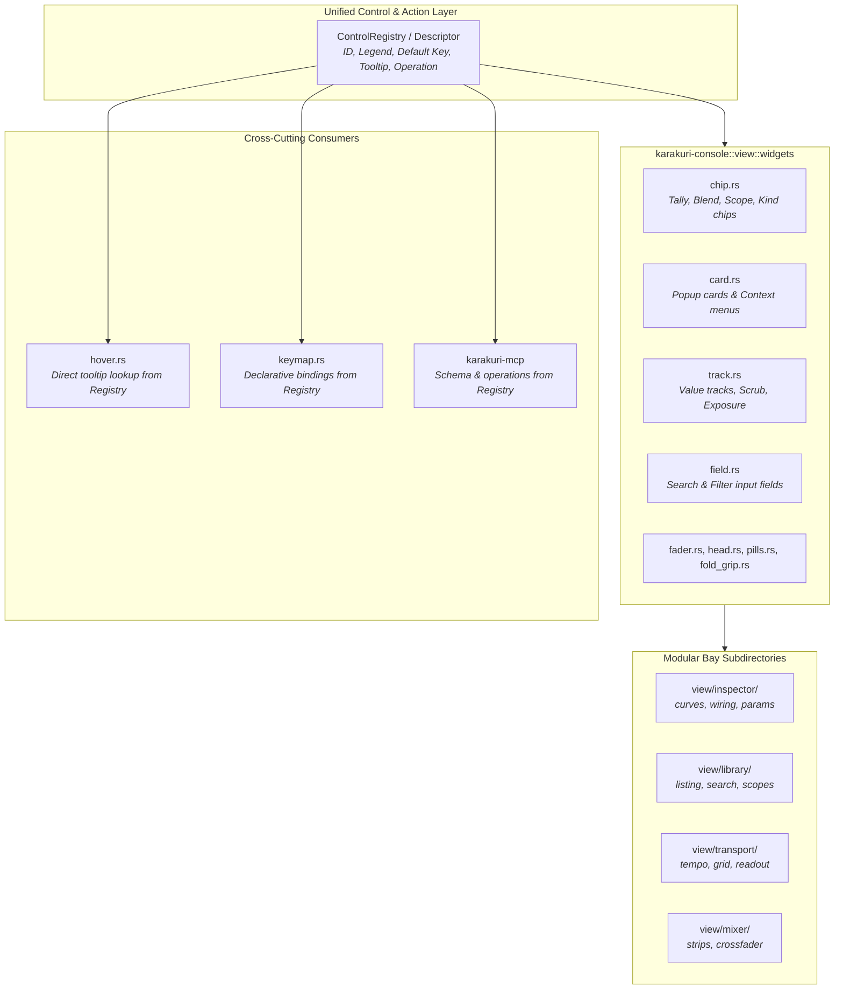

# Architectural Refactoring & Modernization Roadmap

This document records the architectural roadmap for **Karakuri**, focusing on the active refactoring plan: **Phase 4 (P30–P33)**.

---

## 1. Completed Phases (P1–P26)

All prior refactoring phases are complete, verified with full workspace tests, and documented in [`crates/README.md`](../crates/README.md):

- **Phase 1 & 2 (P1–P20)**: Transient render graph DAG, WGSL AST & pass fusion, machine-readable AI diagnostics, zero-allocation stream replay, and keymap convergence.
- **Phase 3 (P21–P26)**: Subsystem decomposition, monolith extraction, layer type centralization, full crate-level `README.md` documentation, and Google Style comment standardization across all 16 crates.

| Initiative | Target Subsystem | Actionable Deliverable | Status |
|---|---|---|:---:|
| **P21** | Type Conversions | Centralized layer conversions in `karakuri-environment::meta` as single source of truth | **COMPLETED** |
| **P22** | `karakuri-cli` / GUI | Extracted headless runtime controller; modularized `karakuri-cli` | **COMPLETED** |
| **P23** | `karakuri-environment` | Decomposed monoliths (`setfile`, `mix`), resolved couplings, isolated test suites | **COMPLETED** |
| **P24** | `karakuri` (GUI) | Decomposed `engine_bridge.rs` into `bridge/` (`sinks`, `engine`, `filesystem`, `handlers`) | **COMPLETED** |
| **P25** | `karakuri-mcp` | Extracted test suites to `tests/`; decomposed `lib.rs` into `protocol`, `server`, `spelled`, `tools/` | **COMPLETED** |
| **P26** | `karakuri-console` | Extracted 3 bays (`sequencer`, `staging`, `master`), `widgets/`, and `layout.rs` | **COMPLETED** |
| **P30** | `karakuri-console::view::widgets` | Componentized `card`, `chip`, `track`, `field` in `view/widgets/` | **COMPLETED** |
| **P31** | `karakuri-console::view` | Decomposed bay monoliths into subdirectories (`mixer/`, `transport/`, `library/`, `inspector/`) | **COMPLETED** |

---

## 2. Phase 4: UI Componentization, Unified Control Descriptors & Decoupled Interaction (P30–P33)

### Core Structural Smells

#### Smell 1: Quadruple-Dispatch & Fragile Hit/Tooltip Seams
- **Phenomenon**: Defining or modifying an interactive control requires updating up to 6 separate places across crates:
  1. Drawing routine in `view/<bay>.rs` (raw painter calls)
  2. Hit test probe in `karakuri-console::input::PROBES` (38 manual entries)
  3. Pointer event translation in `karakuri::readout::Readout::pointer` (1,300 lines of manual sequential dispatch)
  4. Operation translation & execution in `app.rs` / `handlers.rs`
  5. Tooltip lookup in `karakuri-console::hover::TIPS` (mapping probes to HTML CSS classes in `console.html`)
  6. Keyboard shortcut binding in `karakuri::keymap::KEY_BINDINGS` / `live.rs`
- **Impact**: Heavy duplication of control metadata; adding tooltips, keyboard hotkeys, or MCP inspection requires touching disjointed arrays with risk of subtle drift or missed synchronisation.

#### Smell 2: Console Bay Monoliths and Raw egui Painter Scattering
- **Phenomenon**: Individual bay files in `karakuri-console/src/view/` remain massive:
  - `view/inspector.rs`: **4,955 lines**
  - `view/library.rs`: **4,593 lines**
  - `view/transport.rs`: **4,130 lines**
  - `view/mixer.rs`: **2,907 lines**
  - `view/program.rs`: **1,579 lines**
- **Impact**: UI elements (chips, badges, context cards, slider tracks, search fields) are reimplemented with low-level `egui::Painter` primitives in each bay rather than using componentized, reusable widgets.

#### Smell 3: Monolithic Event Accumulators (`readout.rs` & `app.rs`)
- **Phenomenon**:
  - `karakuri/src/readout.rs` (**4,754 lines**) combines memory allocation profiling, frame time sampling, HUD text generation, layout solving, and a 1,300-line `Readout::pointer` match block.
  - `karakuri/src/app.rs` (**5,067 lines**) bundles window event loops, key routing, file drop ingestion, audio monitoring, and session persistence threads.
- **Impact**: High cognitive load, merge conflict friction, and difficulty in testing event handling in isolation.

---

### Phase 4 Architecture & Initiatives

#### P30. Expand Componentized Widget Library (`karakuri-console::view::widgets`) — **COMPLETED**
Extracted recurring visual and interactive elements out of bay modules into `view/widgets/`:
1. `card.rs`: `bay_card`, `popup_card`, `card_row_text`.
2. `chip.rs`: `Tally` residency enum, `badge`, `toggle_chip`, `scope_tab`, `centre_galley`.
3. `track.rs`: `slider_track_into` continuous slider tracks.
4. `field.rs`: `filter_field`, `editable_text_field`, `CARET`.

#### P31. Modularize Bay Monoliths into Subdirectories — **COMPLETED**
Decomposed all four massive bay files into cohesive modular subdirectories:
1. `view/mixer/`: `strip.rs`, `transition.rs`, `mod.rs`
2. `view/transport/`: `tempo.rs`, `audio_in.rs`, `tracker.rs`, `arrangement.rs`, `look.rs`, `mod.rs`
3. `view/library/`: `scopes.rs`, `filters.rs`, `listing.rs`, `mod.rs`
4. `view/inspector/`: `header.rs`, `params.rs`, `wiring.rs`, `mod.rs`

#### P32. Unified Control Descriptor & Declarative Registry
Establish a single source of truth for interactive controls:
1. Define `ControlDescriptor`:
   - `id: ControlId`: Strongly typed control identifier
   - `label: &'static str`: Human-readable label / legend
   - `default_key: Option<BoundKey>`: Default keyboard accelerator
   - `tooltip: &'static str`: Factual documentation text
   - `operation: Option<fn(...) -> Operation>`: Target action
   - `safety_class: Option<Class>`: Operator permission gate
2. Unify consumers:
   - `hover.rs`: Render tooltips directly with dynamically embedded shortcut badges (e.g., `"[G] Fold Bay"`).
   - `keymap.rs`: Derive keyboard legend tables directly from control descriptors.
   - `karakuri-mcp`: Provide consistent parameter descriptions and action schemas.

#### P33. Decouple `Readout` and Event Dispatch in `karakuri`
Dismantle `karakuri/src/readout.rs` (4,754 lines) into `karakuri/src/readout/`:
1. `mod.rs`: `Readout` struct and state container
2. `costs.rs`: Metric / frame timing / memory allocation measurement (`Costs`, `STILL`, `SAMPLE_CAP`)
3. `hud.rs`: Legend formatting and status string generation
4. `dispatch.rs`: Delegate pointer event handling to modular bay dispatchers, replacing the monolithic 1,300-line match block in `Readout::pointer`.

---

## 3. Execution Matrix (Phase 4)

| Initiative | Target Subsystem | Actionable Deliverable | Readiness |
|---|---|---|:---:|
| **P30** | `karakuri-console` | Extract reusable widgets: `chip.rs`, `card.rs`, `track.rs`, `field.rs` | **Ready to Execute** |
| **P31** | `karakuri-console` | Decompose bay monoliths (`inspector/`, `library/`, `transport/`, `mixer/`) | **Ready to Execute** |
| **P32** | `karakuri-operation` / `console` | Implement `ControlDescriptor` registry linking UI, keys, tooltips, and MCP | **Ready to Execute** |
| **P33** | `karakuri` (GUI) | Decompose `readout.rs` into `costs`, `hud`, and modular pointer `dispatch` | **Ready to Execute** |
