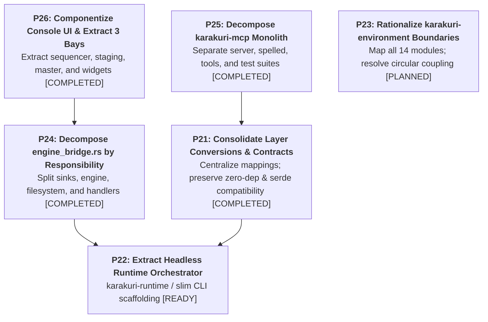

# Architectural Refactoring & Design Smells Report (Phase 3 - Revised)

This document records the architectural smells, structural friction, and design distortions identified in the **Karakuri** codebase, along with the corrected modernization roadmap for **Phase 3: Architectural Decomposition & Structural Decoupling (P21–P26)**.

---

## 1. Executive Context & Ground-Truth Baseline

### The Transition from Phase 2 to Phase 3
- **Phase 1 & Phase 2 (P1–P20) [COMPLETED]**:
  - Addressed critical hot-path and simulation constraints: transient render graph DAG allocation (P15), structured WGSL AST & pass fusion (P16), machine-readable AI diagnostics (P17), zero-allocation stream replay (P19), and unified keymap convergence (P20).
  - Executed emergency first-pass triage: dismantled the original 33.1k-line `karakuri/src/main.rs` into submodules (`engine_bridge.rs`, `app.rs`, `readout.rs`, etc.), split `karakuri-console/src/view.rs` (24.2k lines) into bay modules, and extracted `karakuri-mcp` into its own package.
- **The Limit of Raw File Decomposition**:
  - The first-pass triage made file boundaries visible, but several monolithic modules and procedural adapters remain:
    - `crates/karakuri-cli/src/main.rs`: **12,300 lines** (untouched scaffolding monolith)
    - `crates/karakuri-mcp/src/lib.rs`: **10,888 lines** (6,254 lines of production code, 4,634 lines of tests)
    - `crates/karakuri/src/engine_bridge.rs`: **8,309 lines** (procedural bridge combining 4 distinct responsibilities)
    - `crates/karakuri-console/src/view/mod.rs`: **7,493 lines** (bay orchestrator coupled with shared widget drawing)
  - [ADR-0345](adr/0345-a-file-that-crosses-1000-lines-gets-a-nudge-not-a-gate.md) established that crossing 1,000 lines is a *nudge, not a gate*. The size is a measurable indicator; **the work of Phase 3 is resolving the structural coupling, duplicated orchestration, and cohesive module boundaries.**

---

## 2. Analysis of Core Structural Smells (Ground-Truth Corrected)

### Smell 1: Layer Primitive Duplication & Conversion Scattering
- **Phenomenon**: The 6-variant pipeline layer (`L1`, `L2`, `L3`, `L4`, `Field`, `L5`) is independently defined as an enum across three crates:
  1. `karakuri_ir::ast::Kind` (internal AST/IR type)
  2. `karakuri_operation::Layer` (strictly zero-dependency vocabulary leaf; derives `Debug, Clone, Copy, PartialEq, Eq`)
  3. `karakuri_store::record::Layer` (persistent `.ndjson` schema; derives `Hash, Serialize, Deserialize`)
- **Impact**: Because derive sets and dependency requirements deliberately differ (per `karakuri-operation`'s charter of having zero dependencies), conversions between them are duplicated across:
  - `karakuri-environment/src/meta.rs`: 4 functions (`kind_of`, `layer_of`, `kind_name`, `layer_named`)
  - `karakuri/src/engine_bridge.rs`: `asked_layer`, `ir_layer`, and string parser `kind_of`
  - `karakuri-mcp/src/lib.rs`: `layer_of`, `kind_of`, `layer_name`, `layer_named`
  - `karakuri-environment/src/midi.rs`: `layer_of`
  - `karakuri-engine/src/set.rs`: `kind_of_layer`
- **Key Insight**: String parsing (`FromStr` / `layer_named`) is functionally distinct from enum-to-enum mapping. Any unification must preserve `karakuri-operation`'s zero-dependency invariant and maintain strict serialized JSON compatibility for `record::Layer`.

### Smell 2: Dual Orchestration Duplication (CLI vs. GUI)
- **Phenomenon**: `karakuri-cli` remains a 12,300-line single-file binary. Both `karakuri-cli` (via its `Live` struct and event loop) and `karakuri` GUI (via `app.rs` and `engine_bridge.rs`) independently coordinate:
  - Multi-slot deck state, residency switching, and Set building.
  - Background `HotSwap` compilation worker channels and atomic swap.
  - Preset directory scanning, scratch space synchronisation, and Set file loading.
  - Session recording (`ndjson`) and replay driving.
- **Impact**: Maintenance overhead is doubled; capabilities divergence (e.g. headless session replay working only in CLI) persists.

### Smell 3: Multi-Responsibility Congestion in `engine_bridge.rs` (8,309 lines)
- **Phenomenon**: `karakuri-console` keeps `wgpu::Device` out of its dependencies so that arrangement and panel logic can be tested on machines without a GPU adapter (ADR-0156). To wire this console to the actual runtime device, `engine_bridge.rs` was created in `karakuri`. However, it has accumulated **four entirely different responsibilities**:
  1. **Render Targets & egui Sinks**: Managing `Presented`, `wgpu::TextureView`, resize handling, and egui user texture registrations (`Sink` implementation).
  2. **Engine Lifecycle & Coordination**: Deck instantiation, step advancement, HotSwap polling, and Governor budget verification.
  3. **Filesystem & Asset Discovery**: `Taking`, Presets directory scanning, folder drag-and-drop ingestion, and Set loading.
  4. **Operation Dispatch & Reconciliation**: Transforming UI interaction outcomes into `Operation` / `Record` batches and updating panel state.
- **Key Insight**: The ~8,300 lines cannot be eliminated by introducing intermediate snapshots (which would re-introduce render-thread heap allocations via `Arc`). Instead, this monolithic file must be decomposed by responsibility into dedicated submodules.

### Smell 4: `karakuri-mcp` Monolithic Packaging (10,888 lines)
- **Phenomenon**: `crates/karakuri-mcp/src/lib.rs` contains the entire MCP subsystem in a single file:
  - **Production Code (6,254 lines)**:
    - Transport & Server: JSON-RPC parsing, TCP stream handling, HTTP header checks, client session state (~2,430 lines).
    - Declarative Operation Schema (`SPELLED` array): JSON schema definitions, sample constructors, and argument parsers for all 64 operations (~1,940 lines).
    - Tool Implementations & Handlers: 10 tools (`check_procedure`, `check_set`, `read_procedure`, `write_procedure`, `wire_input`, `swap_outcome`, `read_set`, `list_sets`, `walk_history`, `save_set`, `operate`) and resource endpoints (`vocabulary`) (~1,880 lines).
  - **Test Suites (4,634 lines)**:
    - `mod wire_tests` (lines 6,255–9,194): Socket-level integration test suite (**2,940 lines**).
    - `mod tests` (lines 9,195–10,888): In-memory unit test suite (**1,694 lines**).

### Smell 5: Console UI Procedural Spaghetti & Three Abandoned Bays (`view/mod.rs`)
- **Phenomenon**: While `karakuri-console`'s underlying model layer (`Layout`, `Panel`, `Focus`, `Input`, `Hover`) is rigorously structured as toolkit-independent, deterministic state machines, its view presentation layer (`view/` totaling 26,000 lines) abandons componentization in favor of hundreds of procedural, low-level painter routines (`*_into(ui, pal, ...)`).
- **The Critical Oversight in First-Pass Triage**: When `view.rs` (24.2k lines) was originally split, 5 bay files were extracted (`inspector`, `library`, `transport`, `mixer`, `program`), but **three entire bays were left abandoned inside `view/mod.rs`**:
  1. **Sequencer Bay** (lines 3,130–4,134, **~1,000 lines**): `Sequencer`, `LaneCard`, `SeqRow`, `Choices`, `lane_card_into`, `sequencer_into`.
  2. **Staging Bay** (lines 4,135–4,836, **~700 lines**): `Stage`, `Candidate`, `StagingBay`, `staging_into`.
  3. **Master Bay** (lines 2,497–3,129, **~630 lines**): `MasterRow`, `FxRow`, `Chain`, `master_into`, `fx_into`.
- **Shared Widget Inlining**: Reusable UI controls (Head bars, Capsules, McpPills, FoldGrips, Outputs, Fader/Meter primitives) and geometry solvers (`plan_into`, `track`, `held_inside`) remain inlined in `mod.rs` (lines 800–2,496, **~1,700 lines**), preventing modular testing and creating a 7,493-line bottleneck.

---

## 3. Phase 3 Modernization Initiatives

---

### P26. Componentize Console UI, Extract 3 Bays & Shared Widgets [COMPLETED]

#### Phenomenon
`crates/karakuri-console/src/view/mod.rs` (7,493 lines) remains a massive bottleneck because three major bays (Sequencer, Staging, Master), shared interactive widgets, and layout placement math were never extracted.

#### Refactoring Plan
1. **Extract the 3 Abandoned Bays into Dedicated Modules**:
   - `crates/karakuri-console/src/view/sequencer.rs`: `Sequencer`, `LaneCard`, `SeqRow`, `Choices`, `lane_card_into`, `sequencer_into` (~1,000 lines).
   - `crates/karakuri-console/src/view/staging.rs`: `Stage`, `Candidate`, `StagingBay`, `staging_into`, `staging_box` (~700 lines).
   - `crates/karakuri-console/src/view/master.rs`: `MasterRow`, `FxRow`, `Chain`, `master_into`, `fx_into` (~630 lines).
2. **Extract Shared Interactive Widgets into `crates/karakuri-console/src/view/widgets/`**:
   - `head.rs`: `Head`, `HeadWords`, `head_capsule`, `bank_capsules` (~750 lines).
   - `pills.rs`: `McpPill`, `SinkChip`, status indicators (`pill_into`, `pill_at`) (~650 lines).
   - `fold_grip.rs`: `FoldGrip`, `bay_grip`, `grip_dots` (~500 lines).
   - `outputs.rs`: `Outputs`, `OutputsRow`, master level monitors, routing selectors (~500 lines).
   - `fader.rs`: Common fader / meter drawing primitives (`fader_into`, `meter_into`, `fader`, `grabbed`) (~400 lines).
3. **Extract Geometry Placement into `crates/karakuri-console/src/view/layout.rs`**:
   - Layout helpers: `plan_into`, `track`, `held_inside`, `positive`, `filled` (~400 lines).
4. **Retain `src/view/mod.rs` as Clean Orchestrator**:
   - Top-level bay dispatch, `View` struct definition, and public re-exports (~600–800 lines).

---

### P25. Subsystem Decomposition of `karakuri-mcp` [COMPLETED]

#### Phenomenon
`crates/karakuri-mcp/src/lib.rs` (10,888 lines) houses server plumbing, 1,940 lines of `SPELLED` operation tables, 10 distinct tools, and 4,634 lines of test suites in one file.

#### Refactoring Plan
1. **Relocate Test Suites to Dedicated Integration Test Files**:
   - Move `mod wire_tests` (lines 6,255–9,194, 2,940 lines) to `crates/karakuri-mcp/tests/wire.rs`.
   - Move `mod tests` (lines 9,195–10,888, 1,694 lines) to `crates/karakuri-mcp/tests/unit.rs`.
   - *Immediate impact*: Reduces `lib.rs` from 10,888 lines to 6,254 lines with zero production code changes.
2. **Decompose Production Architecture**:
   - `src/lib.rs`: Public API (`serve`, `check_procedure`, `check_set_configuration`, `Reporter`, `Slots`) (~250 lines).
   - `src/protocol.rs`: JSON-RPC 2.0 framing, error codes, HTTP header parsing (`read_capped`, `is_local_origin`, `respond`) (~500 lines).
   - `src/server.rs`: TCP listener loop, thread handling, dispatch (~450 lines).
   - `src/state.rs`: Session state, permission gating, audit verification (~400 lines).
   - `src/spelled.rs`: `Spelled` struct, helper parsing combinators (`number_of`, `word_of`, etc.), and the 1,940-line `SPELLED` constant table.
   - `src/tools/`: Implementation of the 10 MCP tools:
     - `tools/mod.rs`: `call_tool` router and `tools()` schema catalog.
     - `tools/procedure.rs`: `check_procedure`, `read_procedure`, `write_procedure`.
     - `tools/set.rs`: `check_set`, `read_set`, `list_sets`, `save_set`.
     - `tools/wire.rs`: `wire_input`.
     - `tools/history.rs`: `walk_history`, `swap_outcome`.
     - `tools/operate.rs`: `operate` bridge.
   - `src/resources.rs`: `vocabulary` resource endpoint and checker reflection tables.

---

### P24. Decompose `engine_bridge.rs` by Concrete Responsibility [COMPLETED]

#### Phenomenon
`crates/karakuri/src/engine_bridge.rs` (8,309 lines) couples presentation sinks, engine lifecycle, filesystem scanning, and operation dispatch in a single monolithic file.

#### Refactoring Plan
Decompose into cohesive modules under `crates/karakuri/src/bridge/`:
1. **`bridge/sinks.rs`**:
   - `Presented` struct, `Sink` trait implementation, `Aiming`, texture format constants (`PICTURE_FORMAT`, `PICTURE_SAMPLED_FORMAT`), and egui user texture registrations (~900 lines).
2. **`bridge/engine.rs`**:
   - `Engine` struct, lifecycle initialization (`new`), frame advancement (`compose`), and HotSwap synchronization (~1,500 lines).
3. **`bridge/filesystem.rs`**:
   - `Taking` enum, `presets_listing`, `folder_files`, drag-and-drop directory scanning, and Set file resolution (~1,200 lines).
4. **`bridge/handlers.rs`**:
   - Transformation of panel UI events into `Operation` / `Record` batches and deck mutators (~1,500 lines).
5. **`bridge/mod.rs`**:
   - Facade re-exporting the bridge interface to `app.rs` and `main.rs`.

---

### P22. Extract Headless Runtime & Orchestrator (`karakuri-runtime`) [PLANNED]

#### Phenomenon
`karakuri-cli/src/main.rs` (12,300 lines) and `karakuri` GUI (`app.rs` + `engine_bridge.rs`) independently duplicate deck management, HotSwap compilation worker channels, session recording, and transport clock logic.

#### Refactoring Plan
1. **Extract `karakuri-runtime`**:
   - Headless session controller: owns `Deck`, manages residency transitions, applies `Operation` batches, and drives step execution.
   - `HotSwapCoordinator`: manages background compilation worker threads, staging queues, budget probe verification, and atomic commit.
   - `TransportClock`: centralizes oscillator synchronisation, audio tempo corrections, and latency offset adjustments.
2. **Slim Down `karakuri-cli`**:
   - Transform `karakuri-cli` into a lightweight CLI harness (~800 lines) parsing CLI arguments, instantiating `SessionController`, and driving the event loop.

---

### P21. Consolidate Layer Conversions & Preserve Invariants [COMPLETED]

#### Phenomenon
Layer enums are duplicated across `karakuri-operation`, `karakuri-ir`, and `karakuri-store::record`. Conversion functions are scattered across `meta.rs`, `engine_bridge.rs`, and `mcp/lib.rs`.

#### Refactoring Constraints & Plan
1. **Preserve Invariants**:
   - `karakuri-operation::Layer` must remain **strictly zero-dependency** (`std` only). It cannot take dependencies on `serde` or other crates.
   - `karakuri-store::record::Layer` must retain exact JSON serialization names (`L1`, `L2`, `L3`, `L4`, `Field`, `L5`) to avoid breaking existing session streams.
2. **Refactoring Strategy**:
   - Centralize conversion utilities between `ir::ast::Kind` and `operation::Layer` into `meta.rs` as the authoritative mapping module.
   - Standardize string parsing via `FromStr` implementations rather than ad-hoc `kind_of` / `layer_named` functions.
   - Add automated schema consistency tests ensuring `record::Layer` serialization matches `operation::Layer` string representations.

---

### P23. Rationalize `karakuri-environment` Module Boundaries [PLANNED]

#### Phenomenon
`karakuri-environment` holds 14 modules totaling 20,041 lines. Simply extracting an "I/O" crate risks confusing existing crates (`karakuri-audio`, `karakuri-midi`) which already handle low-level device I/O.

#### Refactoring Plan
1. **Full Accounting of All 14 Modules**:
   - Adaptors: `audio.rs` (757 lines), `midi.rs` (2,072 lines), `tempo_source.rs` (626 lines)
   - Formats: `setfile.rs` (5,156 lines), `session.rs` (1,234 lines), `meta.rs` (204 lines)
   - Engine/Disk Integration: `mix.rs` (2,810 lines), `history.rs` (1,894 lines), `places.rs` (980 lines), `compile.rs` (606 lines), `scratch.rs` (501 lines), `render.rs` (456 lines), `clock.rs` (295 lines), `watch.rs` (2,450 lines)
2. **Strategy**:
   - Address internal circular couplings (`setfile` ↔ `compile` ↔ `meta`) before attempting any crate extraction.
   - Re-evaluate whether `karakuri-environment` should remain a unified coordination crate with cleanly separated internal module hierarchies.

---

## 4. Execution Matrix & Next Steps

| Initiative | Target Subsystem | Actionable Deliverable | Readiness |
|---|---|---|:---:|
| **P26** | `karakuri-console` | Extract 3 bays (`sequencer`, `staging`, `master`), `widgets/`, and `layout.rs` | **COMPLETED** |
| **P25** | `karakuri-mcp` | Extract tests to `tests/wire.rs` & `src/tests.rs`; decompose `lib.rs` into `protocol`, `server`, `spelled`, `tools/` | **COMPLETED** |
| **P24** | `karakuri` (GUI) | Decompose `engine_bridge.rs` into `bridge/` (`sinks`, `engine`, `filesystem`, `handlers`) | **COMPLETED** |
| **P22** | `karakuri-cli` / GUI | Extract headless runtime controller; slim `karakuri-cli/src/main.rs` | **READY** |
| **P21** | Type Conversions | Centralize layer conversions in `meta.rs`; establish serialization parity test | **COMPLETED** |
| **P23** | `karakuri-environment` | Untangle internal cyclic couplings; map destinations for all 14 modules | **PLANNED** |
