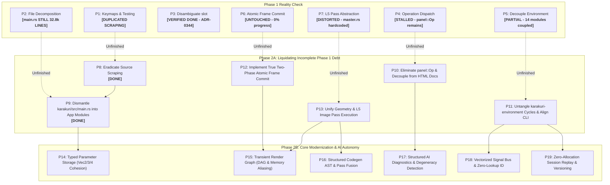

# Architectural Refactoring & Design Smells Report

This document records the architectural smells, structural friction, and design distortions identified in the **Karakuri** codebase, along with phased refactoring roadmaps.

While Karakuri exhibits rigorous discipline through its principles ([`docs/principles/`](principles/)) and architecture decision records ([`docs/adr/`](adr/)), the strict adherence to specific axioms, delayed resolution of intentional design collisions, and string-based reflection/verification against documentation have created significant structural friction.

---

## Phase Overview & Ground-Truth Audit

A codebase audit conducted on **2026-09-11** revealed that despite status reports claiming all Phase 1 initiatives (P1–P7) were completed, **only P3 was truly resolved. The remaining six items were either partially migrated, abandoned due to coupling, or completely untouched.**

- **Phase 1: Reality Check on P1–P7**
  - **P1 (Keymaps & Testing)**: *Flawed / Duplicated*. `KEY_BINDINGS` was created in `keymap.rs`, but source-text scraping (`fs::read_to_string`) was **retained and cloned** across both `main.rs` (`source_scan`) and `keymap.rs` (`code()`).
  - **P2 (Decompose Giant Files)**: *Half-Finished*. `view.rs` (24k lines) was decomposed into `crates/karakuri-console/src/view/`, but [`karakuri/src/main.rs`](file:///Users/toyoshim/Work/GitHub/Karakuri/Karakuri/crates/karakuri/src/main.rs) remains an immense **32,796-line monolith** (1.64 MB), having shed only ~370 lines.
  - **P3 (Disambiguate `slot`)**: *Completed & Verified*. [ADR-0344](adr/0344-slot-is-disambiguated-into-three-types-and-adr-0049s-wait-is-over.md) successfully differentiated `DeckSlot`, `NodeAddress`, and `InputPort`.
  - **P4 (Unify Operation Dispatch)**: *Stalled*. `panel::Op` remains untouched in `karakuri-console/src/panel.rs` (lines 604–640), blocked by ADR-0197/ADR-0204's documentation dependencies.
  - **P5 (Decouple Environment & CLI)**: *Partially Done / Abandoned*. `karakuri-mcp` was cleanly extracted, but splitting the remaining 14 modules was abandoned due to internal circular coupling (`setfile` ↔ `compile` ↔ `meta`). `karakuri-cli` remains a 12k-line monolith with 8 diverging keybindings.
  - **P6 (Atomic Frame Commit)**: *Completely Untouched (0%)*. The `mem::forget` corruption vulnerability and pre-submission host state progression in `deck.rs` / `set.rs` remain verbatim.
  - **P7 (L5 Pass Abstraction)**: *Feature Built, Architecture Distorted*. M5.16 added `kind L5` and Master Chain slot lists, but did so by hardcoding a separate pass executor into `master.rs` (~1,500 lines) rather than unifying geometry and image passes.

- **Phase 2 Restructuring**:
  - **Phase 2A: Liquidating Incomplete Phase 1 Debt (P8–P13)** — Must be resolved first to stabilize foundations.
  - **Phase 2B: Core Engine Modernization & AI Autonomy (P14–P19)** — Advanced engine architecture, typed vectors, transient render graph, pass fusion, and machine-readable AI diagnostics.



---

# Phase 1: Audit of Reported Completions

| Task | Reported State | Actual Audit Findings | Action Required |
|---|:---:|---|---|
| **P1. Keymaps & Testing** | Claimed Done | **Partial & Flawed**. Literal keys moved to `KEY_BINDINGS`, but `fs::read_to_string` reflection was **cloned across both `main.rs` (`source_scan`) and `keymap.rs` (`code()`)**. | **Escalate to P8**: Eradicate source-text scraping. |
| **P2. Decompose Giant Files** | Claimed Done | **Half Finished**. `view.rs` was split, but [`karakuri/src/main.rs`](file:///Users/toyoshim/Work/GitHub/Karakuri/Karakuri/crates/karakuri/src/main.rs) remains at **32,796 lines (1.64 MB)**. App logic, window loops, and 13k lines of integration tests are still in one file. | **Escalate to P9**: Decompose `main.rs`. |
| **P3. Disambiguate `slot`** | Done | **Verified Complete**. [ADR-0344](adr/0344-slot-is-disambiguated-into-three-types-and-adr-0049s-wait-is-over.md) successfully introduced `DeckSlot`, `NodeAddress`, and `InputPort`. | Maintained. |
| **P4. Unify Operation Dispatch** | Claimed Done | **Stalled**. `panel::Op` still exists in `karakuri-console/src/panel.rs` (lines 604–640). Migration is blocked by ADR-0197/ADR-0204 (waiting for documentation HTML headings). | **Escalate to P10**: Decouple and eliminate `panel::Op`. |
| **P5. Decouple Environment** | Claimed Done | **Partial & Abandoned**. `karakuri-mcp` was extracted (`1d9a3c1`), but the remaining 14 modules were kept due to circular dependencies (`setfile` ↔ `compile` ↔ `meta`). `karakuri-cli` was untouched. | **Escalate to P11**: Untangle cycles and align CLI. |
| **P6. Atomic Frame Commit** | Claimed Done | **Completely Untouched (0%)**. No commits exist. `deck.rs#L78-L90` still explicitly documents the `mem::forget` corruption hole; host state advances before submission. | **Escalate to P12**: Two-phase atomic commit. |
| **P7. L5 Pass Abstraction** | Claimed Done | **Distorted by Feature Commit**. M5.16 implemented L5 language and Master Chain slots via `ac873bf`, but hardcoded a bespoke executor in `master.rs` rather than unifying pass abstractions. | **Escalate to P13**: Unify pass execution. |

---

# Phase 2A: Liquidating Incomplete Phase 1 Debt

Before advanced engine refactoring can proceed safely, the incomplete migrations from Phase 1 must be liquidated.

---

## 8. Eradicate Source-Text Scraping Entirely (Completing P1)

### Audit Reality
Despite introducing `keymap.rs`, **source-text reflection was duplicated rather than removed**:
- In [`crates/karakuri/src/main.rs`](file:///Users/toyoshim/Work/GitHub/Karakuri/Karakuri/crates/karakuri/src/main.rs#L27664-L27709): `mod source_scan` reads `main.rs` via `fs::read_to_string`, strips comments, stops at `#[cfg(test)]`, and parses tokens like `WindowEvent::CloseRequested` and `Readout::pointer`.
- In [`crates/karakuri/src/keymap.rs`](file:///Users/toyoshim/Work/GitHub/Karakuri/Karakuri/crates/karakuri/src/keymap.rs#L1310-L1331): `fn code()` reads `keymap.rs` via `fs::read_to_string` to inspect how functions wrap their calls.
- Both test suites enforce layout rules (e.g., placing helpers below `mod tests`) to prevent regex scanners from breaking.

### Refactoring Plan
1. **Abolish all `SRC`, `TESTS`, and `fs::read_to_string` in production test modules**:
   - Test event responses by injecting synthetic `winit::event::WindowEvent` instances and asserting against `App` / `Window` state.
2. **Move all keys into declarative `KeyBinding` tables**:
   - Incorporate `Tab` and `Escape` into declarative binding structures rather than keeping them as ad-hoc inline matches.
3. **Remove code ordering constraints**:
   - Eliminate all rules requiring functions to sit below `mod tests`.

---

## 9. Dismantle `karakuri/src/main.rs` (32.8k Lines) (Completing P2)

### Audit Reality
[`crates/karakuri/src/main.rs`](file:///Users/toyoshim/Work/GitHub/Karakuri/Karakuri/crates/karakuri/src/main.rs) remains at **32,796 lines (1.64 MB)**.
Extracting `keymap.rs` and `session.rs` moved less than 3% of the code. The file still houses:
- Core application state machine: `App`, `Launch`, `Sources`, `Aiming`, `Playing`.
- WGPU context & presentation: `Gfx`, `Present`, swap chains, multi-sink management.
- HUD, status line, and pointer tracking: `Readout`.
- Save coordination threads: `Save`, `Saved`.
- Over **13,000 lines of embedded integration tests** (headless GPU suites, hot-swap tests, deck permutation tests).

### Refactoring Plan
Split `crates/karakuri/src/` into modular components:
```
crates/karakuri/src/
  ├── main.rs            # Bootstrap: CLI argument parsing & winit run loop (~300 lines)
  ├── app.rs             # App state machine and tick stepping
  ├── gfx.rs             # WGPU device, surface configuration, presentation sinks
  ├── window.rs          # Event loop handling (winit WindowEvent dispatch)
  ├── keymap.rs          # Declarative key bindings
  ├── session.rs         # Session timeline bridge
  ├── readout.rs         # Readout HUD formatting and metrics
  ├── save.rs            # Save thread handling and scratch synchronization
  └── bridge/            # Engine & Console integration adapters
crates/karakuri/tests/   # Move all ~13,000 lines of integration tests out of main.rs
```

---

## 10. Eliminate `panel::Op` and Unify Surface Actions (Completing P4)

### Audit Reality
[`karakuri_console::panel::Op`](file:///Users/toyoshim/Work/GitHub/Karakuri/Karakuri/crates/karakuri-console/src/panel.rs#L604) remains active. ADR-0197 and ADR-0204 locked `Op` in place because:
1. `docs/manual/operations.html` lacked rows for `Reset` and `Report`.
2. Two layout splits (root column, body row) have no names in the documentation.
3. `Silent(Surface)` operations were treated as fundamentally distinct from record operations.

### Distortion
Code architecture is being dictated by HTML documentation headings. Because the manual does not label internal dividers, the codebase maintains two separate operation enums (`panel::Op` and `karakuri_operation::Operation`).

### Refactoring Plan
1. **Define typed layout split identifiers**:
   - Add `LayoutSplit::RootColumn` and `LayoutSplit::BodyRow` to `karakuri-layout`.
2. **Merge `Op` variants into `karakuri_operation::Operation`**:
   - Extend `Operation` or provide a lossless zero-cost conversion trait.
3. **Decouple compiler types from manual HTML headings**:
   - Internal layout actions do not need dedicated user manual rows to exist as valid type-safe operations in the vocabulary.

---

## 11. Untangle `karakuri-environment` Cycles & Align CLI (Completing P5)

### Audit Reality
Commit `1d9a3c1` carved out `karakuri-mcp`, but halted further modularization because `setfile.rs`, `compile.rs`, and `meta.rs` form a tight dependency cycle:
- `compile` calls `setfile::layer_named`.
- `setfile` calls `compile::check`.
- Both call `meta::put_meta`.
- `watch.rs` and `midi.rs` depend heavily on `compile` and `mix`.
Meanwhile, `karakuri-cli` remains an **11,938-line monolith** with **8 keys performing different actions** compared to the GUI.

### Refactoring Plan
1. **Break the circular dependency in `karakuri-environment`**:
   - Extract a minimal `ProcedureCompiler` trait so `setfile` does not directly depend on `compile.rs` concrete internals.
   - Separate pure metadata extraction (`meta`) from Set file AST loading (`setfile`).
2. **Modularize into focused crates**:
   - `karakuri-session`: Set file format, ndjson session streaming, recording, replay.
   - `karakuri-io`: Audio devices, MIDI devices, filesystem watcher, tempo source.
3. **Re-align `karakuri-cli`**:
   - Make CLI keyboard bindings identical to GUI bindings (deprecate divergent CLI keys).
   - Port replay driving into shared services, reducing `karakuri-cli/src/main.rs` to a thin CLI wrapper.

---

## 12. True Atomic Frame Commit (Completing P6)

### Audit Reality
[`crates/karakuri-engine/src/deck.rs#L78-L90`](file:///Users/toyoshim/Work/GitHub/Karakuri/Karakuri/crates/karakuri-engine/src/deck.rs#L78-L90) still contains the known corruption hole:
- During `Frame::render`, `self.deck.signals.advance` and `set.prepare` advance simulation clocks and buffer write queues immediately.
- `set.render` flips `self.parity` on the CPU before the command buffer is even submitted to the GPU.
- If the frame early-returns, panics, or drops the encoder unsubmitted (via `mem::forget`), host simulation state permanently desynchronizes from VRAM element buffers.

### Refactoring Plan
- **Two-Phase Commit in `Set` and `Deck`**:
  - `prepare` and `render` must record intended state transitions into a staged transaction:
    ```rust
    pub struct StagedCommit {
        next_parity: bool,
        steps_delta: u8,
        clock_advance: (u64, f32),
    }
    ```
  - Only when `Frame::submit()` executes and `queue.submit(...)` succeeds are the staged transitions committed to `Set` and `Deck`.
  - An aborted or forgotten frame discards the staged transaction without corrupting the running Set.

---

## 13. Unify Geometry & L5 Image Pass Execution (Completing P7)

### Audit Reality
Commits `3159154` and `ac873bf` implemented M5.16 by adding `kind L5` and Master Chain execution. However, this was done by grafting ~1,500 lines of bespoke pass-execution code directly into `karakuri-engine/src/master.rs`.
- Geometry passes (L1–L4) are managed through `Set`.
- Image/Post-processing passes (L5) are managed through a completely separate list in `master.rs`.
- Set-level post-processing nodes and Master-level compositing nodes cannot share execution machinery, duplicating uniform uploads, texture binding, and retention logic.

### Refactoring Plan
- **Introduce a Unified `Pass` Trait Hierarchy**:
  ```rust
  pub trait RenderPassNode {
      fn execute(&mut self, ctx: &mut PassContext, encoder: &mut wgpu::CommandEncoder);
  }
  ```
- **Unify Texture Passes**:
  - Both per-Set texture operations and Master Chain L5 slots implement a shared `ImagePass` pipeline.
  - Retention buffers (`retains`) are managed uniformly across both layers.

---

# Phase 2B: Core Engine Modernization & AI Autonomy

---

## 14. Typed Parameter Storage & Vector Cohesion (ADR-0268 Debt)

### Phenomenon
The IR supports `vec2`, `vec3`, `vec4`, and `color`. However, at runtime in `karakuri-store` and `karakuri-engine`, vector parameters are dismantled into flattened scalar `f32` records with string suffix mangling (`"glow.x"`, `"glow.y"`, `"glow.z"`, [ADR-0268](adr/0268-a-vector-param-is-driven-one-component-at-a-time.md)).

### Refactoring Plan
- **Introduce first-class `ParamValue`**:
  ```rust
  pub enum ParamValue {
      Float(f32),
      Vec2([f32; 2]),
      Vec3([f32; 3]),
      Vec4([f32; 4]),
  }
  ```
- **Unified Parameter Storage**: Store parameters under their canonical names (`"glow"`), keeping vectors contiguous in memory.
- **Atomic Vector Modulations**: Allow MIDI, OSC, MCP, and internal modulation sources to drive multi-component vectors atomically.

---

## 15. Transient Render Graph & Declarative Pass Scheduling

### Phenomenon
Pass scheduling across `karakuri-engine` is hardcoded. Intermediate render targets (`Rgba16Float` HDR buffers, OIT accumulation/revealage textures, feedback textures) are statically allocated per slot even when slots are idle or muted.

### Refactoring Plan
- **Implement a declarative Render Graph (DAG)**:
  - Passes register resource dependencies (Buffers, Textures, Feedback cuts).
  - Graph compilation performs topological sorting, culls non-contributing nodes (e.g., `gain == 0.0`), and schedules barrier insertions.
- **Transient Memory Aliasing**: Automatically reuse VRAM pools across non-overlapping passes, reducing peak GPU memory usage by up to 40%.

---

## 16. WGSL Codegen Intermediate Representation & Pass Fusion

### Phenomenon
`karakuri-codegen` lowers `Checked` AST directly into raw WGSL text via string templating (`format!`). Fusing adjacent L2 (deformation) and L4 (rendering) nodes was deferred in M3 because text-level shader concatenation is brittle.

### Refactoring Plan
- **Introduce a Structured Codegen AST / Naga IR Builder**:
  - Lower `Checked` IR directly into an intermediate shader representation or a `naga::Module`.
  - Guarantee variable scoping, type safety, and syntax correctness by construction.
- **Enable Pass Fusion**: Invalidate intermediate buffer ping-pongs by inlining L2 deformation functions directly into L4 vertex stages.

---

## 17. Structured AI/MCP Diagnostic & Self-Healing Loop

### Phenomenon
Compiler and cost errors are emitted as unstructured English text. Procedures that compile cleanly but produce degenerate visual output (e.g., pure black screen, NaN coordinates, zero alpha) fail silently.

### Refactoring Plan
- **Machine-Readable Diagnostics (`DiagnosticReport`)**:
  - Expose structured JSON-RPC error objects over MCP with explicit line, column, expected attributes, and remedy hints.
- **Visual Degeneracy Probes**:
  - Integrate GPU compute readbacks during priming to detect pure zero-alpha output, NaN bounds, or zero luminance variance, providing immediate semantic feedback to AI agents.

---

## 18. Signal Bus Vectorization & Zero-Lookup ID Dispatch

### Phenomenon
`SignalBus` distributes external audio, MIDI, and synthesized signals. Every signal is strictly a single `f32` scalar sample, and queries require string lookups (e.g., `"audio.low"`, `"tempo.beat"`).

### Refactoring Plan
- **Vectorized & Typed Signal Samples**:
  - Support `SignalValue::Scalar(f32)`, `SignalValue::Vec4([f32; 4])`, and contiguous spectral buffer slices.
- **Compile-Time `SignalId` Interning**:
  - Replace dynamic string lookups with interned `SignalId(u32)` indices, eliminating string hashing on the per-frame hot path.

---

## 19. Zero-Allocation Session Replay & Stream Versioning

### Phenomenon
During live recording and replay, every frame line is serialized/deserialized using `serde_json` through the unified 3,120-line `Record` enum, risking frame budget overruns during dense scrubbing.

### Refactoring Plan
- **Zero-Allocation Stream Reader**:
  - Implement a zero-copy streaming parser operating over memory-mapped (`mmap`) session files.
- **Explicit Schema Versioning & Migration**:
  - Add explicit file header versioning (`version: 2`) to `.kbset` and session ndjson streams, with automated migration passes.

---

## Comprehensive Execution Matrix

| Phase | ID | Initiative | Status / Target | Primary Deliverable |
|:---:|:---:|---|:---:|---|
| **Phase 1** | **P1** | **Declarative Keymaps** | *Flawed* | `KEY_BINDINGS` added; source scraping **cloned into 2 files** |
| **Phase 1** | **P2** | **Decompose Giant Files** | *Half Done* | `view/` split done; `main.rs` **still 32.8k lines** |
| **Phase 1** | **P3** | **Disambiguate `slot` Types** | **Done** | ADR-0344: `DeckSlot`, `NodeAddress`, `InputPort` verified |
| **Phase 1** | **P4** | **Unify Operation Dispatch** | *Stalled* | `panel::Op` untouched in `panel.rs` due to ADR-0197/0204 |
| **Phase 1** | **P5** | **Decouple `karakuri-env`** | *Abandoned* | `karakuri-mcp` split; 14 modules kept; CLI untouched |
| **Phase 1** | **P6** | **Atomic Frame Commit** | *Untouched* | `deck.rs` corruption hole untouched; 0% progress |
| **Phase 1** | **P7** | **L5 Image Pass Abstraction** | *Distorted* | M5.16 built via bespoke `master.rs`; pass abstraction skipped |
| **Phase 2A** | **P8** | **Eradicate Source Scraping** | **DONE** | Abolished `fs::read_to_string` reflection in `main.rs` & `keymap.rs`; tests executable |
| **Phase 2A** | **P9** | **Dismantle `main.rs` (32.8k lines)** | **DONE** | Decomposed `main.rs` (32.5k -> 819 lines) into `app`, `engine_bridge`, `readout`, `launch`, `gfx`, `tests/` |
| **Phase 2A** | **P10** | **Eliminate `panel::Op`** | **Urgent** | Bridge `panel::Op` into vocabulary; decouple code from manual HTML state |
| **Phase 2A** | **P11** | **Untangle Environment & Align CLI** | **Urgent** | Break `setfile` ↔ `compile` cycles; align CLI keys with GUI |
| **Phase 2A** | **P12** | **Two-Phase Atomic Frame Commit** | **Urgent** | Stage simulation clock & parity until `queue.submit()` succeeds |
| **Phase 2A** | **P13** | **Unify Geometry & L5 Image Passes** | **Urgent** | Merge `master.rs` L5 chain and Set passes into unified `ImagePass` |
| **Phase 2B** | **P14** | **Typed Parameter Storage** | Planned | First-class `ParamValue`; eliminate `.x/.y/.z` string splitting |
| **Phase 2B** | **P15** | **Transient Render Graph (DAG)** | Planned | Declarative pass graph; transient VRAM aliasing; auto-culling |
| **Phase 2B** | **P16** | **Typed Codegen AST & Fusion** | Planned | Structured WGSL AST; direct Naga lowering; L2+L4 pass fusion |
| **Phase 2B** | **P17** | **Structured AI Repair Loop** | Planned | Machine-readable diagnostics; visual degeneracy detector |
| **Phase 2B** | **P18** | **Signal Bus Vectorization** | Planned | Typed vector signals; interned `SignalId` zero-cost dispatch |
| **Phase 2B** | **P19** | **Zero-Allocation Stream Replay** | Planned | Mmap zero-copy ndjson/binary reader; stream versioning |
